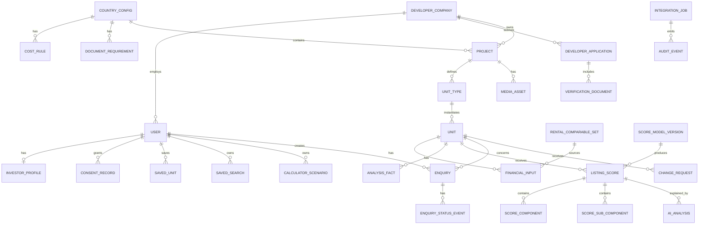

# Архітектура бази даних Best Invest Properties

Дата: 25 вересня 2026  
Система зберігання: Bubble database  
Системи-учасники: Bubble, Make, OpenAI API

## 1. Мета та принципи

Модель має підтримати три реальні контури MVP:

- інвестор знаходить, порівнює, зберігає і запитує конкретний доступний юніт;
- забудовник проходить верифікацію, подає проєкт і підтримує ціну/availability;
- адміністратор перевіряє документи, публікує контент, контролює introduction, score та AI-наратив.

База одна — Bubble. У ній **30 типів даних** і **23 Option Sets**.

Принципи:

1. **Bubble — source of truth.** Make Data Store не є бізнес-базою.
2. **Unit — публічний listing object.** Project описує будівлю/комплекс, Unit Type — повторювану конфігурацію, Unit — конкретну пропозицію.
3. **Single property не створює окремої таблиці.** Це проєкт з одним типом і одним юнітом.
4. **Фінанси детерміновані.** AI не записує ціну, rent, yield, score або податок.
5. **Історія — лише там, де вона потрібна:** score-модель і бали, згоди користувачів, джерела фінансових цифр. Решта змін перезаписує значення, а хто і коли змінив — фіксує Audit Event.
6. **Privacy by default.** Нові типи створюються private; публічно відкриваються тільки whitelist-поля published listings.
7. **Мінімальна денормалізація для Bubble.** Поля, що потрібні privacy rules і частим пошукам, дублюються на захищеному записі.
8. **Ідемпотентні інтеграції.** Кожний асинхронний процес має Integration Job і унікальний idempotency key.

Bubble privacy rules виконуються на сервері й мають бути основним механізмом недопущення даних до браузера. Візуальне приховування групи або кнопки не є контролем доступу.

## 2. Концептуальна схема



Market Benchmark прив'язаний до країни й району, а не до конкретного юніта, тому на схемі окремо не показаний.

## 3. Правила найменування в Bubble

- Data types: singular English, Pascal Case: `Developer Company`, `Score Model Version`.
- Fields: snake_case English: `publication_status`, `price_eur`.
- Option sets: Pascal Case: `Project Status`; options — stable machine keys у нижньому регістрі.
- У кожному бізнес-типі: `public_id` (текст для URL/референсів) і `is_archived`, де запис можна архівувати.
- Bubble `unique id` використовується тільки всередині системи; назовні передається `public_id`.
- Для грошей у MVP: числові поля з суфіксом `_eur`; валюта завжди EUR.
- Для відсотків: зберігати десяткову частку (`0.0725`), показувати як `7.25%`.
- Для часу: усі timestamps у UTC; timezone використовується лише для відображення.
- Поля `Created Date`, `Modified Date` і `Creator` Bubble додає автоматично — у таблицях нижче вони не повторюються.

## 4. Option Sets

Option Sets — для фіксованих, рідко змінюваних і несекретних значень. Bubble прямо зазначає, що option sets входять у код застосунку, не захищаються privacy rules і не підходять для sensitive data. Їх зміна потребує deploy.

| Option Set | Значення MVP |
|---|---|
| User Role | `investor`, `developer`, `admin` |
| Account Status | `pending_email`, `active`, `suspended`, `closed` |
| Application Status | `draft`, `submitted`, `under_review`, `more_info_required`, `approved`, `rejected`, `withdrawn` |
| Project Status | `draft`, `submitted`, `under_review`, `changes_requested`, `approved`, `published`, `paused`, `sold_out`, `archived`, `rejected` |
| Publication Status | `not_published`, `published`, `hidden`, `archived` |
| Unit Availability | `available`, `reserved`, `sold`, `withdrawn` |
| Financial Input Source | `developer_claim`, `portal_comparable`, `analyst_verified`, `platform_default`, `calculated` |
| Analysis Fact Tag | `source`, `developer`, `estimate`, `gap` |
| Change Request Status | `submitted`, `queried`, `approved`, `rejected`, `applied`, `cancelled` |
| Enquiry Status | `submitted`, `screening`, `on_hold`, `declined`, `approved_for_intro`, `introduced`, `developer_responded`, `qualified`, `closed_won`, `closed_lost`, `cancelled` |
| Score Verdict | `strong`, `good`, `watch`, `high_risk`, `not_scored` |
| Review Status | `not_required`, `pending`, `approved`, `changes_requested`, `rejected` |
| Analysis Status | `queued`, `generating`, `generated`, `failed`, `stale`, `published` |
| Job Status | `queued`, `processing`, `succeeded`, `retry_wait`, `failed`, `dead_letter`, `cancelled` |
| Document Kind | `company_registration`, `licence`, `ownership`, `planning`, `title`, `brochure`, `floor_plan`, `legal`, `other` |
| Financing Mode | `cash`, `mortgage` |
| Strategy | `long_term_rental`, `short_term_rental`, `capital_growth`, `mixed` |
| Score Criterion | 5 критеріїв — див. нижче |
| Score Sub-criterion | 13 підкритеріїв — див. нижче |
| Amenity | `communal_pool`, `gym`, `gated_area`, `underground_parking`, `tennis_golf`, `concierge`, `lift`, `landscaped_gardens` |
| Data Provider | погоджені портали / market-data providers; атрибути: `name`, `country`, `access_method` (`api` / `feed` / `manual`), `terms_reference`, `fetch_frequency_days`, `is_active` |
| Media Kind | `photo`, `floor_plan`, `brochure`, `document` |
| Consent Type | `terms`, `privacy`, `marketing`, `contact_sharing` |

**Що не є Option Set.** Country Config, Cost Rule, Document Requirement і Market Benchmark — типи даних, бо адміністратор редагує їх з адмінки без deploy (екран A11). Юридичні тексти (Terms, Privacy, Cookie, дисклеймери) — статичні сторінки; версія, на яку погодився користувач, зберігається в Consent Record.

**`Unit Availability`.** Забудовнику доступні для самостійної зміни лише `available`, `reserved`, `sold`, і кожна така зміна проходить через Change Request із затвердженням. `withdrawn` виставляє лише адміністратор. Це має бути закріплено у whitelist backend workflow, а не в UI.

### Score Criterion — атрибути

| key | label | max_points | default_weight | Примітка |
|---|---|---:|---:|---|
| `income` | Rental Income & Net Yield | 30 | 0.30 | rating автоматично зі смуг net yield |
| `demand` | Rental Demand & Tenant Quality | 20 | 0.20 | з підкритеріїв |
| `value` | Purchase Value & Market Position | 20 | 0.20 | з відхилення ціни за м² від Market Benchmark |
| `growth` | Growth & Resale Potential | 15 | 0.15 | з підкритеріїв |
| `risk` | Risk & Investor Protection | 15 | 0.15 | з підкритеріїв; більший бал = **нижчий** ризик, підпис шкали в UI обов'язковий |

Кожен критерій отримує `rating` 0–10, далі `weighted_points = rating / 10 × weight`. Повні шкали — у FR-03b специфікації проєкту.

### Score Sub-criterion — атрибути

| criterion | key | label | max_points |
|---|---|---|---:|
| demand | `market_activity` | Активність ринку і кількість comparable listings | 3 |
| demand | `year_round` | Цілорічний попит | 3 |
| demand | `tenant_mix` | Різноманітність потенційних орендарів | 2 |
| demand | `seasonality` | Сезонність і vacancy risk | 2 |
| growth | `price_trend` | Динаміка цін | 4 |
| growth | `liquidity` | Ліквідність і кількість угод | 3 |
| growth | `infrastructure` | Інфраструктура та економічні фактори | 2 |
| growth | `data_quality` | Актуальність і повнота даних | 1 |
| risk | `legal_title` | Юридичний статус / title | 3 |
| risk | `permits` | Дозволи та документи будівництва | 2 |
| risk | `payment_protection` | Payment / escrow protection | 2 |
| risk | `developer_check` | Перевірка забудовника | 2 |
| risk | `stage_risk` | Ризик стадії будівництва | 1 |

Сума `max_points` підкритеріїв кожного критерію дорівнює **10**.

### Рольові підписи статусів Enquiry

Набір з одинадцяти значень `Enquiry Status` є **канонічним**. Рольові підписи — три display-атрибути того самого Option Set (`label_admin`, `label_investor`, `label_developer`), а не додаткові статуси.

| Канонічний статус | Admin | Investor | Developer |
|---|---|---|---|
| `submitted` | New | Request received | не показується |
| `screening` | Qualifying | Awaiting analysis | не показується |
| `qualified` | Hot lead / Awaiting you | Awaiting admin approval | Awaiting admin approval |
| `on_hold` | On hold | Under review | On hold |
| `declined` | Declined | Not available | Filtered out by Best Invest |
| `approved_for_intro` | Connecting | Introduction being prepared | Introduction being prepared |
| `introduced` | Connected | Developer contacted | Introduced |
| `developer_responded` | In progress | Developer responded | Contacted |
| `closed_won` | Converted | Completed | Converted |
| `closed_lost` | Closed | Closed | Closed |
| `cancelled` | Cancelled | Cancelled | Cancelled |

Порожній підпис означає, що запис цій ролі не показується взагалі — це перевіряється privacy rule, а не лише приховуванням у UI.

**`AWAITING YOU` не є статусом.** Це підпис для адміністратора, який означає, що lead у статусі `qualified` очікує на його рішення. Так само «Hot lead» — підпис того самого статусу, а не окрема стадія.

## 5. Типи даних

Усього 30 типів у шести групах.

| Група | Типи |
|---|---|
| 5.1 Люди та доступ | User, Investor Profile, Developer Company, Developer Application, Verification Document, Consent Record |
| 5.2 Налаштування ринку | Country Config, Cost Rule, Document Requirement, Market Benchmark |
| 5.3 Каталог | Project, Unit Type, Unit, Media Asset |
| 5.4 Фінанси, оренда, score | Financial Input, Rental Comparable Set, Analysis Fact, Score Model Version, Listing Score, Score Component, Score Sub-component, AI Analysis |
| 5.5 Інвестор і запити | Saved Unit, Saved Search, Calculator Scenario, Enquiry, Enquiry Status Event, Change Request |
| 5.6 Службові | Integration Job, Audit Event |

### 5.1 Люди та доступ

#### User (Bubble built-in)

| Поле | Тип | Обов'язкове | Примітка |
|---|---|---:|---|
| public_id | text | так | `usr_...`, не email |
| full_name | text | так | не використовувати як ідентифікатор |
| phone_e164 | text | ні | приватне |
| country_of_residence | text | ні | приватне |
| roles | list of User Role | так | мінімум одна роль після активації |
| account_status | Account Status | так | route guard |
| email_verified | yes/no | так | false за замовчуванням |
| developer_company | Developer Company | ні | для забудовника; у MVP один користувач на компанію |
| admin_permission_keys | list of text | ні | тільки для admin; права перевіряються за ключами, а не лише за роллю |
| last_login_at | date | ні | аудит |

Не зберігати пароль у власному полі. Використовувати Bubble authentication.

#### Investor Profile

| Поле | Тип | Обов'язкове | Примітка |
|---|---|---:|---|
| user | User | так | один активний профіль на User |
| budget_min_eur | number | ні | |
| budget_max_eur | number | ні | |
| target_gross_yield | number | ні | десяткова частка |
| target_net_yield | number | ні | десяткова частка |
| time_horizon_months | number | ні | |
| countries | list of Country Config | ні | бажані країни |
| strategies | list of Strategy | ні | |
| bedrooms_min | number | ні | |
| marketing_email_opt_in | yes/no | так | дублює останню згоду `marketing` для швидкого фільтра |

Унікальність профілю перевіряється backend workflow перед створенням.

#### Developer Company

| Поле | Тип | Обов'язкове | Примітка |
|---|---|---:|---|
| public_id | text | так | |
| legal_name | text | так | |
| registration_number | text | так | |
| registration_country | Country Config | так | |
| licence_number | text | так | |
| website_url | text | ні | |
| years_active | number | ні | |
| projects_completed | number | ні | |
| projects_selling | number | ні | |
| typical_unit_price_eur | number | ні | |
| verification_status | Application Status | так | дублюється з останньої заявки для privacy rules |
| verified_at | date | ні | |
| is_suspended | yes/no | так | |

Company — власник Project. Ніколи не прив'язувати Project напряму до одного developer User.

#### Developer Application

| Поле | Тип | Обов'язкове | Примітка |
|---|---|---:|---|
| public_id | text | так | `APP-0142` |
| company | Developer Company | так | |
| submitted_by_user | User | так | |
| status | Application Status | так | |
| markets | list of Country Config | так | |
| submitted_at | date | ні | |
| decided_at | date | ні | |
| decision_reason_private | text | ні | лише для адміністратора |
| decision_message_public | text | ні | бачить забудовник |

#### Verification Document

| Поле | Тип | Обов'язкове | Примітка |
|---|---|---:|---|
| application | Developer Application | так | |
| company | Developer Company | так | дублюється для privacy rules |
| document_kind | Document Kind | так | |
| file | file | так | завжди private |
| expires_at | date | ні | |
| verification_status | Review Status | так | |
| review_note_public | text | ні | бачить забудовник |
| reviewed_at | date | ні | |
| is_current | yes/no | так | повторне завантаження робить попередній `no` |

Файл завжди private і прикріплений до Verification Document. Видалення URL не видаляє файл; workflow видалення має спочатку виконати Bubble action «Delete an uploaded file».

#### Consent Record

| Поле | Тип | Обов'язкове | Примітка |
|---|---|---:|---|
| user | User | так | |
| consent_type | Consent Type | так | |
| granted | yes/no | так | |
| document_version | text | так | версія тексту, на який погодився користувач, напр. `terms-2026-09` |
| source_page | text | ні | де надано згоду |
| withdrawn_at | date | ні | |

Згода не перезаписується: кожна зміна — новий запис. Це вимога GDPR — треба довести, на що саме погодився користувач.

### 5.2 Налаштування ринку

#### Country Config

| Поле | Тип | Обов'язкове | Примітка |
|---|---|---:|---|
| iso2 | text | так | `CY`, `ES` |
| name | text | так | |
| is_live | yes/no | так | |
| coming_soon | yes/no | так | для Greece/Portugal, якщо потрібно |
| default_vacancy_rate | number | так | десяткова частка |
| default_management_fee_rate | number | так | |
| default_maintenance_rate | number | так | |
| default_insurance_annual_eur | number | так | |
| legal_disclaimer | text | ні | |
| min_comparable_listings | number | так | дефолт **5** — нижче вибірку **не можна затвердити** |
| sufficient_comparable_listings | number | так | дефолт **10** — нижче вибірка затверджується з позначкою «thin sample» |
| max_comparable_age_days | number | так | дефолт **90** — після цього вибірка застаріла |

Пороги вибірки зберігаються по країнах, бо ліквідність ринків різна: у Нікосії оголошень менше, ніж у Малазі. Медіана з чотирьох оголошень не є ринковою — один викид зсуває її надто сильно, тому 5 — абсолютний мінімум. Від 10 оголошень медіана стабільна. 90 днів — квартал: не треба збирати щотижня, і оцінка не відстає від ринку. Усі значення адміністратор змінює без зміни коду.

#### Cost Rule

| Поле | Тип | Обов'язкове | Примітка |
|---|---|---:|---|
| country | Country Config | так | |
| rule_key | text | так | `transfer_tax`, `stamp_duty`, `legal_fees`, … |
| label | text | так | |
| applies_to_new_build | yes/no | ні | порожнє = для всіх |
| calculation_method | text | так | `flat` / `percent_price` / `banded` |
| rate | number | ні | для `percent_price` |
| fixed_amount_eur | number | ні | для `flat` |
| bands_json | text | ні | для `banded` |
| source_url | text | так | офіційне джерело |
| source_checked_at | date | так | |
| approved_by | text | ні | хто перевірив ставку (консультант) |

Не зберігати всі податкові правила одним текстом. Редагується з адмінки (A11); значення перезаписується, історію змін фіксує Audit Event.

#### Document Requirement

| Поле | Тип | Обов'язкове | Примітка |
|---|---|---:|---|
| country | Country Config | так | |
| subject_type | text | так | `developer` / `project` |
| document_kind | Document Kind | так | |
| required_for_account_creation | yes/no | так | напр. реєстрація компанії, ліцензія |
| required_for_submission | yes/no | так | |
| required_for_publication | yes/no | так | напр. дозвіл на будівництво, escrow |
| expiry_months | number | ні | порожнє = безстроковий |
| instructions | text | ні | підказка забудовнику |
| is_active | yes/no | так | |

Три поля `required_for_*` виражають три рівні з екрана заявки: `REQUIRED` / `TO CONFIRM` / `OPTIONAL`. Матриця **повністю налаштовувана** адміністратором по кожній країні й не зашивається в код.

#### Market Benchmark

Потрібен для критерію `Purchase Value & Market Position`, який порівнює ціну за м² з медіаною по району.

| Поле | Тип | Обов'язкове | Примітка |
|---|---|---:|---|
| country | Country Config | так | |
| city | text | так | |
| area_name | text | ні | порожнє = усе місто |
| property_type | text | ні | |
| median_price_per_m2_eur | number | так | медіана для новобудов |
| sample_size | number | ні | кількість об'єктів у вибірці |
| source_reference | text | так | відкриті оголошення / реєстр угод |
| checked_at | date | так | дата перевірки |

### 5.3 Каталог нерухомості

#### Project

| Поле | Тип | Обов'язкове | Примітка |
|---|---|---:|---|
| public_id | text | так | `PRJ-0311` |
| company | Developer Company | так | **ніколи** не віддається анонімному запиту |
| country | Country Config | так | |
| city | text | так | |
| area_name | text | ні | |
| address_private | text | ні | не публікується |
| map_lat_rounded | number | ні | округлено для публічної карти |
| map_lng_rounded | number | ні | |
| name | text | так | |
| project_type | text | так | `single` / `complex` |
| description_public | text | ні | |
| completion_date | date | так | |
| declared_unit_count | number | так | |
| amenities | list of Amenity | ні | |
| cover_media | Media Asset | ні | обов'язкове для публікації |
| status | Project Status | так | |
| publication_status | Publication Status | так | |
| published_at | date | ні | |

Для search cards достатньо country/city/area; `address_private` не віддається публічно.

**Анонімність забудовника.** Ім'я та контакти забудовника не показуються в каталозі й на сторінці об'єкта; публічний підпис — «Introduced by Best Invest». Privacy rule на Project не віддає `company` анонімному запиту взагалі — не покладатися на те, що UI його не показує.

#### Unit Type

| Поле | Тип | Обов'язкове | Примітка |
|---|---|---:|---|
| public_id | text | так | |
| project | Project | так | |
| name | text | так | напр. «Type B — 2 bed» |
| bedrooms | number | так | |
| bathrooms | number | так | |
| indoor_area_m2 | number | так | |
| outdoor_area_m2 | number | ні | |
| floor_plan | Media Asset | ні | |

#### Unit

Центральний listing record. Тут же зберігаються поточні фінансові показники — окремого типу для них немає.

| Поле | Тип | Обов'язкове | Примітка |
|---|---|---:|---|
| public_id | text | так | URL і зовнішні посилання |
| project | Project | так | |
| unit_type | Unit Type | так | |
| unit_number | text | так | може бути прихований до introduction |
| floor | number | ні | |
| price_eur | number | так | поточна затверджена ціна |
| availability | Unit Availability | так | |
| has_pending_change | yes/no | так | є Change Request в обробці — рядок у порталі підписується «pending approval» |
| monthly_rent_eur | number | ні | затверджена оренда, що йде в score |
| purchase_costs_eur | number | ні | розраховано з Cost Rule |
| annual_net_income_eur | number | ні | розраховано |
| gross_yield | number | ні | розраховано |
| net_yield | number | ні | розраховано |
| financials_calculated_at | date | ні | дата останнього розрахунку |
| investment_score | number | ні | поточний score |
| score_verdict | Score Verdict | ні | badge |
| current_score | Listing Score | ні | компоненти й версія моделі |
| country_cached | Country Config | так | для пошуку й privacy без глибокого ланцюжка |
| city_cached | text | так | пошук |
| bedrooms_cached | number | так | пошук |
| area_m2_cached | number | так | пошук |
| property_type_cached | text | так | пошук |
| completion_date_cached | date | так | фільтр за completion |
| strategy_keys | list of Strategy | ні | пошук |
| publication_status | Publication Status | так | публічний лише `published` |

Фінансові й кешовані поля оновлюються атомарним backend workflow `recalculate_unit`. Не будувати публічний пошук через багато вкладених зв'язків.

Базові формули MVP:

```text
annual_gross_rent = monthly_rent × 12
annual_effective_rent = annual_gross_rent × (1 − vacancy_rate)
gross_yield = annual_gross_rent / price
annual_net_income = annual_effective_rent
  - management - maintenance - insurance - property_tax - other_costs
net_yield = annual_net_income / (price + purchase_costs)
```

Вхідні дані — затверджені Financial Input (оренда — з порівняльних оголошень через Make), налаштування Country Config і Cost Rule для країни. Значення, використані в конкретному score, фіксуються на Listing Score.

#### Media Asset

| Поле | Тип | Обов'язкове | Примітка |
|---|---|---:|---|
| project | Project | так | |
| unit_type | Unit Type | ні | для планувань |
| kind | Media Kind | так | |
| image | image | ні | для `photo` |
| file | file | ні | для PDF/документів |
| is_private | yes/no | так | юридичні документи — `yes` |
| is_cover | yes/no | так | |
| sort_order | number | так | |
| caption | text | ні | |

Публічні фото/брошури і приватні документи — різні записи з різними privacy rules.

### 5.4 Фінанси, оренда, score

#### Financial Input

Екран Project Review показує панель, де кожна цифра має власне джерело, і три оцінки оренди поруч (заявлена забудовником, порівнянна оцінка Best Invest, та, що фактично пішла в score). Тому кожне вхідне значення — окремий запис.

| Поле | Тип | Обов'язкове | Примітка |
|---|---|---:|---|
| unit | Unit | так | |
| input_key | text | так | `monthly_rent`, `recurring_costs`, `vacancy_allowance`, … |
| label | text | так | підпис у рев'ю |
| value_number | number | так | |
| source | Financial Input Source | так | |
| source_reference | text | ні | «Larnaca district, 14 lettings» |
| comparable_set | Rental Comparable Set | ні | обов'язковий для `portal_comparable` |
| is_used_for_scoring | yes/no | так | лише одне активне значення на `input_key` |
| review_status | Review Status | так | `pending` до затвердження адміністратором |
| approved_at | date | ні | |
| superseded_by | Financial Input | ні | нове значення не перезаписує старе |

Правила:

- у public listing потрапляють лише значення з `review_status = approved`;
- фінансові показники Unit рахуються **тільки** з затверджених Financial Input;
- значення з `source = developer_claim` ніколи не може мати `is_used_for_scoring = yes` без окремого затвердження аналітиком (BR-02);
- для `source = portal_comparable` обов'язковий `comparable_set` із `review_status = approved`;
- для орендної плати завжди існують щонайменше два записи: заявлений забудовником (`developer_claim`) і виведений із порівняльних оголошень (`portal_comparable`) — саме вони показуються поруч на Project Review;
- `developer_claim` ніколи не перетворюється на `portal_comparable` автоматично;
- запис не редагується: нове значення створює новий запис і заповнює `superseded_by` у старого. Так видно, звідки взялася кожна опублікована цифра.

#### Rental Comparable Set

Результат збору порівняльних оголошень оренди через Make. Один запис = одна вибірка на один набір параметрів у конкретну дату.

| Поле | Тип | Обов'язкове | Примітка |
|---|---|---:|---|
| public_id | text | так | |
| provider | Data Provider | так | Option Set |
| retrieved_at | date | так | дата отримання даних |
| country | Country Config | так | параметр нормалізації |
| city | text | так | параметр нормалізації |
| area_name | text | ні | район |
| property_type | text | так | параметр нормалізації |
| bedrooms | number | так | параметр нормалізації |
| area_m2_min | number | ні | межа вибірки за площею |
| area_m2_max | number | ні | межа вибірки за площею |
| listings_count | number | так | кількість comparable listings |
| rent_min_eur | number | так | нижня межа діапазону |
| rent_median_eur | number | так | медіана — основа базової оцінки |
| rent_max_eur | number | так | верхня межа діапазону |
| collection_method | text | так | `api` / `feed` / `manual_import` / `manual_entry` |
| integration_job | Integration Job | ні | порожнє для ручного внесення |
| review_status | Review Status | так | `pending` до перевірки адміністратором |
| is_current | yes/no | так | поточна вибірка для цього набору параметрів |

Правила:

- вибірка з `review_status ≠ approved` не може бути джерелом для Financial Input і не показується інвестору;
- `listings_count` нижче `Country Config.min_comparable_listings` (дефолт **5**) **блокує затвердження**;
- `listings_count` у смузі від мінімуму до `sufficient_comparable_listings` (дефолт **10**) затверджується з позначкою **thin sample**: вона показується адміністратору на рев'ю і додається інвестору як Analysis Fact із тегом `estimate`;
- вибірка, старша за `max_comparable_age_days` (дефолт **90**), отримує `is_current = no` і не може бути джерелом для нового Financial Input; опубліковані значення не зникають, але потрапляють у чергу на оновлення;
- нова вибірка не перезаписує попередню: стара отримує `is_current = no`;
- ручний fallback (`manual_import` / `manual_entry`) зберігається тим самим типом і з тими самими полями, щоб походження цифри лишалося видимим.

> Юридична підстава використання даних кожного порталу (умови API, ліцензія
> на дані) перевіряється до підключення. Посилання на умови — атрибут
> `terms_reference` в Option Set `Data Provider`.

#### Analysis Fact

Блок «Sources, assumptions & gaps» на екранах аналізу та рев'ю.

| Поле | Тип | Обов'язкове | Примітка |
|---|---|---:|---|
| unit | Unit | так | |
| tag | Analysis Fact Tag | так | |
| body | text | так | текст факту |
| source_url | text | ні | |
| sort_order | number | так | |
| is_active | yes/no | так | |

Тег `gap` позначає відому відсутність даних і має бути видимим інвестору — це юридично значуща частина розкриття.

#### Score Model Version

| Поле | Тип | Обов'язкове | Примітка |
|---|---|---:|---|
| version_number | number | так | v1, v2, … |
| status | text | так | `draft` / `active` / `retired` |
| weight_income | number | так | десяткова частка, дефолт 0.30 |
| weight_demand | number | так | дефолт 0.20 |
| weight_value | number | так | дефолт 0.20 |
| weight_growth | number | так | дефолт 0.15 |
| weight_risk | number | так | дефолт 0.15 |
| change_reason | text | так | показується в таблиці версій |
| properties_rescored | number | ні | заповнюється після перерахунку |
| activated_at | date | ні | |

Правила ваг:

- сума п'яти ваг активної моделі дорівнює `1.0`; поки ні — Save заблоковано (перевіряє backend workflow);
- редактор працює у відсотках 0–100 на критерій; жорсткої межі на окремий критерій **немає**;
- в UI показується м'яке попередження, якщо будь-який критерій перевищує **50%** — тоді один критерій фактично визначає весь score. Попередження не блокує збереження; поріг — константа інтерфейсу;
- ваги однакові для Кіпру та Іспанії;
- `Revert` створює **нову** версію з параметрами попередньої, а не видаляє історію.

#### Listing Score

| Поле | Тип | Обов'язкове | Примітка |
|---|---|---:|---|
| unit | Unit | так | |
| model_version | Score Model Version | так | |
| total_score | number | так | 0–100 |
| verdict | Score Verdict | так | |
| price_eur_used | number | так | ціна на момент розрахунку |
| monthly_rent_eur_used | number | так | оренда на момент розрахунку |
| net_yield_used | number | так | |
| gross_yield_used | number | так | |
| calculated_at | date | так | |
| is_current | yes/no | так | новий розрахунок робить попередній `no` |

Поля `*_used` фіксують вхідні дані, з яких розраховано бал: так score лишається відтворюваним, навіть коли ціна чи оренда на Unit змінилися.

#### Score Component

| Поле | Тип | Обов'язкове | Примітка |
|---|---|---:|---|
| listing_score | Listing Score | так | |
| criterion | Score Criterion | так | Option Set |
| raw_value | number | ні | напр. net yield або відхилення від медіани; порожнє для оцінкових критеріїв |
| rating | number | так | 0–10 |
| weighted_points | number | так | `rating / 10 × вага × 100` |
| explanation | text | ні | детерміноване пояснення для екрана аналізу |

На кожен Listing Score — рівно п'ять компонентів; їх сума дорівнює total score з похибкою не більше `0.01`.

#### Score Sub-component

Фактична оцінка підкритерію для конкретного Listing Score.

| Поле | Тип | Обов'язкове | Примітка |
|---|---|---:|---|
| listing_score | Listing Score | так | |
| sub_criterion | Score Sub-criterion | так | Option Set |
| points_awarded | number | так | не більше `max_points` підкритерію |
| note | text | ні | коментар аналітика |

Сума `points_awarded` у межах критерію дає його `rating`.

#### AI Analysis

| Поле | Тип | Обов'язкове | Примітка |
|---|---|---:|---|
| unit | Unit | так | |
| listing_score | Listing Score | так | на якому score побудовано текст |
| status | Analysis Status | так | |
| review_status | Review Status | так | |
| prompt_version | text | так | |
| model_id | text | так | |
| summary | text | ні | |
| strengths_json | text | ні | |
| risks_json | text | ні | |
| missing_data_json | text | ні | |
| input_tokens | number | ні | |
| output_tokens | number | ні | |
| reviewed_at | date | ні | |
| published_at | date | ні | |
| failure_code | text | ні | |

Публікується тільки `review_status = approved` і лише якщо пов'язаний Listing Score досі `is_current = yes`.

### 5.5 Інвестор і запити

#### Saved Unit

| Поле | Тип | Обов'язкове | Примітка |
|---|---|---:|---|
| user | User | так | |
| unit | Unit | так | |
| price_at_save_eur | number | так | для бейджа «ціна змінилася» |
| availability_at_save | Unit Availability | так | для бейджа «статус змінився» |
| is_active | yes/no | так | перед створенням перевірити відсутність активного дубля |

#### Saved Search

| Поле | Тип | Обов'язкове | Примітка |
|---|---|---:|---|
| public_id | text | так | |
| user | User | так | |
| name | text | так | |
| countries | list of Country Config | ні | |
| property_types | list of text | ні | |
| bedrooms | list of text | ні | `studio`, `1`, `2`, `3+` |
| strategies | list of Strategy | ні | |
| completion | list of text | ні | `ready`, `lt_12m`, `12_24m` |
| price_max_eur | number | ні | |
| gross_yield_min | number | ні | |
| net_yield_min | number | ні | |
| is_active | yes/no | так | |

#### Calculator Scenario

| Поле | Тип | Обов'язкове | Примітка |
|---|---|---:|---|
| public_id | text | так | |
| user | User | так | анонімні розрахунки не зберігаються |
| unit | Unit | так | |
| name | text | так | |
| strategy | Strategy | так | long / short term |
| rent_scenario | text | так | `base` / `average` / `best` |
| financing_mode | Financing Mode | так | |
| purchase_price_eur | number | так | |
| deposit_eur | number | ні | для `mortgage` |
| interest_rate | number | ні | для `mortgage` |
| term_years | number | ні | для `mortgage` |
| monthly_rent_eur | number | так | |
| occupancy_rate | number | так | |
| management_fee_rate | number | так | |
| annual_net_income_eur | number | так | результат на момент збереження |
| cash_on_cash_return | number | ні | результат на момент збереження |

#### Enquiry

Поля розкриття контактів зберігаються прямо тут — окремого типу для них немає.

| Поле | Тип | Обов'язкове | Примітка |
|---|---|---:|---|
| public_id | text | так | `ENQ-YYYY-...` / для забудовника `LEAD-0412` |
| investor_user | User | так | приватне |
| unit | Unit | так | конкретний предмет запиту |
| project | Project | так | денормалізовано |
| developer_company | Developer Company | так | денормалізовано для privacy rules |
| status | Enquiry Status | так | канонічний статус |
| budget_eur | number | ні | значення на момент подання |
| consent_to_share_contact | yes/no | так | окрема згода |
| fit_summary_private | text | ні | лише для адміністратора |
| follow_up_date | date | ні | обов'язкове для `on_hold` |
| submitted_at | date | так | початок SLA |
| contact_released_at | date | ні | заповнюється при Approve & connect |
| released_investor_name | text | ні | копія, яку бачить забудовник після розкриття |
| released_investor_email | text | ні | |
| released_investor_phone | text | ні | |
| released_developer_contact | text | ні | контакт забудовника, який бачить інвестор |
| developer_outcome | text | ні | результат роботи з лідом (D11): `viewing_booked` / `reserved` / `not_interested` |
| closed_at | date | ні | |

Забудовник **не** отримує доступу до User інвестора. До розкриття поля `released_*` порожні; privacy rule віддає їх забудовнику лише коли `contact_released_at` заповнено.

#### Enquiry Status Event

| Поле | Тип | Обов'язкове | Примітка |
|---|---|---:|---|
| enquiry | Enquiry | так | |
| from_status | Enquiry Status | ні | |
| to_status | Enquiry Status | так | |
| actor_user | User | ні | порожнє для автоматичних переходів |
| reason_private | text | ні | обов'язкове для `on_hold` / `declined`; інвестору не показується |
| note_investor | text | ні | що бачить інвестор в історії (P12) |

Статус не змінюється без Status Event. Саме ці записи показуються інвестору як історія статусів.

#### Change Request

Один запит = одна зміна одного юніта або запит на content review.

| Поле | Тип | Обов'язкове | Примітка |
|---|---|---:|---|
| public_id | text | так | |
| project | Project | так | |
| unit | Unit | ні | порожнє для content review |
| company | Developer Company | так | для privacy rules |
| request_type | text | так | `price` / `availability` / `content_review` |
| old_price_eur | number | ні | |
| new_price_eur | number | ні | |
| old_availability | Unit Availability | ні | |
| new_availability | Unit Availability | ні | лише `available` / `reserved` / `sold` |
| content_message | text | ні | для `content_review`: що забудовник хоче змінити |
| status | Change Request Status | так | |
| decision_reason | text | ні | обов'язкове для `queried` / `rejected`; бачить забудовник |
| submitted_at | date | так | |
| decided_at | date | ні | |

Після публікації забудовник змінює лише ціну й availability; обидві зміни проходять **попереднє** затвердження. Заблоковані поля (project name, location, completion date, unit mix, specification, media) змінюються через `content_review`. Change Request зберігається після застосування — це і є історія змін на екрані D08.

### 5.6 Службові

#### Integration Job

Кожна асинхронна дія: виклики Make і кожен лист, який надсилає Bubble.

| Поле | Тип | Обов'язкове | Примітка |
|---|---|---:|---|
| public_id | text | так | correlation id |
| job_type | text | так | `ai_analysis_generate`, `email`, `introduction`, `rental_comparables`, `score_rescore_batch`, … |
| entity_type | text | так | |
| entity_public_id | text | так | |
| recipient_user | User | ні | для листів |
| template_key | text | ні | для листів |
| status | Job Status | так | |
| idempotency_key | text | так | унікальний |
| attempt_count | number | так | |
| processed_count | number | ні | прогрес пакетного перерахунку |
| last_error_redacted | text | ні | без PII і секретів |
| provider_message_id | text | ні | id листа / відповіді OpenAI |
| completed_at | date | ні | |

Унікальність забезпечується по `idempotency_key`. Перед дією (виклик Make або відправка листа) перевіряється Job; якщо `succeeded`, повтор завершується без side effects. Цей самий тип — журнал надісланих листів: невдалий лист видно на екрані A10 з кнопкою Retry.

#### Audit Event

| Поле | Тип | Обов'язкове | Примітка |
|---|---|---:|---|
| actor_user | User | ні | порожнє для системних дій |
| action_key | text | так | `project.published`, `cost_rule.updated`, … |
| entity_type | text | так | |
| entity_public_id | text | так | |
| before_json | text | ні | без PII |
| after_json | text | ні | без PII |
| reason | text | ні | |
| source | text | так | `bubble_ui` / `bubble_backend` / `make` / `openai` |

Audit Event append-only; користувацькі workflow не мають права змінювати або видаляти записи. Саме він фіксує, хто і коли змінив налаштування (ставки, пороги, документи), замість окремих версій кожного запису.

## 6. Статусні переходи

### Project lifecycle

```text
draft → submitted → under_review
under_review → changes_requested → submitted
under_review → approved → published
under_review → rejected
published → paused | sold_out | archived
```

Перехід `approved → published` виконує адміністратор окремою дією. Publish заборонено без approved verification, мінімум одного available unit, cover photo, розрахованих фінансових показників, current score і approved AI analysis або явного deterministic-only fallback.

Забудовник може **подати** проєкт із неповним набором юнітів (модальне вікно: «12 units declared · 3 entered. You can submit and add the rest before publication»). Тому повнота юнітів є умовою переходу `approved → published`, а не `draft → submitted`. Додатково publish вимагає, щоб усі Financial Input, які беруть участь у score, мали `review_status = approved`.

### Enquiry decision

| Дія в UI | Канонічний перехід | Листи |
|---|---|---|
| Approve & connect | `qualified → approved_for_intro → introduced` | обом сторонам |
| Hold | `qualified → on_hold` | жодного |
| Decline | `qualified → declined` | лише інвестору, нейтральний текст без причини |

`on_hold` і `declined` вимагають `reason_private`. Текст, який бачить інвестор при відмові, береться з шаблону і **не** містить причини. `on_hold` додатково вимагає `follow_up_date` на Enquiry.

### Developer Application lifecycle

```text
draft → submitted → under_review
under_review → more_info_required → submitted
under_review → approved | rejected
submitted/under_review → withdrawn
```

### Enquiry lifecycle

```text
submitted → screening → qualified → approved_for_intro → introduced
screening | qualified → on_hold | declined
on_hold → qualified | declined
introduced → developer_responded → closed_won | closed_lost
submitted | screening | qualified → cancelled
```

`qualified` означає «лід перевірено аналітиком і він очікує рішення адміністратора», тобто стоїть **до** `approved_for_intro`. Стадія після відповіді забудовника — `developer_responded`, далі `closed_won` / `closed_lost`.

## 7. Privacy rules matrix

| Data type | Anonymous | Investor owner | Developer company member | Admin |
|---|---|---|---|---|
| User | none | own whitelisted fields | own only | full |
| Investor Profile | none | own | none | full |
| Developer Company | none | none | own | full |
| Developer Application / Verification Document | none | none | own company | full |
| Consent Record | none | own | own | full |
| Project | published public subset, без `company` | published public subset | own company | full |
| Unit | published + available public subset | same | own company units | full |
| Media Asset public | published records | published records | own company | full |
| Media Asset private | none | none | own company | full |
| Financial Input | none | none | own project, лише `approved` | full |
| Rental Comparable Set | none | none | none | full |
| Analysis Fact / Listing Score / Score Component | published subset | published subset | own project | full |
| AI Analysis | approved/published only | approved/published only | own project published view | full |
| Enquiry | none | own, investor-safe fields | own company; поля `released_*` лише після розкриття | full |
| Enquiry Status Event | none | own, без `reason_private` | own company, без `reason_private` | full |
| Change Request | none | none | own company | full |
| Integration Job / Audit Event | none | none | none | full |

Implementation details:

- privacy conditions перевіряють прямі поля на самому record; не будувати багаторівневі ланцюги;
- дублювати `company`, `publication_status` на захищених типах, де це спрощує правило;
- workflow `Only when` перевіряє роль, компанію, account status і дозволений перехід; privacy rules не замінюють workflow authorization;
- не дозволяти auto-binding для критичних полів;
- Data API для бізнес-типів не відкривати публічно; Make викликає вузькі authenticated Workflow API endpoints.

## 8. Bubble workflows, що підтримують цілісність

| Workflow | Тригер | Результат |
|---|---|---|
| `create_developer_application` | submit form | User + Company + Application без дублів, consent, audit |
| `submit_project` | developer action | validation, status event, review |
| `publish_project` | admin action | server validation, publication, audit |
| `store_rental_comparables` | callback від MK-10 | Rental Comparable Set `pending`, попередній — `is_current = no` |
| `approve_rental_comparables` | admin action | вибірка `approved`, стає доступною як джерело Financial Input |
| `approve_financial_input` | admin action на A04 | Financial Input `approved`, попередній — `superseded_by` |
| `recalculate_unit` | затверджена зміна ціни/оренди/налаштувань | оновлені фінансові поля й кеш Unit |
| `calculate_unit_score` | зміна фінансів або моделі | новий Listing Score + компоненти |
| `queue_ai_analysis` | створено current score | Integration Job `ai_analysis_generate` |
| `rescore_all_published` | адміністратор зберіг нову Score Model Version | пакетний перерахунок із прогресом, новий Listing Score на кожний unit, старі → `is_current = no` |
| `submit_enquiry` | investor action | consent check, Enquiry + status event |
| `approve_introduction` | admin action | поля розкриття на Enquiry + Integration Job на доставку |
| `submit_change_request` | developer action | Change Request `submitted`, `has_pending_change = yes` |
| `apply_change_request` | admin approval | застосувати зміну один раз, перерахунок, audit |
| `close_account` | confirmed request | suspend access, queue export/anonymization review |

Database triggers використовувати лише як страховку для змін з Bubble editor/API. Основні second-order updates краще викликати з первинного backend workflow, щоб не витрачати workload на перевірку кожної зміни.

## 9. Пошук і продуктивність

- Пошук на екрані 02 виконується по Unit, constraints: `publication_status`, `availability`, `country_cached`, `price_eur`, `bedrooms_cached`, `gross_yield`, `net_yield`, `strategy_keys`, `completion_date_cached`.
- Не використовувати `:filtered` для серверно-фільтрованого каталогу; усі основні умови мають бути search constraints.
- Slider-зміни debounce 300–500 ms.
- Сортування за `net_yield`, `gross_yield`, `price_eur`, `investment_score`.
- Пагінація: **8 записів на сторінку**, нумерований пейджер.
- Рейка «Top 5» бере перші п'ять записів того самого відсортованого набору — окремого запиту робити не треба.
- Списки records не зберігати на User, якщо вони необмежено ростуть; Saved Unit, Enquiry — окремі типи.

## 10. Retention і видалення

Строки зберігання фіксуються в юридичній політиці платформи. Технічна політика MVP:

- account closure одразу блокує login; фактичне delete/anonymize — керований backend process;
- open enquiries, consent, audit і transactional records не видаляються автоматично до завершення legal hold;
- investor PII у closed records замінюється на pseudonymous reference після затвердженого строку;
- uploaded file видаляється окремою дією до очищення URL;
- Integration Job не містить повний PII — лише посилання на запис;
- OpenAI input містить факти про об'єкт, але не контактні дані інвестора.

## 11. Seed data перед build

1. Country Config: Spain, Cyprus (з порогами вибірки); Greece/Portugal як `coming_soon` за потреби.
2. Cost Rules для обох країн — з джерелом і датою перевірки.
3. Option Set `Data Provider`: погоджені портали для Іспанії та Кіпру.
4. Market Benchmark: медіанна ціна за м² для районів запуску.
5. Document Requirements по країні.
6. Перша Score Model Version (30/20/20/15/15).
7. Шаблони листів і рольові підписи Enquiry Status.

## 12. Міграція між Bubble Development і Live

- структуру/option sets deploy через Bubble version control;
- налаштування (Country Config, Cost Rule, Document Requirement, Market Benchmark) експортувати/імпортувати у визначеній послідовності;
- не копіювати Live PII у Development без письмової підстави й маскування;
- OpenAI/Make credentials окремі для Development і Live;
- smoke dataset: 2 countries, 2 companies, 4 projects, 8 unit types, 20 units, усі availability/status cases.

## 13. Критерії приймання архітектури

- жоден anonymous request не отримує email, phone, exact private address або private document URL;
- developer до introduction бачить lead без PII; після approval бачить лише поля `released_*`;
- повторний Make webhook з тим самим idempotency key не створює дубль і не надсилає повторний email;
- кожний published unit має розраховані фінансові показники, current Listing Score і Score Model Version;
- кожне число на Analysis простежується до Financial Input або Listing Score;
- score components дорівнюють total score в межах 0.01 і їх рівно п'ять;
- зміна затвердженої ціни створює Change Request, Audit Event, перерахунок Unit і новий Listing Score;
- зміна availability так само проходить Change Request і не застосовується до затвердження;
- анонімний запит не отримує `Project.company` і жодного поля забудовника;
- жоден Financial Input зі `source = developer_claim` не бере участі у score без окремого затвердження;
- кожний published unit має щонайменше один Analysis Fact або явну позначку, що gaps відсутні;
- видалення private record не залишає доступний attached file;
- усі status changes створюють Status Event/Audit Event;
- admin publish і розкриття контактів неможливі без server-side authorization.
