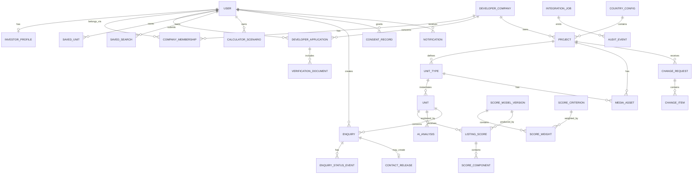

# Архітектура бази даних Best Invest Properties для Марини

Версія: 1.1  
Дата: 25 вересня 2026  
Система зберігання: Bubble database  
Системи-учасники: Bubble, Make, OpenAI API

> **Версія 1.1 — звірення із затвердженим прототипом.** Змінено: модель score
> (п'ять критеріїв замість восьми), правило зміни price/availability, джерела
> фінансових вхідних даних, статуси введення/верифікації. Структура документа
> збережена. Схема **не** копіює структуру фронтенд-компонентів прототипу:
> демонстраційні об'єкти на кшталт `queueOut` чи `previewState` є станом
> інтерфейсу і в базу не переносяться.

## 1. Мета та принципи

Модель має підтримати три реальні контури MVP:

- інвестор знаходить, порівнює, зберігає і запитує конкретний доступний юніт;
- забудовник проходить верифікацію, подає проєкт і підтримує ціну/availability;
- адміністратор перевіряє документи, публікує контент, контролює introduction, score та AI-наратив.

Принципи:

1. **Bubble — source of truth.** Make Data Store не є бізнес-базою.
2. **Unit — публічний listing object.** Project описує будівлю/комплекс, Unit Type — повторювану конфігурацію, Unit — конкретну пропозицію.
3. **Single property не створює окремої таблиці.** Це проєкт з одним типом і одним юнітом.
4. **Фінанси детерміновані.** AI не записує ціну, rent, yield, score або податок.
5. **Опубліковані дані версіонуються.** Критичні зміни мають історію й автора.
6. **Privacy by default.** Нові типи створюються private; публічно відкриваються тільки whitelist-поля published listings.
7. **Мінімальна денормалізація для Bubble.** Поля, що потрібні privacy rules і частим пошукам, дублюються на захищеному записі.
8. **Ідемпотентні інтеграції.** Кожний асинхронний процес має Integration Job і унікальний idempotency key.

Bubble privacy rules виконуються на сервері й мають бути основним механізмом недопущення даних до браузера. Візуальне приховування групи або кнопки не є контролем доступу.

## 2. Концептуальна схема



## 3. Правила найменування в Bubble

- Data types: singular English, Pascal Case: `Developer Company`, `Score Model Version`.
- Fields: snake_case English: `publication_status`, `price_eur`.
- Option sets: Pascal Case: `Project Status`; options — stable machine keys у нижньому регістрі.
- У кожному бізнес-типі: `public_id` (текст для URL/референсів), `is_archived`, `created_by_user`, за потреби `version_number`.
- Bubble `unique id` використовується тільки всередині системи; назовні передається `public_id`.
- Для грошей у MVP: числові поля з суфіксом `_eur`; `currency_code` зберігається навіть якщо значення завжди EUR.
- Для відсотків: зберігати десяткову частку (`0.0725`), показувати як `7.25%`.
- Для часу: усі timestamps у UTC; timezone використовується лише для відображення.

## 4. Option Sets

Option Sets допустимі тільки для несекретних і рідко змінюваних значень. Bubble прямо зазначає, що option sets входять у код застосунку, не захищаються privacy rules і не підходять для sensitive data.

| Option Set | Значення MVP |
|---|---|
| User Role | `investor`, `developer`, `admin`, `senior_admin`, `support` |
| Account Status | `pending_email`, `active`, `suspended`, `closed` |
| Application Status | `draft`, `submitted`, `under_review`, `more_info_required`, `approved`, `rejected`, `withdrawn` |
| Project Status | `draft`, `submitted`, `under_review`, `changes_requested`, `approved`, `published`, `paused`, `sold_out`, `archived`, `rejected` |
| Publication Status | `not_published`, `published`, `hidden`, `archived` |
| Unit Availability | `available`, `reserved`, `sold`, `withdrawn` |
| Financial Input Source | `developer_claim`, `portal_comparable`, `analyst_verified`, `platform_default`, `calculated` |
| Analysis Fact Tag | `source`, `developer`, `estimate`, `gap` |
| Change Request Status | `draft`, `submitted`, `under_review`, `queried`, `approved`, `rejected`, `applied`, `cancelled` |
| Enquiry Status | `submitted`, `screening`, `on_hold`, `declined`, `approved_for_intro`, `introduced`, `developer_responded`, `qualified`, `closed_won`, `closed_lost`, `cancelled` |
| Score Verdict | `strong`, `good`, `watch`, `high_risk`, `not_scored` |
| Review Status | `not_required`, `pending`, `approved`, `changes_requested`, `rejected` |
| Analysis Status | `queued`, `generating`, `generated`, `failed`, `stale`, `published` |
| Job Status | `queued`, `processing`, `succeeded`, `retry_wait`, `failed`, `dead_letter`, `cancelled` |
| Notification Status | `queued`, `sending`, `sent`, `failed`, `cancelled` |
| Notification Channel | `in_app`, `email` |
| Document Kind | `company_registration`, `licence`, `ownership`, `planning`, `title`, `brochure`, `floor_plan`, `legal`, `other` |
| Financing Mode | `cash`, `mortgage` |
| Strategy | `long_term_rental`, `short_term_rental`, `capital_growth`, `mixed` |

Country, city, amenities, document requirements, scoring criteria, tax rules і legal documents **не** є option sets: вони мають редагуватися без deploy та мати історію.

**Уточнення v1.1 до `Unit Availability`.** Забудовнику доступні для
самостійної зміни лише `available`, `reserved`, `sold`, і кожна така зміна
проходить через Change Request із затвердженням. `withdrawn` виставляє лише
адміністратор. Це має бути закріплено у whitelist backend workflow, а не в UI.

**Уточнення v1.1 до `Enquiry Status`.** Набір з одинадцяти значень лишається
без змін і є **канонічним**. Рольові підписи — це окремий довідник, а не
додаткові статуси.

#### Рольові підписи статусів (ухвалено 25.09.2026)

| Канонічний статус | Admin | Investor | Developer |
|---|---|---|---|
| `submitted` | New | Request received | не показується |
| `screening` | Qualifying | Awaiting analysis | не показується |
| `qualified` | Hot lead / Awaiting you | Awaiting admin approval | Awaiting admin approval |
| `on_hold` | On hold | Under review | On hold |
| `declined` | Declined | Not available | Filtered out by Best Invest |
| `approved_for_intro` | Connecting | Introduction being prepared | Introduction being prepared |
| `introduced` | Connected | Developer contacted | Introduced |
| `developer_responded` | In progress | Developer responded | Contacted |
| `closed_won` | Converted | Completed | Converted |
| `closed_lost` | Closed | Closed | Closed |
| `cancelled` | Cancelled | Cancelled | Cancelled |

Реалізація: Option Set `Enquiry Status` з трьома display-атрибутами
(`label_admin`, `label_investor`, `label_developer`). Порожній підпис означає,
що запис цій ролі не показується взагалі — це перевіряється privacy rule,
а не лише приховуванням у UI.

**`AWAITING YOU` не є статусом.** Це підпис для адміністратора, який означає,
що lead у статусі `qualified` очікує на його рішення. Так само «Hot lead» —
підпис того самого статусу, а не окрема стадія.

## 5. Типи даних

### 5.1 Identity та доступ

#### User (Bubble built-in)

| Поле | Тип | Обов'язкове | Примітка |
|---|---|---:|---|
| public_id | text | так | `usr_...`, не email |
| full_name | text | так | не використовувати як ідентифікатор |
| phone_e164 | text | ні | приватне |
| country_of_residence | Country Config | ні | приватне |
| roles | list of User Role | так | мінімум одна роль після активації |
| account_status | Account Status | так | route guard |
| email_verified | yes/no | так | false за замовчуванням |
| locale | text | так | `en` у MVP |
| last_login_at | date | ні | аудит |
| terms_version_accepted | text | ні | кеш для UI; джерело — Consent Record |
| privacy_version_accepted | text | ні | кеш для UI |
| admin_permission_keys | list of text | ні | тільки для admin; не покладатися лише на роль |

Не зберігати пароль у власному полі. Використовувати Bubble authentication.

#### Investor Profile

`user`, `budget_min_eur`, `budget_max_eur`, `target_gross_yield`, `target_net_yield`, `time_horizon_months`, `countries` (list Country Config), `strategies` (list Strategy), `bedrooms_min`, `profile_completed_at`, `marketing_email_opt_in`, `match_email_frequency`, `assigned_admin_user`.

Один активний Investor Profile на User. Унікальність перевіряється backend workflow перед створенням.

#### Developer Company

`public_id`, `legal_name`, `trading_name`, `registration_number`, `registration_country`, `registered_address`, `website_url`, `vat_number`, `verification_status`, `verified_at`, `verified_by_user`, `relationship_owner_user`, `anonymity_default`, `is_suspended`, `is_archived`.

Company — власник Project. Ніколи не прив'язувати Project напряму до одного developer User.

#### Company Membership

`company`, `user`, `member_role_key`, `can_manage_projects`, `can_change_prices`, `can_view_leads`, `status`, `invited_at`, `joined_at`.

Для MVP створюється один membership, але структура готова до команди.

#### Developer Application

`public_id`, `company`, `submitted_by_user`, `status`, `markets` (list Country Config), `years_active`, `completed_projects_count`, `submitted_at`, `review_started_at`, `decided_at`, `decision_by_user`, `decision_reason_private`, `decision_message_public`, `current_review_round`, `terms_version_accepted`.

#### Verification Document

`application`, `company`, `country`, `document_kind`, `file`, `original_filename`, `mime_type`, `size_bytes`, `expires_at`, `verification_status`, `review_note_private`, `review_note_public`, `reviewed_by_user`, `reviewed_at`, `is_current`.

Файл завжди private і attached до Verification Document. Видалення URL не видаляє файл; workflow видалення має спочатку виконати Bubble action “Delete an uploaded file”.

### 5.2 Конфігурація ринку

#### Country Config

`iso2`, `name`, `currency_code`, `is_live`, `coming_soon`, `default_vacancy_rate`, `default_management_fee_rate`, `default_maintenance_rate`, `default_insurance_annual_eur`, `legal_disclaimer`, `calculator_config_version`, `effective_from`, `effective_to`.

Не зберігати всі податкові правила одним текстом. Для прозорого розрахунку використовувати Cost Rule.

#### Cost Rule

`country`, `rule_key`, `label`, `applies_to_property_type`, `applies_to_new_build`, `calculation_method` (`flat`, `percent_price`, `banded`, `manual`), `rate`, `fixed_amount_eur`, `bands_json`, `effective_from`, `effective_to`, `source_url`, `source_checked_at`, `approved_by_user`, `version_number`.

`bands_json` використовується лише для конфігурації; кінцеві розраховані суми фіксуються окремими числовими полями у Financial Snapshot.

#### Document Requirement

`country`, `subject_type` (`developer`, `project`), `document_kind`,
`required_for_account_creation`, `required_for_submission`,
`required_for_publication`, `expires`, `expiry_months`, `instructions`,
`is_active`, `effective_from`.

**v1.1.** Додано `required_for_account_creation` — прототип розрізняє
документи, потрібні для відкриття акаунта забудовника (реєстрація компанії,
ліцензія), і ті, що потрібні лише до публікації проєкту (дозвіл на
будівництво, escrow). Без цього поля три рівні з екрана заявки
(`REQUIRED` / `TO CONFIRM` / `OPTIONAL`) не виражаються.

Матриця **повністю налаштовувана** і не зашивається в код. Building permit і
escrow до підтвердження Мариною та юристом не позначаються обов'язковими для
жодної країни.

#### Amenity

`key`, `label`, `scope` (`project`, `unit_type`, `unit`), `countries`, `is_filterable`, `sort_order`, `is_active`.

### 5.3 Каталог нерухомості

#### Project

`public_id`, `company`, `country`, `city`, `area_name`, `address_private`, `map_lat_public_rounded`, `map_lng_public_rounded`, `name_internal`, `name_public`, `project_type`, `description_source`, `description_public`, `completion_date`, `declared_unit_count`, `status`, `publication_status`, `published_at`, `published_by_user`, `cover_media`, `amenities`, `developer_visible_publicly`, `current_content_version`, `is_archived`.

`address_private` не віддавати публічно, якщо бізнес хоче анонімізувати точне розташування. Для search cards достатньо country/city/area.

**v1.1 — анонімність забудовника підтверджена.** Екран User Journeys
затвердженого прототипу фіксує, що ім'я та контакти забудовника не показуються
в каталозі й на сторінці об'єкта; публічний підпис — «Introduced by Best
Invest». Тому `developer_visible_publicly` у MVP **завжди `no`**: поле
лишається у схемі під майбутню зміну політики, але не виводиться в UI і не
редагується забудовником. Privacy rule на Project не має віддавати
`company` анонімному запиту взагалі — не покладатися на те, що UI його не
показує.

#### Unit Type

`public_id`, `project`, `type_code`, `display_name`, `bedrooms`, `bathrooms`, `indoor_area_m2`, `outdoor_area_m2`, `floor_plan_media`, `default_expected_monthly_rent_eur`, `features`, `is_active`.

#### Unit

Це центральний listing record.

| Поле | Тип | Призначення |
|---|---|---|
| public_id | text | URL і зовнішні посилання |
| project | Project | батьківський проєкт |
| unit_type | Unit Type | типова конфігурація |
| unit_number_internal | text | приватне до introduction за потреби |
| display_reference | text | публічний номер/назва |
| floor | number | фільтр/деталі |
| orientation | text | опційно |
| price_eur | number | поточна approved price |
| expected_monthly_rent_eur | number | кеш затвердженого Financial Input, що йде в score |
| rent_source_type | Financial Input Source | кеш джерела для швидкого показу |
| rent_source_reference | text | traceability |
| has_pending_change | yes/no | є Change Request в обробці — рядок у порталі підписується «pending approval» |
| availability | Unit Availability | current state |
| reservation_expires_at | date | якщо reserved |
| gross_yield | number | кеш детермінованої формули |
| net_yield | number | кеш детермінованої формули |
| investment_score | number | поточний published score |
| score_verdict | Score Verdict | badge |
| current_score_record | Listing Score | версія/компоненти |
| completion_date_cached | date | для швидкого search |
| country_cached | Country Config | для privacy/search без глибокого ланцюжка |
| city_cached | text | search |
| bedrooms_cached | number | search |
| area_m2_cached | number | search |
| project_type_cached | text | search |
| strategy_keys | list of Strategy | search |
| publication_status | text | `published` only is public |
| published_at | date | audit |
| last_financial_recalc_at | date | freshness |

Кешовані поля оновлюються атомарним backend workflow `rebuild_unit_public_snapshot`. Не будувати публічний пошук через багато вкладених зв'язків.

#### Media Asset

`public_id`, `project`, `unit_type`, `unit`, `kind`, `image`, `file`, `is_private`, `is_cover`, `sort_order`, `caption`, `mime_type`, `size_bytes`, `width_px`, `height_px`, `upload_status`, `uploaded_by_user`, `review_status`, `rights_confirmed`, `is_archived`.

Публічні photos/brochures і private legal documents — різні записи з різними privacy rules.

#### Project Content Version

`project`, `version_number`, `snapshot_json`, `created_by_user`, `created_at`, `reason`, `source_change_request`, `is_published_version`.

Зберігає реконструкцію опублікованого стану. Для часто потрібних полів live-значення лишається у Project/Unit.

### 5.4 Фінанси та score

#### Financial Snapshot

`unit`, `version_number`, `price_eur`, `monthly_rent_eur`, `annual_gross_rent_eur`, `occupancy_rate`, `annual_effective_rent_eur`, `annual_management_eur`, `annual_maintenance_eur`, `annual_insurance_eur`, `annual_property_tax_eur`, `annual_other_costs_eur`, `purchase_costs_eur`, `annual_net_income_eur`, `gross_yield`, `net_yield`, `country_config_version`, `calculated_at`, `calculated_by_workflow_version`, `is_current`.

Базові формули MVP:

```text
annual_gross_rent = monthly_rent × 12
annual_effective_rent = annual_gross_rent × occupancy_rate
gross_yield = annual_gross_rent / price
annual_net_income = annual_effective_rent
  - management - maintenance - insurance - property_tax - other_costs
net_yield = annual_net_income / (price + purchase_costs)
```

Формули мають бути підтверджені замовником і фінансовим/юридичним експертом. Зміна формули створює нову версію, а не переписує історію.

> **v1.1.** Спрощені коефіцієнти з прототипу (ціна × 1.08, фіксовані €1 400
> витрат, short-let × 1.33, best case = 2 × base) у схему **не** переносяться.
> Це демонстраційні числа інтерфейсу, а не методологія. Формули вище лишаються
> чинними. Вхідні дані для них визначено рішенням Р-03 (оренда — з
> порівняльних оголошень через Make); cost/tax таблиці лишаються відкритими
> до підтвердження Мариною — В-01.

#### Financial Input (новий тип, v1.1)

Затверджений прототип показує на екрані Project Review панель, де кожна цифра
має власне джерело, і три різні оцінки орендної плати поруч (заявлена
забудовником, порівнянна оцінка Best Invest, та, що фактично пішла в score).
Одного поля `rent_source_type` на Unit для цього замало.

| Поле | Тип | Обов'язкове | Призначення |
|---|---|---:|---|
| unit | Unit | так | до якого юніта належить |
| input_key | text | так | `expected_annual_rent`, `recurring_costs`, `vacancy_allowance`, … |
| label | text | так | підпис у рев'ю |
| value_number | number | так | значення |
| unit_of_measure | text | ні | `eur_per_month`, `eur_per_year`, `rate` |
| source | Financial Input Source | так | `developer_claim` / `portal_comparable` / `analyst_verified` / `platform_default` / `calculated` |
| source_reference | text | ні | «Larnaca district, 14 lettings» |
| comparable_set | Rental Comparable Set | ні | обов'язковий для `portal_comparable` — уся деталізація вибірки зберігається там |
| verified_at | date | ні | дата перевірки адміністратором |
| verified_by_user | User | ні | хто перевіряв |
| is_used_for_scoring | yes/no | так | лише одне активне значення на `input_key` |
| review_status | Review Status | так | `pending` до затвердження адміністратором |
| approved_by_user | User | ні | хто затвердив |
| approved_at | date | ні | коли |
| superseded_by | Financial Input | ні | історія замість перезапису |

Поле `proposed_by_job` із чернетки v1.1 **прибрано**: автоматичного
формування оцінок у MVP немає, значення вносить аналітик вручну.

Правила:

- у public listing потрапляють лише значення з `review_status = approved`;
- `Financial Snapshot` будується **тільки** з затверджених Financial Input;
- значення з `source = developer_claim` ніколи не може мати
  `is_used_for_scoring = yes` без окремого затвердження аналітиком (BR-02);
- для `source = portal_comparable` обов'язковий `comparable_set` із
  `review_status = approved` — без затвердженої вибірки значення не
  затверджується;
- для орендної плати в базі одночасно існують щонайменше два записи:
  заявлений забудовником (`developer_claim`) і виведений із порівняльних
  оголошень (`portal_comparable`). Саме вони показуються поруч на екрані
  Project Review;
- `developer_claim` ніколи не перетворюється на `portal_comparable`
  автоматично — це різні записи з різним походженням;
- запис не редагується: нове значення створює новий запис і заповнює
  `superseded_by` у старого.

#### Rental Comparable Set (новий тип, v1.1)

Результат збору порівняльних оголошень оренди через Make. Один запис = одна
вибірка на один набір параметрів у конкретну дату.

| Поле | Тип | Обов'язкове | Примітка |
|---|---|---:|---|
| public_id | text | так | |
| provider | Data Provider | так | портал або market-data provider |
| retrieved_at | date | так | дата отримання даних |
| country | Country Config | так | параметр нормалізації |
| city | text | так | параметр нормалізації |
| area_name | text | ні | район |
| property_type | text | так | параметр нормалізації |
| bedrooms | number | так | параметр нормалізації |
| area_m2_min | number | ні | межа вибірки за площею |
| area_m2_max | number | ні | межа вибірки за площею |
| listings_count | number | так | кількість comparable listings |
| rent_min_eur | number | так | нижня межа діапазону |
| rent_median_eur | number | так | медіана — основа базової оцінки |
| rent_max_eur | number | так | верхня межа діапазону |
| collection_method | text | так | `api` / `feed` / `manual_import` / `manual_entry` |
| integration_job | Integration Job | ні | порожнє для ручного внесення |
| review_status | Review Status | так | `pending` до перевірки адміністратором |
| reviewed_by_user | User | ні | |
| reviewed_at | date | ні | |
| is_current | yes/no | так | поточна вибірка для цього набору параметрів |

Правила:

- вибірка з `review_status ≠ approved` не може бути джерелом для Financial
  Input і не показується інвестору;
- `listings_count` нижче налаштованого мінімуму блокує затвердження —
  оцінка на двох оголошеннях не є ринковою;
- нова вибірка не перезаписує попередню: стара отримує `is_current = no`,
  історичний score лишається відтворюваним;
- ручний fallback (`collection_method = manual_import|manual_entry`)
  зберігається **тим самим типом** і з тим самим набором полів, щоб
  походження цифри лишалося видимим на екрані рев'ю.

#### Data Provider (новий тип, v1.1)

Довідник погоджених джерел. Не option set: склад змінюється без deploy і
потребує історії.

`key`, `name`, `country`, `access_method` (`api` / `feed` / `manual`),
`terms_reference`, `is_active`, `approved_by_user`, `approved_at`,
`last_successful_fetch_at`, `notes`.

> Юридична підстава використання даних кожного порталу (умови API, ліцензія
> на дані) має бути перевірена до підключення. Поле `terms_reference`
> зберігає посилання на відповідний документ.

#### Analysis Fact (новий тип, v1.1)

Блок «Sources, assumptions & gaps» на екранах аналізу та рев'ю.

`unit`, `tag` (Analysis Fact Tag), `body`, `source_url`, `source_checked_at`,
`sort_order`, `is_active`, `created_by_user`.

Тег `gap` позначає відому відсутність даних і має бути видимим інвестору —
це юридично значуща частина розкриття.

#### Score Criterion

`key`, `label`, `description`, `direction` (`higher_better`, `lower_better`, `target_range`), `input_source`, `calculation_rule_version`, `is_active`, `sort_order`.

**Seed v1.1 — п'ять критеріїв (було вісім).** Затверджений прототип
використовує рівно цей набір на екранах Analysis, Compare, Score Editor і
Project Review:

| sort_order | key | label | max_points | weight_fraction | direction |
|---:|---|---|---:|---:|---|
| 1 | `income` | Rental Income & Net Yield | 30 | 0.30 | higher_better |
| 2 | `demand` | Rental Demand & Tenant Quality | 20 | 0.20 | higher_better |
| 3 | `value` | Purchase Value & Market Position | 20 | 0.20 | higher_better |
| 4 | `growth` | Growth & Resale Potential | 15 | 0.15 | higher_better |
| 5 | `risk` | Risk & Investor Protection | 15 | 0.15 | higher_better |

Для `risk` більший бал означає **нижчий** ризик, тому `direction` —
`higher_better`, а не `lower_better`. Підпис шкали обов'язковий в UI.

**Рубрика нормалізації (ухвалено 25.09.2026).** Кожен критерій отримує
`rating` 0–10, далі `weighted_points = rating / 10 × weight`. Повні шкали —
у §FR-03b специфікації проєкту. Для критерію `income` rating виводиться
автоматично з net yield за смугами; для решти чотирьох — складається з
підкритеріїв, які оцінює аналітик.

#### Score Sub-criterion (новий тип, v1.1)

Довідник підкритеріїв для чотирьох критеріїв, що оцінюються вручну.

`criterion`, `key`, `label`, `max_points`, `sort_order`, `guidance`, `is_active`.

Seed:

| criterion | key | label | max_points |
|---|---|---|---:|
| demand | `market_activity` | Активність ринку і кількість comparable listings | 3 |
| demand | `year_round` | Цілорічний попит | 3 |
| demand | `tenant_mix` | Різноманітність потенційних орендарів | 2 |
| demand | `seasonality` | Сезонність і vacancy risk | 2 |
| growth | `price_trend` | Динаміка цін | 4 |
| growth | `liquidity` | Ліквідність і кількість угод | 3 |
| growth | `infrastructure` | Інфраструктура та економічні фактори | 2 |
| growth | `data_quality` | Актуальність і повнота даних | 1 |
| risk | `legal_title` | Юридичний статус / title | 3 |
| risk | `permits` | Дозволи та документи будівництва | 2 |
| risk | `payment_protection` | Payment / escrow protection | 2 |
| risk | `developer_check` | Перевірка забудовника | 2 |
| risk | `stage_risk` | Ризик стадії будівництва | 1 |

Критерій `value` підкритеріїв не має: його rating виводиться з відхилення
ціни за м² від медіани (див. Market Benchmark).

Сума `max_points` підкритеріїв кожного критерію має дорівнювати **10**.
Перевіряється backend workflow при збереженні довідника.

#### Score Sub-component (новий тип, v1.1)

Фактична оцінка підкритерію для конкретного Listing Score.

`listing_score`, `sub_criterion`, `points_awarded`, `note`, `assessed_by_user`,
`assessed_at`.

`points_awarded` не може перевищувати `sub_criterion.max_points`.
Сума `points_awarded` у межах критерію дає його `rating`.

#### Market Benchmark (новий тип, v1.1)

Потрібен для критерію `Purchase Value & Market Position`, який порівнює ціну
за м² з медіаною по району.

| Поле | Тип | Обов'язкове | Примітка |
|---|---|---:|---|
| country | Country Config | так | |
| city | text | так | |
| area_name | text | ні | порожнє = уся місто |
| property_type | text | ні | |
| benchmark_key | text | так | `median_price_per_m2_new_build` |
| value_number | number | так | €/м² |
| sample_size | number | ні | кількість об'єктів у вибірці |
| source_type | text | так | відкриті оголошення / реєстр угод |
| source_reference | text | ні | |
| checked_at | date | так | дата перевірки |
| checked_by_user | User | так | |
| effective_from | date | так | |
| effective_to | date | ні | |

Benchmark версіонується датами, а не перезаписом: історичний score має
лишатися відтворюваним.

#### Score Model Version

`public_id`, `version_number`, `country` (empty = global), `strategy` (optional), `status` (`draft`, `active`, `retired`), `effective_from`, `created_by_user`, `approved_by_user`, `approved_at`, `change_reason`.

#### Score Weight

`model_version`, `criterion`, `weight_fraction`, `max_points`. Для активної моделі сума `weight_fraction` повинна дорівнювати `1.0`; Save disabled, якщо не дорівнює.

У прототипі редактор ваг працює у відсотках (0–40 на критерій, сума = 100).
У базі зберігається десяткова частка (`0.30`), перетворення — на рівні UI.
Верхня межа 40% на критерій — обмеження контрола у прототипі; чи є це
бізнес-правилом (рішення Р-05): до підтвердження Мариною його слід зробити
налаштуванням або прибрати — В-05.

#### Listing Score

`unit`, `model_version`, `financial_snapshot`, `total_score`, `verdict`, `calculated_at`, `calculation_run_id`, `is_current`, `superseded_at`, `review_status`.

#### Score Component

`listing_score`, `criterion`, `raw_value_number`, `rating`, `weighted_points`, `source_type`, `source_record_id`, `explanation_deterministic`.

`rating` — оцінка 0–10 (у v1.0 поле називалося `normalized_score`;
перейменовано, щоб збігалося з рубрикою). `weighted_points` обчислюється як
`rating / 10 × criterion.weight_fraction × 100`.

Компоненти повинні сумуватися до total score з дозволеною похибкою округлення не більше `0.01`.

#### AI Analysis

`unit`, `listing_score`, `financial_snapshot`, `status`, `review_status`, `prompt_version`, `schema_version`, `model_id`, `input_snapshot_json`, `output_json`, `summary`, `strengths_json`, `risks_json`, `source_keys_json`, `openai_response_id`, `input_tokens`, `output_tokens`, `estimated_cost_usd`, `generated_at`, `reviewed_by_user`, `reviewed_at`, `published_at`, `failure_code`, `failure_message_private`.

Публікується тільки `review_status = approved` і лише якщо пов'язані score/financial snapshot досі current.

### 5.5 Investor journey

#### Saved Unit

`user`, `unit`, `saved_at`, `is_active`, `removed_at`, `price_at_save_eur`, `availability_at_save`. Перед create перевірити відсутність активного дубля.

#### Saved Search

`public_id`, `user`, `name`, `country`, `price_min_eur`, `price_max_eur`, `property_types`, `bedrooms_min`, `gross_yield_min`, `net_yield_min`, `strategies`, `completion_from`, `completion_to`, `alert_frequency`, `is_active`, `last_matched_at`.

#### Calculator Scenario

`public_id`, `user`, `unit`, `name`, `financing_mode`, `purchase_price_eur`, `deposit_eur`, `loan_amount_eur`, `interest_rate`, `term_years`, `monthly_rent_eur`, `occupancy_rate`, `management_fee_rate`, `purchase_costs_eur`, `annual_net_income_eur`, `cash_on_cash_return`, `formula_version`, `is_saved`, `created_at`.

Анонімні розрахунки не зберігаються. Збереження вимагає login.

#### Enquiry

| Поле | Тип | Примітка |
|---|---|---|
| public_id | text | `ENQ-YYYY-...` |
| investor_user | User | приватне |
| investor_profile | Investor Profile | snapshot source |
| unit | Unit | конкретний предмет запиту |
| project | Project | denormalized |
| developer_company | Developer Company | denormalized |
| status | Enquiry Status | канонічний статус |
| budget_snapshot_eur | number | значення на момент submit |
| criteria_snapshot_json | text | незмінний контекст |
| consent_to_share_contact | yes/no | окрема згода |
| fit_score | number | deterministic/analyst; не AI без пояснення |
| fit_summary_private | text | admin-only |
| assigned_admin_user | User | owner |
| submitted_at | date | SLA start |
| admin_decision_at | date | SLA |
| developer_response_due_at | date | 48h, якщо підтверджено бізнесом |
| closed_at | date | lifecycle |
| outcome_reason | text | controlled values + note |

#### Enquiry Status Event

`enquiry`, `from_status`, `to_status`, `actor_user`, `actor_role`, `occurred_at`, `reason_code`, `note_private`, `note_investor`, `note_developer`, `automation_job`.

Статус не змінюється без Status Event. Рольові UI-лейбли можуть відрізнятися, але canonical status — один.

#### Contact Release

`enquiry`, `approved_by_user`, `approved_at`, `consent_record`, `investor_fields_released`, `developer_fields_released`, `delivery_job`, `delivered_at`, `revoked_at`, `revocation_reason`.

Developer privacy rule на User не відкривається. Developer бачить дозволені contact fields через Contact Release/окремий projection, а не через широкий доступ до User.

### 5.6 Changes, consent, notification, audit

#### Change Request

`public_id`, `project`, `requested_by_user`, `company`, `status`, `request_type`, `submitted_at`, `assigned_admin_user`, `decision_at`, `decision_by_user`, `decision_reason_private`, `decision_message_public`, `applied_at`, `idempotency_key`.

#### Change Item

`change_request`, `target_type`, `target_public_id`, `field_key`, `old_value_text`, `new_value_text`, `old_value_number`, `new_value_number`, `old_value_date`, `new_value_date`, `old_value_option_key`, `new_value_option_key`, `review_status`, `review_note`, `applied_at`.

MVP whitelist editable fields для published проєкту: `Unit.price_eur`, `Unit.availability`. Інші зміни створюють повний content review.

**Підтверджено прототипом (v1.1).** Обидва поля проходять **попереднє**
затвердження — негайного застосування availability немає. Дозволені значення
availability при самостійній зміні забудовником: `available`, `reserved`,
`sold`. Значення `withdrawn` виставляє лише адміністратор.

Заблоковані поля, які прототип показує у панелі «LOCKED — ADMIN REVIEW
REQUIRED» на екрані Project & Units: project name, location, completion date,
unit mix, specification, media. Запит на їх зміну створює Change Request із
`request_type = content_review`.

Рішення адміністратора по Change Request у черзі: `approved`, `queried`,
`rejected`. `queried` і `rejected` вимагають обов'язкової причини, яка
зберігається у `decision_reason_private` і надсилається забудовнику в
`decision_message_public`.

#### Consent Record

`user`, `consent_type`, `granted`, `document_version`, `occurred_at`, `source_page`, `ip_hash`, `user_agent_hash`, `withdrawn_at`, `supersedes_record`.

Не перезаписувати згоду одним yes/no без історії.

#### Notification

`user`, `channel`, `template_key`, `entity_type`, `entity_public_id`, `title`, `body_preview`, `status`, `scheduled_at`, `sent_at`, `read_at`, `integration_job`, `failure_code`.

#### Legal Document Version

`document_type`, `country`, `language`, `version`, `status`, `effective_from`, `content`, `file`, `approved_by_user`, `approved_at`, `supersedes_version`.

#### Integration Job

`public_id`, `job_type`, `entity_type`, `entity_public_id`, `status`, `idempotency_key`, `payload_version`, `payload_hash`, `attempt_count`, `max_attempts`, `next_retry_at`, `make_execution_id`, `external_request_id`, `started_at`, `completed_at`, `last_error_code`, `last_error_message_redacted`, `result_record_type`, `result_record_public_id`.

Унікальність логічно забезпечується по `idempotency_key`. Make спочатку читає Job; якщо `succeeded`, повтор завершується без side effects.

#### Audit Event

`occurred_at`, `actor_user`, `actor_role`, `action_key`, `entity_type`, `entity_public_id`, `before_json_redacted`, `after_json_redacted`, `reason`, `source` (`bubble_ui`, `bubble_backend`, `make`, `openai`), `integration_job`, `correlation_id`, `ip_hash`.

Audit Event append-only; користувацькі workflow не мають права змінювати або видаляти записи.

## 6. Статусні переходи

### Project lifecycle

```text
draft → submitted → under_review
under_review → changes_requested → submitted
under_review → approved → published
under_review → rejected
published → paused | sold_out | archived
```

Тільки senior admin: `approved → published`. Publish заборонено без approved verification, мінімум одного available unit, cover photo, current financial snapshot, current score і approved AI analysis або explicit deterministic-only fallback.

**Уточнення v1.1.** Прототип дозволяє **подати** проєкт із неповним набором
юнітів (модальне вікно: «12 units declared · 3 entered. You can submit and add
the rest before publication»). Тому повнота юнітів є умовою переходу
`approved → published`, а не `draft → submitted`. Додатково до умов вище publish
вимагає, щоб усі Financial Input, які беруть участь у score, мали
`review_status = approved`.

### Enquiry decision (v1.1)

Рішення адміністратора по introduction у черзі відображаються на канонічні
статуси так:

| Дія в UI | Канонічний перехід | Листи |
|---|---|---|
| Approve & connect | `qualified → approved_for_intro → introduced` | обом сторонам |
| Hold | `qualified → on_hold` | жодного |
| Decline | `qualified → declined` | лише інвестору, нейтральний текст без причини |

`on_hold` і `declined` вимагають `reason_code`/`note_private`. Текст, який
бачить інвестор при відмові, береться з шаблону і **не** містить причини —
причина лишається у `note_private` та Audit Event.

`on_hold` додатково вимагає `follow_up_date` і `assigned_admin_user`
(див. FR-11 специфікації проєкту).

### Developer Application lifecycle

```text
draft → submitted → under_review
under_review → more_info_required → submitted
under_review → approved | rejected
submitted/under_review → withdrawn
```

### Enquiry lifecycle

```text
submitted → screening → qualified → approved_for_intro → introduced
screening | qualified → on_hold | declined
on_hold → qualified | declined
introduced → developer_responded → closed_won | closed_lost
submitted | screening | qualified → cancelled
```

> **Виправлено у v1.1.** У версії 1.0 `qualified` стояв **після**
> `developer_responded`. За ухваленою таблицею рольових підписів `qualified`
> означає «лід перевірено аналітиком і він очікує рішення адміністратора»,
> тобто стоїть **до** `approved_for_intro`. Підписи «Awaiting admin approval»
> для інвестора й забудовника це підтверджують. Стадія після відповіді
> забудовника описується статусом `developer_responded` і далі
> `closed_won` / `closed_lost`.

## 7. Privacy rules matrix

| Data type | Anonymous | Investor owner | Developer company member | Admin |
|---|---|---|---|---|
| User | none | own whitelisted fields | own only | permitted admins |
| Investor Profile | none | own | none | assigned/permitted admins |
| Developer Company | public brand subset if approved | public subset | own company full allowed subset | full |
| Verification Document | none | none | own company/app | verification admins |
| Project | published public subset | published public subset | own company | full |
| Unit | published + available public subset | same + own saved links | own company units | full |
| Media Asset public | published records | published records | own company | full |
| Media Asset private | none | none unless specifically released | own company where allowed | full |
| Financial Snapshot | current public metrics only | current public metrics | own project | full |
| Financial Input | none | none | own project, лише `approved` | full |
| Analysis Fact | approved/published subset | approved/published subset | own project published view | full |
| AI Analysis | approved/published subset only | approved/published subset | own project published view | full |
| Enquiry | none | own, investor-safe fields | own company, masked until release | full |
| Contact Release | none | own | own company | full |
| Change Request | none | none | own company | full |
| Audit Event / Integration Job | none | none | none | ops/senior admin only |

Implementation details:

- privacy conditions повинні перевіряти прямі поля на самому record; не будувати багаторівневі ланцюги для search access;
- дублювати `owner_user`, `company`, `publication_status` на захищених типах, де це спрощує правило;
- workflow `Only when` перевіряє роль, membership, account status і дозволений перехід; privacy rules не замінюють workflow authorization;
- не дозволяти auto-binding для критичних полів;
- Data API для бізнес-типів не відкривати публічно; Make викликає вузькі authenticated Workflow API endpoints.

## 8. Bubble workflows, що підтримують цілісність

| Workflow | Тригер | Результат |
|---|---|---|
| `create_developer_application` | submit form | User/Company/Application без дублів, consent, audit |
| `submit_project` | developer action | validation, content version, status event, review job |
| `publish_project` | senior admin action | server validation, publish unit snapshots, audit |
| `store_rental_comparables` | callback від MK-10 | Rental Comparable Set `pending`, попередній — `is_current = no` |
| `approve_rental_comparables` | admin action | вибірка `approved`, стає доступною як джерело Financial Input |
| `approve_financial_input` | admin action на A04 | Financial Input `approved`, попередній — `superseded_by` |
| `recalculate_unit_financials` | approved price/rent/config change | new Financial Snapshot, Unit cached metrics |
| `calculate_unit_score` | current financial/model change | Listing Score + components |
| `queue_ai_analysis` | current score created | Integration Job `ai_analysis_generate` |
| `rescore_all_published` | senior admin зберіг нову Score Model Version | пакетний перерахунок із прогресом, новий Listing Score на кожний unit, старі → `is_current = no` |
| `submit_enquiry` | investor action | consent check, Enquiry + status event |
| `approve_introduction` | admin action | Contact Release + delivery Integration Job |
| `submit_change_request` | developer action | immutable Change Items |
| `apply_change_request` | admin approval | apply whitelist fields once, recalc, audit |
| `close_account` | confirmed request | suspend access, queue export/anonymization review |

Database triggers використовувати лише як страховку для змін, що можуть статися з Bubble editor/API. Основні second-order updates краще викликати з первинного backend workflow, щоб не витрачати workload на перевірку кожної зміни.

## 9. Пошук і продуктивність

- Пошук Screen 02 виконується по Unit, constraints: `publication_status`, `availability`, `country_cached`, `price_eur`, `bedrooms_cached`, `gross_yield`, `net_yield`, `strategy_keys`, `completion_date_cached`.
- Не використовувати `:filtered` для серверно-фільтрованого каталогу; усі основні умови мають бути search constraints.
- Slider-зміни debounce 300–500 ms; результат сторінками по 20.
- Сортування за `net_yield`, `gross_yield`, `price_eur`, `investment_score`.
  Сортування за `completion_date_cached` у затвердженому прототипі відсутнє —
  прибрано з обсягу MVP (поле лишається для фільтра за completion range).
- Пагінація: **8 записів на сторінку**, нумерований пейджер (у версії 1.0 було 20).
- Рейка «Top 5» бере перші п'ять записів того самого відсортованого набору —
  окремого запиту робити не треба.
- Списки records не зберігати на User, якщо вони необмежено ростуть; Saved Unit, Enquiry, Notification — окремі типи.
- Для dashboard counts за потреби створити `Admin Metrics Snapshot`, а не виконувати десятки live count searches на кожне відкриття.

## 10. Retention і видалення

Остаточні строки підтверджує юрист. Технічна політика MVP:

- account closure одразу блокує login; фактичне delete/anonymize — керований backend process;
- open enquiries, consent, audit і legal/transactional records не видаляються автоматично до завершення legal hold;
- investor PII у closed records замінюється на pseudonymous reference після затвердженого строку;
- uploaded file видаляється окремою дією до очищення URL;
- Integration Job payload не повинен містити повний PII; зберігати hash та entity reference;
- OpenAI input snapshot містить property facts, але не investor contact data.

## 11. Seed data перед build

Обов'язкові seed-набори:

1. Country Config: Spain, Cyprus; Greece/Portugal як `coming_soon` лише після рішення.
2. Cost Rules з джерелом, effective date і approver.
2a. Data Provider: погоджені портали / market-data providers для Іспанії та Кіпру, зі способом доступу й посиланням на умови використання.
2b. Market Benchmark: медіанна ціна за м² для районів запуску.
3. Document Requirements по країні.
4. Amenities і project/unit features.
5. Score Criteria (**п'ять**, склад у §5.4) і перша approved Score Model Version.
6. Legal Document Versions: Terms, Privacy, Cookie, Investment Disclaimer, AI Disclaimer, Developer Agreement.
7. Notification templates і role-specific labels для Enquiry Status.

## 12. Міграція між Bubble Development і Live

- структуру/option sets deploy через Bubble version control;
- reference data експортувати/import у визначеній послідовності з `public_id`/`key`;
- не копіювати Live PII у Development без письмової підстави й маскування;
- OpenAI/Make credentials окремі для Development і Live;
- smoke dataset: 2 countries, 2 companies, 4 projects, 8 unit types, 20 units, усі availability/status cases.

## 13. Критерії приймання архітектури

- жоден anonymous request не отримує email, phone, exact private address або private document URL;
- developer до introduction бачить lead без PII; після approval бачить лише whitelisted contact fields;
- повторний Make webhook з тим самим idempotency key не створює дубль і не надсилає повторний email;
- кожний published unit має current Financial Snapshot, Listing Score і Score Model Version;
- кожне число на Analysis traceable до конкретного snapshot/source key;
- score components дорівнюють total score в межах 0.01 і їх рівно п'ять;
- зміна approved price створює Change Request, Audit Event, новий Financial Snapshot і новий Listing Score;
- зміна availability так само проходить Change Request і не застосовується до затвердження;
- анонімний запит не отримує `Project.company` і жодного поля забудовника;
- жоден Financial Input зі `source = developer_claim` не бере участі у score без окремого затвердження;
- кожний published unit має щонайменше один Analysis Fact або явну позначку, що gaps відсутні;
- видалення private record не залишає доступний attached file;
- усі status changes створюють Status Event/Audit Event;
- admin publish і contact release неможливі без server-side authorization.

## 14. Відкриті рішення

Статус станом на 25 вересня 2026 (v1.1).

**Закрито затвердженим прототипом:**

- public developer identity — приховано завжди;
- availability approval rule — потребує затвердження, як і ціна;
- gating аналізу та score — публічні;
- кількість критеріїв score — п'ять.

**Лишаються відкритими до створення типів у Bubble:** listing level
(Unit vs Unit Type), rent ownership і джерело орендної оцінки, cost/tax tables,
**рубрика нормалізації score**, admin roles і правило «four eyes», legal
retention, а також нове питання — хто формує AI-proposed financial estimates.

Якщо будь-яке з цих рішень змінюється, спочатку оновлюється ця схема, а вже
потім Bubble app. Повний перелік із контекстом — у `CHANGELOG-2026-09-25.md`.
