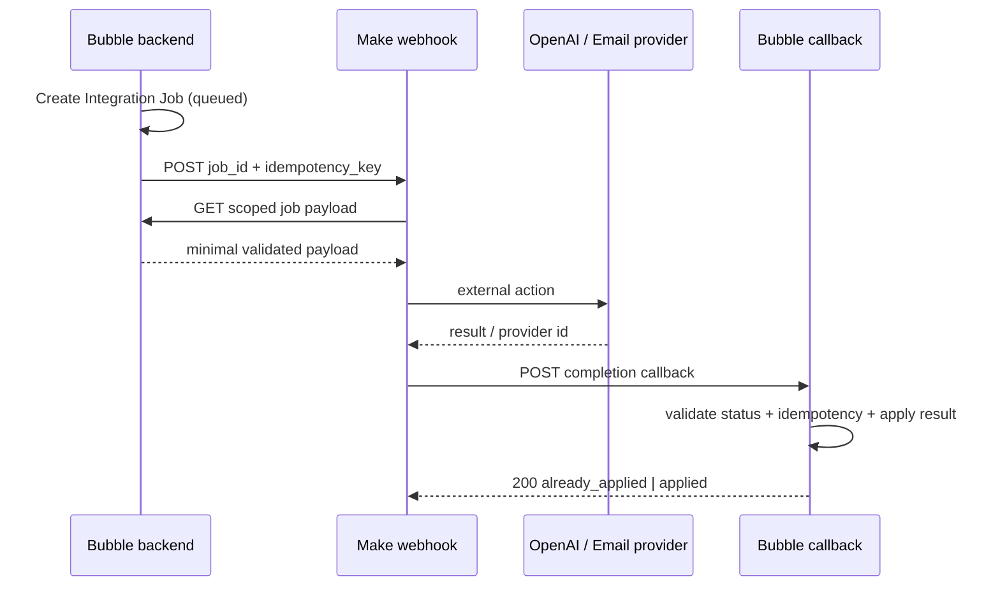

# Специфікація Make для Best Invest Properties

Версія: 1.1  
Дата: 25 вересня 2026  
Оркестратор: Make  
Source of truth: Bubble

> **Версія 1.1.** Архітектура інтеграції не змінилася — Bubble лишається
> системою обліку, Make оркестратором, ідемпотентність і dead-letter працюють
> як описано. Змінено: (1) MK-05 тепер покриває **обидва** типи змін, бо
> availability теж потребує затвердження; (2) додано MK-09 для пакетного
> перерахунку score; (3) уточнено вміст листів при відмові в introduction;
> (4) idempotency key для AI враховує нову версію промпта.

## 1. Роль Make у системі

Make використовується для довгих, зовнішніх і повторюваних процесів:

- генерація AI-наративу через OpenAI;
- transactional email і status notifications;
- доставка introduction після рішення адміністратора;
- digest нових відповідностей і price/availability alerts;
- сповіщення команди про збої;
- майбутня CRM-синхронізація.

Make **не** повинен:

- бути основною базою бізнес-даних;
- самостійно визначати score, yield, tax або approval;
- отримувати Bubble admin token із необмеженим доступом, якщо задачу можна виконати вузьким Workflow API endpoint;
- напряму змінювати published records без server-side перевірки Bubble;
- приймати фінальне юридичне або інвестиційне рішення.

## 2. Загальна схема інтеграції



Bubble створює Integration Job **до** виклику Make. У webhook передається мінімум даних; Make забирає повний scoped payload окремим authenticated запитом. Це зменшує PII у Make queues/logs і не дозволяє підмінити entity data через webhook body.

## 3. Оточення та connections

Окремі Make Teams/папки або принаймні connections для:

- `BIP - Development`
- `BIP - Production`

Connections/секрети:

| Назва | Де зберігається | Правило |
|---|---|---|
| Bubble Workflow API bearer token | Make connection/secret | окремий Dev/Live; rotate quarterly або після інциденту |
| Make custom webhook API key | Bubble API Connector private header | `X-Make-Apikey`; не в URL/Option Set |
| OpenAI API key | Make OpenAI/HTTP connection | production project key з budget/rate limits |
| Email provider API key | Make connection | окремий sending domain/environment |
| Callback shared secret | Make secret + Bubble API Connector/private config | окремий Dev/Live |

Bubble outgoing calls мають використовувати private header parameters. Bubble API Connector зберігає приватні ключі server-side; Development і Live keys задаються окремо.

## 4. Єдиний envelope для webhook

### Request Bubble → Make

```json
{
  "event_version": "1.0",
  "event_type": "ai.analysis.requested",
  "job_id": "job_01J...",
  "entity_type": "unit",
  "entity_id": "unt_01J...",
  "idempotency_key": "ai-analysis:unt_01J:score-v12:prompt-v2",
  "occurred_at": "2026-09-17T12:00:00Z",
  "environment": "live"
}
```

Ключ ідемпотентності містить версію промпта. У v1.1 промпт аналізу
підвищено до `bip-investment-analysis-v2` (п'ять категорій score), тому
попередні ключі автоматично стають недійсними і перегенерація відбудеться
коректно, без ручного очищення.

Headers:

```text
Content-Type: application/json
X-Make-Apikey: <private>
X-Correlation-Id: <job_id>
```

Заборонено передавати в envelope: email, phone, documents, exact address, OpenAI key, Bubble admin key.

### Immediate Make response

```json
{
  "accepted": true,
  "job_id": "job_01J..."
}
```

Make webhook повинен відповідати швидко. Для довгих сценаріїв не чекати результат у Bubble page workflow; UI читає status Integration Job.

### Callback Make → Bubble

```json
{
  "event_version": "1.0",
  "job_id": "job_01J...",
  "idempotency_key": "ai-analysis:unt_01J:score-v12:prompt-v3",
  "status": "succeeded",
  "provider_request_id": "resp_...",
  "result": {},
  "metrics": {
    "duration_ms": 4820,
    "input_tokens": 1850,
    "output_tokens": 620
  },
  "completed_at": "2026-09-17T12:00:05Z"
}
```

Bubble callback workflow:

1. перевіряє bearer/shared secret;
2. знаходить Integration Job по `job_id`;
3. перевіряє `idempotency_key`, job type і дозволений status transition;
4. якщо job уже `succeeded`, повертає `200 {"result":"already_applied"}`;
5. валідовує result fields і current related records;
6. записує бізнес-результат, Audit Event і `succeeded` в одному backend flow;
7. повертає `200 {"result":"applied"}`.

## 5. Реєстр сценаріїв

| ID | Scenario | Trigger | Priority | MVP |
|---|---|---|---|---:|
| MK-01 | Generate investment analysis | instant webhook | high | так |
| MK-02 | Transactional email dispatcher | instant webhook | high | так |
| MK-03 | Approved introduction delivery | instant webhook | critical | так |
| MK-04 | Developer/application decision notification | instant webhook | high | так |
| MK-05 | Price and availability alerts | instant webhook | medium | так |
| MK-06 | Saved-search match digest | scheduled | medium | так |
| MK-07 | Integration dead-letter alert | scheduled/instant | critical | так |
| MK-08 | CRM export | instant webhook | low | після MVP |
| MK-09 | Bulk re-score progress relay | instant webhook | medium | так |

## 6. Детальні сценарії

### MK-01 Generate investment analysis

**Trigger:** Integration Job `job_type = ai_analysis_generate`.

Modules/кроки:

1. Webhooks — Custom webhook with API key.
2. JSON parse + schema/version check.
3. HTTP GET/POST до Bubble endpoint `make_get_ai_payload` з `job_id`.
4. Filter: job status `queued|retry_wait`, entity current, payload hash збігається.
5. HTTP POST `https://api.openai.com/v1/responses` або актуальний Make OpenAI module, якщо він дозволяє передати весь Responses API payload без втрати Structured Outputs.
6. Parse JSON Structured Output.
7. Validate: schema version, source keys, заборонені claims, numbers unchanged.
8. HTTP POST Bubble `make_complete_ai_job`.
9. Webhook response/finish.

Результат не публікується напряму: Bubble створює AI Analysis зі `review_status = pending`.

Error route:

- 429/connection/timeout → Retry handler + incomplete execution;
- invalid model JSON → одна повторна генерація з тим самим input і repair instruction; далі `failed_validation`;
- Bubble 409 stale snapshot → позначити job `cancelled_stale`, не retry;
- OpenAI policy/refusal → `failed_refusal`, показати admin deterministic fallback;
- callback failure → retry callback; не повторювати OpenAI call, якщо provider result уже збережений у execution bundle.

### MK-02 Transactional email dispatcher

**Події:** email verification, password reset (якщо не handled Bubble), application received, verification decision, changes requested, project decision, enquiry received, status update.

Payload містить `notification_id` і `template_key`, а не довільний HTML. Make отримує approved template data з Bubble.

Кроки:

1. Receive job.
2. Fetch Notification payload.
3. Router by `template_key`.
4. Send through email provider.
5. Callback with provider message id.

Правила:

- transactional і marketing email не змішувати;
- marketing повідомлення відправляти лише за активною Consent Record;
- unsubscribe не застосовується до security/transactional messages, але legal review required;
- template version і language записувати в Notification.

### MK-03 Approved introduction delivery

Це high-risk flow, бо розкриває персональні дані обом сторонам.

Preconditions у Bubble до створення job:

- Enquiry status `approved_for_intro`;
- є активна згода investor на contact sharing;
- Unit/Project/Company не suspended;
- Contact Release створений і містить whitelist полів;
- admin confirmation завершено.

Кроки Make:

1. Fetch one-time introduction payload.
2. Send investor email з whitelisted developer contact.
3. Send developer email з whitelisted investor contact.
4. Якщо одна доставка успішна, а друга ні — не відправляти першу повторно; зберегти provider id на channel item і retry лише failed leg.
5. Callback з результатами обох доставок.
6. Bubble переводить `approved_for_intro → introduced` тільки коли required deliveries successful.

Ідемпотентність на рівні каналу:

```text
intro:<enquiry_id>:investor:v1
intro:<enquiry_id>:developer:v1
```

### MK-04 Decision notification

Події:

- developer application `more_info_required|approved|rejected`;
- project `changes_requested|approved|published|rejected`;
- change request `queried|approved|rejected|applied`;
- **v1.1:** enquiry `on_hold` (листів немає) і `declined`.

Make доставляє повідомлення; business transition вже відбувся в Bubble. Failure email не відкочує рішення, але створює admin alert і retry job.

**Правила для відмови в introduction (v1.1, підтверджено прототипом).**

- `on_hold` — **жодного листа** ні інвестору, ні забудовнику. Якщо сценарій
  отримав job на цей статус із шаблоном листа, це помилка конфігурації:
  job має завершитися `failed_validation`, а не відправкою.
- `declined` — **лише один** лист, інвестору, за нейтральним шаблоном:
  об'єкт недоступний, плюс три схожі об'єкти. Причина відмови у лист
  **не потрапляє** і в payload Make **не передається** взагалі.
- Забудовник при відмові листа не отримує; він бачить лише агрегований
  лічильник відфільтрованих запитів у своєму порталі.

Це означає, що payload для `declined` не має містити ні `reason`, ні
`note_private` — інакше причина потрапить у логи Make.

### MK-05 Price and availability alerts

Trigger після успішного apply Change Request і перерахунку financial/score.

**Уточнення v1.1.** Оскільки затверджений прототип вимагає адміністративного
затвердження **і** для ціни, **і** для availability, цей сценарій завжди
запускається з однієї точки — після `apply_change_request`. Окремої гілки для
«негайної» зміни availability не існує; у версії 1.0 така гілка допускалася.

Bubble готує список Notification IDs для:

- investors, що зберегли Unit;
- investors з open Enquiry;
- saved searches, які перестали/почали match.

Make не виконує широкий пошук у Bubble Data API. Fan-out формується backend workflows із batching.

Події:

- price changed by configured threshold;
- `available → reserved|sold`;
- `→ withdrawn` (адміністративна дія, не забудовника);
- listing back to available;
- score verdict changed, якщо це погоджено бізнесом.

### MK-06 Saved-search match digest

Schedule: щодня о 08:00 у timezone користувача або один global UTC batch у MVP.

Bubble endpoint повертає batch Notification IDs, уже сформовані по privacy/business rules. Make відправляє digest і callback. Не виконувати per-user uncontrolled Data API scans у Make.

### MK-07 Integration dead-letter alert

Schedule: кожні 15 хвилин.

1. Запитати Bubble `Integration Job` зі status `failed|dead_letter` або overdue `processing`.
2. Group by job type/error code.
3. Надіслати operational alert відповідальним admins.
4. Не включати PII/payload у subject або chat notification.

Alert містить job id, entity public id, environment, attempts, redacted error, direct admin URL.

### MK-09 Bulk re-score progress relay

**Trigger:** Integration Job `job_type = score_rescore_batch`, створений після
того, як senior admin зберіг нову Score Model Version.

Екран Score Editor у затвердженому прототипі показує прогрес («N of 83»), стан
завершення з можливістю відкоту та стан помилки з референсом і кнопками
«Retry the remainder» / «Roll back to v3». Щоб це працювало без опитування
Bubble з браузера, потрібен сценарій, який повідомляє про поступ.

Кроки:

1. Bubble сам виконує перерахунок пакетами у backend workflow (обчислення
   лишається в Bubble — Make score не рахує).
2. Після кожного пакета Bubble оновлює `processed_count` в Integration Job.
3. MK-09 надсилає операційне сповіщення лише у двох випадках: повне завершення
   і остаточна помилка після вичерпання спроб.
4. Проміжний прогрес UI читає безпосередньо з Integration Job.

Правила:

- перерахунок **ніколи** не переписує історичні Listing Score — створюються
  нові записи, старі отримують `is_current = no` (BR-04);
- відкат до попередньої версії моделі — це новий пакетний job, а не видалення;
- часткова помилка лишає каталог у змішаному стані, тому alert має рівень P2
  і повідомлення має прямо називати кількість опрацьованих об'єктів.

## 7. Ідемпотентність і concurrency

Правила для кожного scenario:

- `idempotency_key` створює Bubble, Make не генерує його сам;
- перед side effect Make перевіряє актуальний Job status;
- після side effect зберігає provider id і повертає його в callback;
- повторний bundle з тим самим key не відправляє email/AI request повторно, якщо provider id уже існує;
- для Unit change jobs ключ включає target version;
- для webhook scenarios, де порядок важливий, увімкнути **Process data in order**;
- для незалежних email jobs дозволений parallel processing з provider rate limit.

Make webhooks за замовчуванням обробляються паралельно, тому ordering не можна вважати гарантованим без відповідного scenario setting.

## 8. Error handling policy

У всіх production scenarios:

- `Store incomplete executions = Yes`;
- automatic retry для connection/rate-limit/timeouts;
- Retry error handler для важливих зовнішніх модулів;
- no silent Ignore/Skip для AI, introduction, decisions або transactional email;
- invalid business data → callback `failed_validation`, без нескінченних retry;
- temporary failure → exponential/backoff retry;
- permanent 4xx authentication/configuration failure → dead letter + alert;
- 3–5 attempts залежно від provider, після чого manual resolution;
- `Discard data if storage is full = No` для critical scenarios;
- `Commit after each module` не вмикати без конкретної потреби; side effects контролювати власною channel-level idempotency.

Make incomplete executions — механізм відновлення, а не довготривале сховище. Critical data лишається в Bubble Integration Job/Notification.

## 9. Data Store у Make

Дозволені випадки:

- короткочасний dedup/lock по idempotency key, якщо scenario module вимагає;
- cache не-sensitive reference data;
- cursor технічного scheduled batch.

Заборонено:

- master records Users, Projects, Units, Enquiries;
- копії verification documents;
- довготривале зберігання contact data;
- єдине джерело delivery status.

Якщо Data Store використовується для dedup, record key = idempotency key, TTL очищається scheduled maintenance, а authoritative status однаково перевіряється в Bubble.

## 10. Логи та конфіденційність

- У Make scenario logs не передавати більше даних, ніж необхідно.
- Для introduction і PII-heavy flows розглянути `Keep data confidential`, але врахувати, що це обмежує debugging; рішення має бути узгоджене з incident procedure.
- Error message, що повертається в Bubble, redacted: без token, email, document URL, raw OpenAI prompt.
- Correlation ID = Integration Job public_id у Bubble, Make і зовнішньому metadata.
- Retention Make logs/incomplete executions документується окремо як subprocessor setting.

## 11. Моніторинг і SLA

Dashboard метрики:

| Метрика | Target MVP |
|---|---:|
| Webhook acceptance p95 | < 2 s |
| AI job complete p95 | < 60 s |
| Transactional email queued p95 | < 2 min |
| Introduction complete p95 | < 5 min |
| Failed jobs after retries | < 1% |
| Duplicate side effects | 0 |
| Jobs stuck processing > 15 min | 0 |

Alert levels:

- P1: introduction delivered to one party only; possible data leak; credential compromise.
- P2: AI/transactional scenario dead-letter, >5 consecutive failures, provider auth error.
- P3: digest delay, individual noncritical email failure.

## 12. Naming convention у Make

```text
BIP | PROD | MK-01 | Generate investment analysis
BIP | DEV  | MK-01 | Generate investment analysis
```

Webhook names, connections і data stores мають містити environment. Scenario notes повинні містити owner, purpose, payload version, Bubble endpoints, retry policy та last review date.

## 13. Тестові сценарії

Обов'язково перевірити:

1. валідний AI job → pending review AI Analysis;
2. duplicate webhook → один AI call/один result;
3. OpenAI 429 → retry без duplicate callback;
4. stale score version → cancel без publication;
5. malformed structured output → one repair attempt → failure;
6. approved introduction → два унікальні email і status `introduced`;
7. failure другого introduction email → retry тільки другого;
8. invalid/missing consent → job не створюється;
9. Bubble callback timeout після external success → retry callback, не side effect;
10. Make queue/rate-limit response → Bubble job залишається retryable;
11. email opt-out → marketing digest не відправляється, transactional відправляється за правилами;
12. private data не видно в non-admin Make alert;
13. **v1.1:** enquiry `on_hold` → жодного листа; job із шаблоном листа на цей
    статус завершується `failed_validation`;
14. **v1.1:** enquiry `declined` → рівно один лист інвестору, причина відсутня
    і в тілі листа, і в payload, і в логах Make;
15. **v1.1:** зміна availability без затвердженого Change Request не створює
    job на alert;
16. **v1.1:** перерахунок score із частковою помилкою залишає історичні
    Listing Score недоторканими і дає P2-alert із кількістю опрацьованих.

## 14. Критерії готовності Make

- усі production webhooks захищені API key/secret і мають versioned schema;
- усі critical scenarios мають incomplete executions, retry route і dead-letter alert;
- secrets розділені Dev/Live і не присутні в payload/URL/log text;
- кожний scenario має documented owner і rollback/disable procedure;
- manual replay не породжує duplicate email, AI analysis або status event;
- Bubble admin бачить status, attempts і redacted error для кожного job;
- фінансові/approval рішення не залежать від Make Data Store;
- introduction PII передається тільки після explicit Bubble authorization і consent validation.

