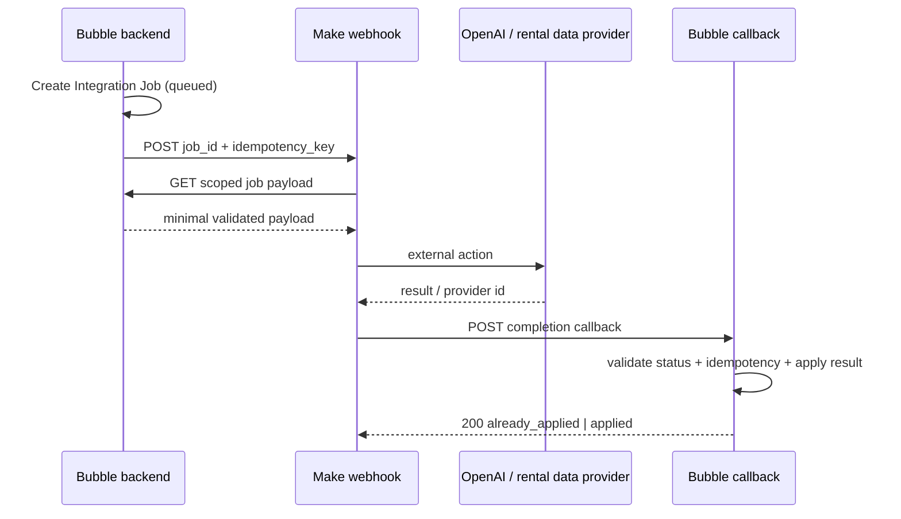

# Специфікація Make для Best Invest Properties

Дата: 25 вересня 2026  
Оркестратор: Make  
Source of truth: Bubble

> **Межа відповідальності:** Make **збирає** дані, Bubble **зберігає й
> рахує**, OpenAI **пояснює**. Жоден сценарій Make не записує опублікованої
> фінансової цифри.

## 1. Роль Make у системі

Make використовується для довгих, зовнішніх і повторюваних процесів:

- **збір порівняльних оголошень оренди** з погоджених порталів і
  market-data providers;
- генерація AI-наративу через OpenAI;
- сповіщення команди про власні збої (вбудовані error notifications);
- майбутня CRM-синхронізація (після MVP).

Make не надсилає жодних листів. Усі листи платформи надсилає Bubble — див. FR-12 специфікації проєкту.

Make **не** повинен:

- бути основною базою бізнес-даних;
- самостійно визначати score, yield, tax або approval;
- отримувати Bubble admin token із необмеженим доступом, якщо задачу можна виконати вузьким Workflow API endpoint;
- напряму змінювати published records без server-side перевірки Bubble;
- приймати фінальне юридичне або інвестиційне рішення.

## 2. Загальна схема інтеграції



Bubble створює Integration Job **до** виклику Make. У webhook передається мінімум даних; Make забирає повний scoped payload окремим authenticated запитом. Це зменшує PII у Make queues/logs і не дозволяє підмінити entity data через webhook body.

## 3. Оточення та connections

Окремі Make Teams/папки або принаймні connections для:

- `BIP - Development`
- `BIP - Production`

Connections/секрети:

| Назва | Де зберігається | Правило |
|---|---|---|
| Bubble Workflow API bearer token | Make connection/secret | окремий Dev/Live; rotate quarterly або після інциденту |
| Make custom webhook API key | Bubble API Connector private header | `X-Make-Apikey`; не в URL/Option Set |
| OpenAI API key | Make OpenAI/HTTP connection | production project key з budget/rate limits |
| Callback shared secret | Make secret + Bubble API Connector/private config | окремий Dev/Live |

Bubble outgoing calls мають використовувати private header parameters. Bubble API Connector зберігає приватні ключі server-side; Development і Live keys задаються окремо.

## 4. Єдиний envelope для webhook

### Request Bubble → Make

```json
{
  "event_version": "1.0",
  "event_type": "ai.analysis.requested",
  "job_id": "job_01J...",
  "entity_type": "unit",
  "entity_id": "unt_01J...",
  "idempotency_key": "ai-analysis:unt_01J:score-v12:prompt-v1",
  "occurred_at": "2026-09-17T12:00:00Z",
  "environment": "live"
}
```

Ключ ідемпотентності містить версію промпта. Коли промпт аналізу отримує нову
версію, попередні ключі автоматично стають недійсними, і перегенерація
відбувається коректно, без ручного очищення.

Headers:

```text
Content-Type: application/json
X-Make-Apikey: <private>
X-Correlation-Id: <job_id>
```

Заборонено передавати в envelope: email, phone, documents, exact address, OpenAI key, Bubble admin key.

### Immediate Make response

```json
{
  "accepted": true,
  "job_id": "job_01J..."
}
```

Make webhook повинен відповідати швидко. Для довгих сценаріїв не чекати результат у Bubble page workflow; UI читає status Integration Job.

### Callback Make → Bubble

```json
{
  "event_version": "1.0",
  "job_id": "job_01J...",
  "idempotency_key": "ai-analysis:unt_01J:score-v12:prompt-v1",
  "status": "succeeded",
  "provider_request_id": "resp_...",
  "result": {},
  "metrics": {
    "duration_ms": 4820,
    "input_tokens": 1850,
    "output_tokens": 620
  },
  "completed_at": "2026-09-17T12:00:05Z"
}
```

Bubble callback workflow:

1. перевіряє bearer/shared secret;
2. знаходить Integration Job по `job_id`;
3. перевіряє `idempotency_key`, job type і дозволений status transition;
4. якщо job уже `succeeded`, повертає `200 {"result":"already_applied"}`;
5. валідовує result fields і current related records;
6. записує бізнес-результат, Audit Event і `succeeded` в одному backend flow;
7. повертає `200 {"result":"applied"}`.

## 5. Реєстр сценаріїв

У MVP — **два** сценарії Make. Експорт у CRM (MK-08) — після MVP.

| ID | Scenario | Trigger | MVP |
|---|---|---|---|
| MK-10 | Comparable rental data collection | scheduled | **так** — головна причина, навіщо потрібен Make |
| MK-01 | Generate investment analysis | instant webhook | **так** |

## 6. Детальні сценарії

### MK-01 Generate investment analysis

**Trigger:** Integration Job `job_type = ai_analysis_generate`.

Modules/кроки:

1. Webhooks — Custom webhook with API key.
2. JSON parse + schema/version check.
3. HTTP GET/POST до Bubble endpoint `make_get_ai_payload` з `job_id`.
4. Filter: job status `queued|retry_wait`, entity current, payload hash збігається.
5. HTTP POST `https://api.openai.com/v1/responses` або актуальний Make OpenAI module, якщо він дозволяє передати весь Responses API payload без втрати Structured Outputs.
6. Parse JSON Structured Output.
7. Validate: schema version, source keys, заборонені claims, numbers unchanged.
8. HTTP POST Bubble `make_complete_ai_job`.
9. Webhook response/finish.

Результат не публікується напряму: Bubble створює AI Analysis зі `review_status = pending`.

Error route:

- 429/connection/timeout → Retry handler + incomplete execution;
- invalid model JSON → одна повторна генерація з тим самим input і repair instruction; далі `failed_validation`;
- Bubble 409 stale snapshot → позначити job `cancelled_stale`, не retry;
- OpenAI policy/refusal → `failed_refusal`, показати admin deterministic fallback;
- callback failure → retry callback; не повторювати OpenAI call, якщо provider result уже збережений у execution bundle.

### Сповіщення про збої й перерахунок score — без окремих сценаріїв

- **Сповіщення про збої:** вбудовані сповіщення Make про помилки сценаріїв (email команді) плюс екран A10 Automation Monitor у Bubble — список failed і stuck Integration Job з кнопкою Retry. Окремий сценарій не потрібен.
- **Пакетний перерахунок score:** Bubble рахує пакетами в backend workflow і оновлює `processed_count` в Integration Job; Score Editor читає прогрес звідти напряму. Історичні Listing Score ніколи не перезаписуються (BR-04); відкат — новий пакет, а не видалення.

### MK-10 Comparable rental data collection

**Trigger:** розклад. Частота визначається умовами кожного provider і
задається в атрибутах Option Set `Data Provider`.

Оцінка ринкової оренди формується зі зібраних порівняльних оголошень, а не
вручну аналітиком.

Кроки:

1. Отримати з Bubble перелік активних провайдерів (Option Set `Data Provider`) і наборів параметрів,
   для яких потрібна свіжа вибірка. «Потрібна» означає: поточна вибірка
   старша за `Country Config.max_comparable_age_days` (дефолт **90**) або
   відсутня взагалі. Перелік формує Bubble — Make сам не вирішує, що
   застаріло.
2. Для кожного набору звернутися до офіційного API або feed провайдера.
3. Нормалізувати відповідь за: країною, містом/районом, типом нерухомості,
   кількістю спалень, площею.
4. Обчислити `listings_count`, `rent_min`, `rent_median`, `rent_max`.
5. Відправити результат у Bubble одним callback — створюється
   **Rental Comparable Set** зі `review_status = pending`.

Правила:

- Make **не** записує результат у Financial Input і не змінює жодної
  опублікованої цифри. Він створює вибірку, яку адміністратор перевіряє;
- вибірка з `listings_count` нижче `Country Config.min_comparable_listings`
  (дефолт **5**) все одно зберігається, але позначається як недостатня і не
  може бути затверджена — Make її не відкидає, рішення ухвалює Bubble;
- вибірка у смузі від мінімуму до `sufficient_comparable_listings`
  (дефолт **10**) зберігається з позначкою **thin sample**;
- нова вибірка не перезаписує попередню (`is_current` перемикає Bubble);
- `collection_method` фіксує спосіб отримання — `api`, `feed` або
  `manual_import` для fallback;
- rate limit і умови використання кожного provider налаштовуються окремо;
  перевищення ліміту — не помилка, а привід зменшити частоту розкладу;
- якщо provider недоступний кілька циклів поспіль, створюється operational
  alert: оцінка оренди застаріває мовчки, і це треба бачити.

**Fallback без API.** Якщо для порталу немає дозволеного API або feed,
вибірка вноситься вручну через адмінку Bubble. Make у цьому випадку не
задіяний, але запис створюється того самого типу й з тими самими полями.

**Юридичне застереження.** Підключення кожного джерела потребує перевірки
умов використання даних. Це не технічне, а договірне питання — див.
атрибут `terms_reference` в Option Set `Data Provider`.

## 7. Ідемпотентність і concurrency

Правила для кожного scenario:

- `idempotency_key` створює Bubble, Make не генерує його сам;
- перед side effect Make перевіряє актуальний Job status;
- після side effect зберігає provider id і повертає його в callback;
- повторний bundle з тим самим key не повторює AI request і не зберігає вибірку двічі, якщо provider id уже існує;
- для Unit change jobs ключ включає target version;
- для webhook scenarios, де порядок важливий, увімкнути **Process data in order**;
- для незалежних jobs дозволений parallel processing з provider rate limit.

Make webhooks за замовчуванням обробляються паралельно, тому ordering не можна вважати гарантованим без відповідного scenario setting.

## 8. Error handling policy

У всіх production scenarios:

- `Store incomplete executions = Yes`;
- automatic retry для connection/rate-limit/timeouts;
- Retry error handler для важливих зовнішніх модулів;
- no silent Ignore/Skip для AI-аналізу чи збору оренди;
- invalid business data → callback `failed_validation`, без нескінченних retry;
- temporary failure → exponential/backoff retry;
- permanent 4xx authentication/configuration failure → dead letter + alert;
- 3–5 attempts залежно від provider, після чого manual resolution;
- `Discard data if storage is full = No` для critical scenarios;
- `Commit after each module` не вмикати без конкретної потреби; side effects контролювати власною channel-level idempotency.

Make incomplete executions — механізм відновлення, а не довготривале сховище. Critical data лишається в Bubble Integration Job.

## 9. Data Store у Make

Дозволені випадки:

- короткочасний dedup/lock по idempotency key, якщо scenario module вимагає;
- cache не-sensitive reference data;
- cursor технічного scheduled batch.

Заборонено:

- master records Users, Projects, Units, Enquiries;
- копії verification documents;
- довготривале зберігання contact data;
- єдине джерело delivery status.

Якщо Data Store використовується для dedup, record key = idempotency key, TTL очищається scheduled maintenance, а authoritative status однаково перевіряється в Bubble.

## 10. Логи та конфіденційність

- У Make scenario logs не передавати більше даних, ніж необхідно.
- Make не обробляє персональних даних інвесторів чи забудовників: лише факти про об'єкт і public IDs.
- Error message, що повертається в Bubble, redacted: без token, email, document URL, raw OpenAI prompt.
- Correlation ID = Integration Job public_id у Bubble, Make і зовнішньому metadata.
- Retention Make logs/incomplete executions документується окремо як subprocessor setting.

## 11. Моніторинг і SLA

Dashboard метрики:

| Метрика | Target MVP |
|---|---:|
| Webhook acceptance p95 | < 2 s |
| AI job complete p95 | < 60 s |
| Failed jobs after retries | < 1% |
| Duplicate side effects | 0 |
| Jobs stuck processing > 15 min | 0 |

Alert levels:

- P1: possible data leak; credential compromise.
- P2: AI/transactional scenario dead-letter, >5 consecutive failures, provider auth error.
- P3: затримка збору вибірки оренди.

## 12. Naming convention у Make

```text
BIP | PROD | MK-01 | Generate investment analysis
BIP | DEV  | MK-01 | Generate investment analysis
```

Webhook names, connections і data stores мають містити environment. Scenario notes повинні містити owner, purpose, payload version, Bubble endpoints, retry policy та last review date.

## 13. Тестові сценарії

Обов'язково перевірити:

1. валідний AI job → AI Analysis зі `review_status = pending`;
2. duplicate webhook → один AI call / один result;
3. OpenAI 429 → retry без duplicate callback;
4. stale score version → cancel без publication;
5. malformed structured output → one repair attempt → failure;
6. Bubble callback timeout після external success → retry callback, не зовнішнього виклику;
7. Make queue/rate-limit response → Bubble job залишається retryable;
8. жодних персональних даних у payload, логах чи сповіщеннях Make;
9. MK-10 створює Rental Comparable Set зі `review_status = pending` і не змінює жодного Financial Input;
10. вибірка з `listings_count` = 4 при мінімумі 5 зберігається, але не може бути затверджена; вибірка з 7 затверджується з позначкою thin sample; вибірка старша за 90 днів не пропонується як джерело;
11. недоступність provider кілька циклів поспіль дає alert, а не мовчазне застарівання оцінки;
12. повторний запуск MK-10 за тими самими параметрами не створює дубль поточної вибірки.

## 14. Критерії готовності Make

- усі production webhooks захищені API key/secret і мають versioned schema;
- усі critical scenarios мають incomplete executions, retry route і dead-letter alert;
- secrets розділені Dev/Live і не присутні в payload/URL/log text;
- кожний scenario має documented owner і rollback/disable procedure;
- manual replay не породжує duplicate AI analysis чи вибірку оренди;
- Bubble admin бачить status, attempts і redacted error для кожного job;
- фінансові/approval рішення не залежать від Make Data Store;
- Make не отримує персональних даних.

