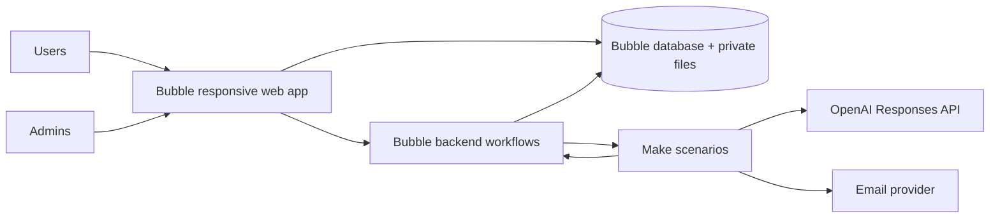

# Повна специфікація MVP Best Invest Properties

Версія: 1.1  
Дата: 25 вересня 2026  
Цільова платформа: Bubble.io  
Інтеграції: Make, OpenAI API, transactional email provider

> **Версія 1.1 — звірення із затвердженим прототипом.** Документ оновлено під
> візуальний прототип, який затвердила Марина (33 екрани, з них 2 позначені як
> superseded). Прототип є джерелом істини для **інтерфейсу та видимої
> поведінки**; бізнес-правила беруться з вимог Марини. Демонстраційні числа й
> обчислення прототипу **не** є підтвердженою фінансовою методологією — див.
> §21 і `CHANGELOG-2026-09-25.md`.

## 1. Executive summary

Best Invest Properties — marketplace/controlled introduction platform для інвестиційної нерухомості в Іспанії та на Кіпрі. Платформа дозволяє:

- інвестору знайти конкретний доступний unit, порівняти фінансові показники, переглянути score та запитати introduction;
- забудовнику пройти перевірку, подати проєкт і підтримувати ціну та availability;
- команді Best Invest перевіряти всі публічні дані, score, AI-наратив і розкриття контактів.

MVP не є фінансовим радником, transaction platform або повним CRM. Його цінність — контрольований каталог з прозорими метриками, перевіреним текстовим аналізом і керованим lead/introduction flow.

## 2. Цілі та показники успіху

### Product goals

1. Дати інвестору зрозумілий шлях від критеріїв до enquiry по конкретному unit.
2. Дати верифікованому developer керований self-service submission flow.
3. Зберегти editorial/approval control у Best Invest.
4. Зробити кожний score, yield і narrative відтворюваним та auditable.
5. Запустити Spain/Cyprus без hard-coded country logic, щоб додавання нового ринку не вимагало перебудови бази.

### Launch KPIs

| KPI | Початкова ціль |
|---|---:|
| Search → property detail CTR | виміряти baseline; ціль після 30 днів |
| Property detail → enquiry conversion | ≥ 3% qualified traffic |
| Registration completion | ≥ 55% тих, хто почав форму |
| Developer application completion | ≥ 40% |
| Project submission without support intervention | ≥ 70% |
| Admin introduction decision within SLA | ≥ 90% |
| Duplicate enquiries/automations | 0 critical duplicates |
| Published records with complete traceability | 100% |

KPI targets є робочими та мають бути підтверджені product owner.

## 3. Ролі

| Роль | Основні права |
|---|---|
| Anonymous visitor | landing, search, public unit detail; gating analysis/score визначається рішенням |
| Investor | save, saved search, calculator scenarios, enquiry, dashboard, settings/data rights |
| Developer applicant | application status, requested information, draft preparation за правилом |
| Verified developer member | own company/projects/units, change requests, masked leads |
| Support admin | read/support, limited user lookup, no publish/contact release |
| Reviewer admin | verify developer/project/AI, request changes, manage enquiries |
| Senior admin | publish, change score model, approve contact release, manage permissions |

Один User може мати кілька ролей, але MVP UI показує один active workspace at a time.

**Звірення з прототипом (v1.1).** Прототип реалізує три робочі простори —
публічний/інвесторський, developer portal і admin — і **один** набір admin-навігації
(Dashboard · Approvals · Investors · Investment Scores). Поділу admin-інтерфейсу на
support / reviewer / senior у прототипі немає: усі admin-дії показані одному
користувачеві. Розмежування Support / Reviewer / Senior залишається чинною бізнес-вимогою
і реалізується правами на рівні Bubble (`admin_permission_keys` + `Only when` у backend
workflows), а не окремими екранами. Дії, що в таблиці прав належать лише senior admin
(publish, contact release, зміна score-моделі), у прототипі доступні з тих самих екранів —
під час реалізації вони мають ховатися/блокуватися за правами. **Відкрите питання
OQ-08**: чи потрібне правило «four eyes».

## 4. Архітектурні рішення (ADR)

| ID | Рішення | Наслідок |
|---|---|---|
| ADR-01 | Investor browses Unit | search/detail/enquiry прив'язані до concrete availability/price |
| ADR-02 | Project → Unit Type → Unit | повторювані floor plans без дублювання; індивідуальні price/status |
| ADR-03 | Single villa = one-unit Project | одна модель і один workflow |
| ADR-04 | One User, multiple roles | єдиний auth store; role-based routing |
| ADR-05 | Application creates User/Company immediately | applicant може бачити статус і доповнювати дані |
| ADR-06 | Enquiry is aggregate root | один canonical lifecycle; role-specific labels лише presentation |
| ADR-07 | Score/financials deterministic, AI narrative only | цифри відтворювані; AI failure не блокує core product |
| ADR-07a | **Уточнено v1.1:** автоматичний крок аналізу може *пропонувати* вхідні фінансові оцінки (орендна плата, витрати), але вони не публікуються без затвердження адміністратором; усі похідні значення й score рахує детермінований сервіс | зберігає відтворюваність, але легалізує екран A04 затвердженого прототипу. Потребує підтвердження — OQ-02 |
| ADR-08 | Bubble source of truth, Make orchestrator | простіше audit, retry, privacy та recovery |

## 5. Технічна архітектура

### Відповідальність компонентів

- Bubble pages: UI, route guards, forms, client calculations лише для preview.
- Bubble backend workflows: authorization, validation, deterministic calculations, status transitions, final writes.
- Bubble database: authoritative state, versions, audit, consent, integration jobs.
- Make: async external calls, retry, email delivery, operational routing.
- OpenAI: reviewed narrative only.
- Email provider: transactional delivery; provider вибирається окремо.

## 6. Інформаційна архітектура та екрани

Колонка «Прототип» показує номер екрана в затвердженому прототипі. `—` означає,
що екран у прототипі відсутній і його потрібно спроєктувати під час build.

### Public / investor

| ID | Екран | Прототип | MVP status |
|---|---|---|---|
| P01 | Landing / Home | 01 | затверджено |
| P02 | Investment Search & Results (Browse) | 02 | затверджено |
| P03 | Property/Unit Detail | 04 | затверджено |
| P04 | Investment Analysis | 05 | затверджено |
| P05 | Financial Calculator | 06 | затверджено |
| P06 | Compare Investments | 07 | затверджено |
| P07 | Investor Registration | 08 | затверджено |
| P08 | Login | 15 | затверджено |
| P09 | Forgot Password / expired link | 24 | затверджено |
| P10 | Investor Dashboard | 09 | затверджено |
| P11 | Saved Searches | — | у прототипі це панель на P10, окремого екрана немає |
| P12 | Enquiry Detail | — | build minimal; у прототипі лише рядок у списку на P10 |
| P13 | Account Settings | 25 | затверджено |
| P14 | Privacy, Terms | 17, 18 | макет затверджено; текст — draft до legal sign-off |
| P14b | Cookie Policy, Investment/AI Disclaimer | — | окремих сторінок немає; **OQ-10** |
| P15 | How It Works / About / Contact | частково | «How it works» — секція-якір на P01; окремих About/Contact немає |

Екрани **02-old «Investment Search»** і **03-old «Search Results»** позначені у
прототипі як `OLD` (superseded) і замінені об'єднаним P02. У реалізацію не беруться.

### Developer

| ID | Екран | Прототип | MVP status |
|---|---|---|---|
| D01 | For Developers | 16 | затверджено |
| D02 | Developer Sign-up | 19 | затверджено |
| D03 | Verification Status / Re-upload | 26 | затверджено (був «missing in prototype») |
| D04 | Developer Portal | 10 | затверджено |
| D05 | Company Profile | 27 | затверджено (був «missing in prototype») |
| D06 | Add/Edit Draft Project | 11 | затверджено |
| D07 | My Projects | 20 | затверджено |
| D08 | Project & Units | 21 | затверджено |
| D09 | Changes Requested | 10 (стан `changes`) | реалізовано як стан порталу D04, не окремий екран |
| D10 | Leads | 22 | затверджено |
| D11 | Lead Detail / outcome | — | build minimal; у прототипі лише рядок таблиці на D10 |

### Admin

| ID | Екран | Прототип | MVP status |
|---|---|---|---|
| A01 | Admin Login / role gate | 31 | затверджено (був «add») |
| A02 | Dashboard | 12 | затверджено |
| A03 | Unified Approvals Queue | 23 | затверджено; чотири секції (див. §6.1) |
| A04 | Project Review | 28 | затверджено (був «add; launch blocker») |
| A05 | Developer Verification | 29 | затверджено (був «add; launch blocker») |
| A06 | AI / Analysis Review | 28 (панель) | **об'єднано з A04**, окремого екрана немає — див. §6.2 і OQ-02 |
| A07 | Score Model Versions | 13 | екран ваг затверджено; списку версій немає — **OQ-05** |
| A08 | Enquiries / Contact Release | 12 + 23 | розділено: таблиця enquiries на A02, рішення — у секції Introductions на A03 |
| A09 | Users and Companies lookup | 30 | затверджено як «User Management» (інвестори + контакти забудовників) |
| A10 | Audit & Automation Monitor | — | екрана немає; у прототипі лише згадка «logged to the automation monitor». **Потрібно спроєктувати** — OQ-12 |
| A11 | Country/Cost Config | — | екрана немає. **Потрібно спроєктувати**, інакше cost/tax правила редагуються лише в БД — OQ-12 |
| A12 | User Journeys (внутрішня діаграма) | 14 | довідковий екран для команди; не частина продукту для клієнтів |

Admin-навігація у прототипі має рівно чотири пункти: **Dashboard · Approvals ·
Investors · Investment Scores**. A04, A05 відкриваються з черги A03 і мають кнопку
повернення «← Approvals queue»; окремих пунктів меню не мають.

### 6.1 Структура черги затверджень (A03)

Одна черга, перемикач типу — п'ять вкладок: **All · Project submissions ·
Developer applications · Introductions · Listing changes**. Секції:

| Секція | Джерело | Дії в рядку |
|---|---|---|
| New project submissions | Project `submitted` | «Open review» → A04 |
| Developer applications | Developer Application `submitted/under_review` | «Open verification» → A05 |
| Investor introductions | Enquiry, що очікує рішення | Approve & connect · Hold · Decline |
| Listing change requests | Change Request по price/availability | Approve · Query · Reject |

Кожна секція показує лічильник «N WAITING», який зменшується після рішення.
Після рішення рядок замінюється блоком результату з переліком надісланих листів
(чипи «✉ Investor notified», «✉ Developer notified») і кнопкою **Undo**.
Стан «Queue clear» — окремий порожній стан усього екрана.

`Hold`, `Decline`, `Query` і `Reject` вимагають обов'язкового текстового
обґрунтування (модальне вікно не дає підтвердити без нього). `Approve` для
introduction і для project-submission обґрунтування не вимагає, але показує
попередження про незворотність розкриття контактів.

> **Розбіжність із FR-11.** У специфікації 1.0 було: «No decision disappears on
> Hold/Query: owner and due date required». Прототип для Hold/Query вимагає лише
> причину; поля owner і due date відсутні. Рішення — **OQ-07**.

### 6.2 Панель аналізу в Project Review (A04)

Екран A04 містить панель «Investment analysis» з двома станами
(`Awaiting review` / `Reviewed & approved`) і такими блоками:

1. **Метрики**: Investment score, Gross yield, Net yield.
2. **AI-proposed financial estimates** — рядки з позначкою походження:
   `Proposed` (запропоновано кроком аналізу), `Assumption` (платформенне
   значення за замовчуванням), `Calculated` (детерміновано обчислено).
3. **Category assessments** — п'ять критеріїв із балами й поясненням.
4. **Sources, assumptions & gaps** — теги `SOURCE`, `DEVELOPER`, `ESTIMATE`, `GAP`.
5. Примітка: «Analysis uses the agreed free/open sources. Information gaps are
   flagged for review or manual input».

До затвердження панель підписана «Not yet visible to investors»; після —
«Published … Investors see this saved version».

> **Суттєва розбіжність, потребує рішення (OQ-02).** Специфікація OpenAI 1.0
> прямо забороняє AI обчислювати rent, costs і yield. Прототип показує, що крок
> аналізу **пропонує вхідні фінансові оцінки** (очікувана орендна плата,
> регулярні витрати), які адміністратор перевіряє та затверджує, після чого
> детермінований сервіс рахує похідні значення й score. Це сумісно з принципом
> «AI не записує фінанси напряму» лише якщо запропоновані значення трактуються як
> **чернетка вхідних даних під обов'язкове людське затвердження**. Саме так це
> зафіксовано в §8 FR-03a і в специфікації OpenAI 1.1 (use case AI-03).
> Потрібне підтвердження Марини щодо джерела цих оцінок.

### 6.3 Стани екранів

Прототип реалізує перемикач **PREVIEW STATE** на кожному екрані, який має
нетривіальні стани. Це не частина продукту — це демонстраційний перемикач, щоб
показати стани без бекенду. Перелік нижче є обов'язковим обсягом реалізації.

| Екран | Стани у прототипі |
|---|---|
| P02 Browse | `Results` · `Loading` (скелетони) · `Query failed` (помилка з повтором); окремо `Signed in` / `Signed out`; порожній результат фільтрів |
| P03 Detail | `Published` · `Enquiry sent` · `Analysis not ready` · `Withdrawn / 404` |
| P04 Analysis | `Full analysis` · `Narrative unavailable` (детермінований fallback) |
| P05 Calculator | валідація полів; блок результату не рахується за наявності помилок |
| P06 Compare | порожньо (<2 об'єктів) · 2–3 об'єкти · ліміт при спробі додати 4-й |
| P08 Login | `Credentials` · `Two-factor` · `Locked`; стан помилки входу |
| P09 Forgot password | `Request` · `Sent` · `Reset` · `Done` |
| P10 Dashboard | `Active investor` · `First day — nothing yet` (порожній стан) |
| P13 Account settings | `idle` · `Saving…` · `Saved` |
| D04 Developer portal | `verified` · `pending` · `changes` · `approved` |
| D03 Verification status | `pending` · `more info required` · `rejected`; прогрес завантаження документа |
| D06 Add project | помилки обов'язкових полів (перемикач «показати помилки»); прогрес і помилка вивантаження файлів |
| A02 Admin dashboard | `Queue has work` · `Nothing to review`; результат рішення по картці |
| A03 Approvals queue | `Queue has work` · `Queue clear`; результат рішення по кожному рядку |
| A04 Project review | `Awaiting review` · `Reviewed & approved` |
| A07 Score editor | `idle` · `running` (прогрес N of 83) · `done` · `failed` |

Наскрізні системні стани, які прототип не показує, але які лишаються в обсязі:
`403`, maintenance, session expired, offline/network error, stale record/conflict,
duplicate submit, unsaved changes guard. `404` показано як стан «Withdrawn» на P03.

**Toast і модальні вікна — глобальні.** Один toast (автозакриття ~3.8 с, клік —
закрити) і одне модальне вікно підтвердження на весь застосунок. Модальне вікно
має: заголовок, текст, необов'язкову примітку, необов'язкове обов'язкове поле
причини, кнопки Cancel / підтвердження. Тон підтвердження: звичайний (синій) або
небезпечний (темно-червоний).

## 7. End-to-end flows

### 7.1 Investor discovery → enquiry

1. Visitor sets country, budget, bedrooms/type and minimum yield on Landing.
2. P02 opens with query parameters and live search constraints.
3. Visitor sorts/filters, saves to compare in session.
4. P03 shows one Unit with project context, approved media, availability, financials and score.
5. P04 explains deterministic score; AI narrative is labelled reviewed/AI-assisted.
6. P05 recalculates scenario locally and optionally saves after login.
7. P06 compares 2–3 Units; each row has canonical better direction.
8. “Request information/analysis” opens login/registration when anonymous.
9. Investor reviews contact-sharing consent and submits Enquiry.
10. Confirmation shows reference and `submitted` status.
11. Admin screens enquiry; on approval, confirms Contact Release.
12. Make sends both introductions; Enquiry moves to `introduced` after required deliveries.
13. Investor sees history in P12, developer sees role-safe status in D10/D11.

### 7.2 Developer application → verified portal

1. D02 creates User, Developer Company and Application draft.
2. Applicant fills company/contact/markets and uploads private documents.
3. Submit validates required fields/document matrix and records consents.
4. D03 shows `submitted/under_review` with application reference.
5. Admin A05 reviews document-by-document.
6. `more_info_required` unlocks relevant upload/fields and shows public reviewer message.
7. Approved application creates/activates Company Membership and developer role.
8. Rejected application retains reason, support path and allowed resubmission policy.

### 7.3 Project submission → publication

1. Verified developer creates Project draft.
2. Adds Unit Types, Units, media and private documents.
3. Readiness checklist is calculated from explicit submission rules.
4. Save draft is autosafe/manual; unsaved changes guard works.
5. Submit creates immutable Project Content Version and status `submitted`.
6. Admin A04 sees full media/documents/financial inputs and validation summary.
7. Request Changes creates structured request; D09 shows fields/reason and resubmit path.
8. Approve does not publish automatically unless business confirms combined action.
9. Publish requires senior permission and complete current score/analysis.
10. Published Units appear in P02; Project/Unit history remains reconstructable.

### 7.4 Price/availability update

1. Developer edits only allowed fields on D08: **price** і **availability**.
2. UI collects a Change Request batch with old/new values.
3. Submit freezes items and shows pending per Unit («Price change pending approval» у рядку юніта).
4. Admin A03 approves/rejects/queries each batch у секції **Listing change requests**.
5. Approval applies once, recalculates financials/score, marks AI stale and queues regeneration.
6. Saved investors receive configured notifications.

**Правило підтверджено (раніше DEC-07 / відкрите питання 10).** Екран User
Journeys у затвердженому прототипі фіксує: *«After publication developers may
change price and availability only (Available / Reserved / Sold); each change
waits for admin approval.»*

Отже:

- **обидві** зміни — і ціни, і availability — проходять попереднє затвердження
  адміністратором; негайного застосування availability немає;
- редаговані значення availability для забудовника: `Available`, `Reserved`, `Sold`;
- `Withdrawn` забудовнику недоступний — це адміністративна дія (на P03 існує
  відповідний стан «Withdrawn / 404»);
- усі інші поля опублікованого проєкту заблоковані. Прототип показує їх у панелі
  **«LOCKED — ADMIN REVIEW REQUIRED»**: project name, location, completion, unit mix,
  specification, media. Запит на їх зміну ставиться в чергу разом із первинною заявкою;
- екран D08 веде **Change history** з рядками «дата · що змінено · стан»
  (`Awaiting approval`, `Approved`).

Раніше рекомендоване правило «availability застосовується негайно з аудитом»
**скасовано** як таке, що суперечить затвердженому прототипу.

## 8. Functional requirements

### FR-01 Search and catalogue

- Search object: published and available Unit.
- Фільтри в прототипі (ліва колонка, застосовуються одразу, без кнопки Apply):

  | Фільтр | Контрол | Значення у прототипі |
  |---|---|---|
  | Country | чекбокси | Cyprus, Spain |
  | Property type | чекбокси | Apartment, Villa, House |
  | Bedrooms | чекбокси | Studio, 1, 2, 3+ |
  | Strategy | чекбокси | Long-term rental, Short-term rental, Mixed with private use, Capital growth |
  | Completion | чекбокси | Ready, `<12 months`, `12–24 months` |
  | Max price | слайдер | до €400 000 |
  | Min gross yield | слайдер | від 6% |
  | Min net yield | слайдер | від 4.5% |

- Default sort: **net yield descending**.
- Варіанти сортування у прототипі: **net yield, gross yield, investment score, price**.
  Сортування за completion date у прототипі **відсутнє** — прибрано з обсягу
  (раніше було у FR-01 і в §9 архітектури БД).
- Debounce filter changes; update count and ranking. Лічильник збігів стоїть у
  заголовку колонки фільтрів і показує `0` на порожньому результаті.
- Rank number is rank within current filtered result set.
- **Пагінація: 8 карток на сторінку**, нумерований пейджер із «Previous / Next»
  і підписом «Showing X–Y of N properties». Infinite scroll у прототипі немає.
  (У специфікації 1.0 було «batches of 20» — виправлено за прототипом.)
- **Рейка «Top 5»** — бічний блок із п'ятьма найкращими об'єктами за поточною
  ознакою сортування; підпис змінюється: `BY NET YIELD` / `BY GROSS YIELD` /
  `BY SCORE` / `BY PRICE`. На мобільному переноситься над списком. Ховається у
  станах `loading` і `error`.
- Empty state recommends widening named constraints.
- На мобільному фільтри згортаються у drawer із лічильником вибраних.
- Compare вибирається прямо з карток результатів; ліміт — 3 об'єкти, спроба
  додати четвертий показує toast.
- Anonymous compare persists in browser session; account persistence optional MVP.
- Greece/Portugal never look live unless Country Config says `coming_soon` with clear label.

**Гейтинг (підтверджено прототипом).** Пошук, картки, детальна сторінка, score,
net yield і повний Investment Analysis доступні **анонімно**. Авторизації
вимагають: збереження об'єкта в shortlist, збереження пошуку, enquiry і
збереження сценарію калькулятора. Спроба зберегти без входу показує toast
«Sign in to save properties to your shortlist» / «Sign in to save this search».
Це закриває відкрите питання 7 у README 1.0 (DEC-06) **у частині інтерфейсу**;
комерційне підтвердження — за Мариною.

### FR-02 Unit detail

- Show price, availability, unit attributes, project facilities, approved media, score/version date, financial assumptions.
- **Developer identity is never shown (підтверджено).** Екран User Journeys фіксує:
  *«Developer name and contacts stay hidden on listings; the listing reads
  "Introduced by Best Invest" and every introduction is approved by admin first.»*
  Це закриває відкрите питання 2 у README 1.0. Для MVP прапорець
  `Project.developer_visible_publicly` фіксується у значенні «приховано»;
  поле лишається у схемі під майбутню зміну політики, але UI його не пропонує.
- Exact unit number/address can be masked.
- Unavailable/sold/withdrawn link shows current status and alternatives, not generic 404.
  У прототипі це стан `Withdrawn / 404` з поясненням і переходом до схожих об'єктів.
- Стан `Analysis not ready` показує об'єкт без блоку аналізу й без score.
- Стан `Enquiry sent` замінює CTA підтвердженням із референсом запиту.
- CTA captures chosen Unit.
- No listing may publish without cover image, current financial snapshot and current score.

### FR-03 Analysis and score

> **Змінено у v1.1: критеріїв п'ять, а не вісім.** Затверджений прототип
> (екрани 05 Investment Analysis, 13 Score Editor, 28 Project Review, 07 Compare)
> послідовно використовує **п'ять** категорій. Усі згадки «восьми критеріїв»
> у специфікації 1.0 застаріли.

Категорії та максимальні бали у затвердженому прототипі:

| # | Категорія | Макс. балів | Вага за замовчуванням |
|---|---|---:|---:|
| 1 | Rental Income & Net Yield | 30 | 30% |
| 2 | Rental Demand & Tenant Quality | 20 | 20% |
| 3 | Purchase Value & Market Position | 20 | 20% |
| 4 | Growth & Resale Potential | 15 | 15% |
| 5 | Risk & Investor Protection | 15 | 15% |
| | **Разом** | **100** | **100%** |

- Вимоги до моделі:
  - сума ваг = 100%; збереження заблоковане, поки сума не дорівнює 100;
  - сума компонентів дорівнює показаному score (похибка округлення ≤ 0.01);
  - кожна категорія має текстове пояснення на екрані аналізу;
  - для категорії «Risk & Investor Protection» більший бал означає **нижчий**
    ризик — напрям шкали має бути підписаний в UI (прототип це робить).
- Екран аналізу показує дату розрахунку, версію моделі та посилання на
  джерела/дисклеймер, і розділяє: обчислені числа, детерміноване пояснення
  та AI-assisted reviewed narrative.
- Блок **«Sources, assumptions & gaps»** з тегами походження:
  `SOURCE` (зовнішнє джерело), `DEVELOPER` (дані забудовника, не перевірені
  незалежно), `ESTIMATE` (модельоване припущення), `GAP` (відсутні дані).
  Теги обов'язкові до реалізації — вони несуть юридичне навантаження.
- If AI pending/failed, page still renders score breakdown (стан
  `Narrative unavailable` у прототипі).
- Senior admin confirmation required before re-score all.
- Previous scores remain in history.

> **Не підтверджено.** Рубрика нормалізації (як саме net yield чи попит
> перетворюються на бали), джерела даних для кожної категорії та країнова
> специфіка ваг у прототипі **не задані** — показані лише готові бали
> демонстраційного об'єкта. Формула `BREAKDOWN()` у коді прототипу є
> ілюстративним розподілом балів і **не є методологією**. Потрібна рубрика від
> Марини — **OQ-04** (раніше DEC-05).

### FR-03a Вхідні фінансові оцінки та їх затвердження

Новий блок, доданий за екраном A04 (Project Review) затвердженого прототипу.

- Крок аналізу формує **пропозицію вхідних значень** для юніта/проєкту:
  очікувана річна орендна плата, регулярні витрати, допуск на простій.
- Кожен рядок має позначку походження: `Proposed` (запропоновано автоматично),
  `Assumption` (значення платформи за замовчуванням), `Calculated`
  (детерміновано обчислено з попередніх).
- Похідні значення (acquisition cost, net rental income, yields, score)
  **завжди** обчислює детермінований сервіс, ніколи не AI.
- Запропоновані значення не потрапляють у публічний listing, поки
  адміністратор не затвердить їх на A04. До затвердження панель підписана
  «Not yet visible to investors».
- Затвердження фіксує рецензента, час і версії моделі/снапшоту.
- Поруч із кожним показником показується контрольна панель **Financial inputs**
  з джерелом кожної цифри («Developer rent claim», «Our comparable rent»,
  «Rent used for scoring», «Calculated on acquisition cost · not AI»).

> **OQ-02**: потрібне підтвердження Марини, що саме формує ці пропозиції
> (OpenAI, зовнішнє джерело даних чи ручна робота аналітика) — від цього
> залежить специфікація OpenAI та Make.

### FR-04 Calculator

- Inputs: purchase price, cash/mortgage, deposit, loan, interest, term, rent, occupancy, management fee.
- **Додано у прототипі:** перемикач стратегії (`Long-term` / `Short-term`) і
  перемикач сценарію орендної плати — **base / average / best case**. Обраний
  сценарій підставляє орендну плату замість ручного значення.
- Country costs: transfer/VAT, legal/notary/registration and configured recurring costs.
- Валідація у прототипі (повідомлення показуються під полем, блок результату
  не рахується за наявності помилок):

  | Поле | Правило | Повідомлення |
  |---|---|---|
  | Purchase price | > 0 | Enter a purchase price above zero. |
  | Deposit (mortgage) | ≥ 0 | Deposit cannot be negative. |
  | Deposit (mortgage) | ≤ purchase price | Deposit cannot exceed the purchase price. |
  | Term (mortgage) | ≥ 1 рік | Term must be at least 1 year. |
  | Interest (mortgage) | ≥ 0 | Interest cannot be negative. |
  | Monthly rent | ≥ 0 | Monthly rent cannot be negative. |

  Межі occupancy 50–100% і management 0–25% зі специфікації 1.0 у прототипі
  задані діапазоном слайдера, а не повідомленням про помилку. Обмеження на
  діапазон interest rate у прототипі відсутнє — лишається вимогою до реалізації.
- Live calculation is deterministic and uses formula version.
- Clearly state why personalised scenario may differ from published yield.
- Save/name scenario requires login.

> **Формули калькулятора у прототипі — демонстраційні.** Прототип використовує
> спрощені припущення (acquisition cost = ціна × 1.08; фіксовані €1 400
> річних витрат; short-let = ×1.33 від базової оренди; best case = 2× base;
> округлення оренди до 25). Це **не** підтверджена методологія і **не**
> переноситься у специфікацію як формула. Чинними лишаються базові формули
> з архітектури БД §5.4, які теж потребують підтвердження. Джерело орендної
> оцінки — відкрите питання, прямо зафіксоване на екрані User Journeys
> прототипу («Decide where the rental estimate comes from — the calculator needs
> one credible source before launch») — **OQ-03** (раніше DEC-03).

### FR-05 Compare

- 2–3 Units; fourth add shows limit toast.
- Add/remove and return to results.
- Рядки порівняння у затвердженому прототипі:

  1. Price / total acquisition cost
  2. Monthly / annual rent — base case
  3. Net yield — base case
  4. Monthly / annual rent — average case
  5. Net yield — average case
  6. Monthly / annual rent — best case
  7. Net yield — best case
  8. Gross yield
  9. Investment score
  10–14. П'ять категорій score окремими рядками (бал / максимум)
  15. Size
  16. Completion

- Best marker based on configured direction; availability/risk use explicit order, not numeric guess.
- Mobile horizontal scroll with pinned metric column.

> Порівняння трьох сценаріїв оренди (base/average/best) — нова вимога, якої не
> було у версії 1.0. Вона залежить від того ж невирішеного питання про джерело
> орендної оцінки (**OQ-03**).

### FR-06 Registration and authentication

- Investor registration (екран 08) — поля прототипу:

  | Поле | Тип | Обов'язкове | Повідомлення про помилку |
  |---|---|---|---|
  | Full name | text | так | Enter your full name. |
  | Email | email | так | This address is already registered. Sign in instead? |
  | Password | password | так | Use at least 8 characters, including one number. |
  | Phone | tel | ні | — |
  | Country of residence | text | ні | — |

  Плюс згода з Terms/Privacy і **окрема** згода на маркетинг.
- Sign-in with Google у прототипі **прибрано** за рішенням Марини
  («continue with google поки не буде») — у MVP лише email + пароль.
- Email verification required before enquiry/contact sharing; browsing policy is configurable.
- Duplicate email, weak password, wrong credentials, locked/suspended/unverified states.
- **Login (екран 15)** має три стани: `Credentials`, `Two-factor`, `Locked`,
  плюс стан помилки «We do not recognise this email and password combination.»
- **Admin login (екран 31)** — окремий вхід із власним двокроковим процесом
  (credentials → 2FA) і станом блокування. Це закриває пункт A01 «add»
  зі специфікації 1.0.
- **Forgot password (екран 24)** — чотири кроки: `Request` → `Sent`
  (нейтральне повідомлення, яке не розкриває наявність акаунта) → `Reset`
  → `Done`. Обробку простроченого/використаного токена показано текстом.
- Route by active role/workspace.
- Admin accounts require stronger access policy/2FA subject to Bubble capability and plan.

### FR-07 Investor dashboard

- Profile criteria with edit link. У прототипі показано: Budget, Target yield,
  Preferred countries, Strategy.
- Recommendations = same catalogue ranking with saved criteria unless a separate documented model is approved.
- Saved Units with changed price/availability badges; видалення зі списку має
  крок підтвердження (стан «removing»).
- Saved Searches and alert frequency.
- Enquiries with canonical history and public notes.
- Empty/loading/error states for each panel independently. Прототип має окремий
  повний порожній стан дашборду «First day — nothing yet».

### FR-07a Account settings (екран 25)

- Контактні поля: Full name (обов'язкове), Email (обов'язкове, перевірка на
  дублікат), Phone, Country of residence.
- Інвестиційні критерії з редагуванням: Budget, Target yield, Time horizon.
- Керування згодами та сповіщеннями.
- Кнопка збереження має три стани: `Save changes` → `Saving…` → `Saved`;
  під час збереження повторний клік ігнорується.
- Зміна пароля — через модальне підтвердження з попередженням, що сесії на
  інших пристроях будуть завершені.
- **Закриття акаунта** — модальне вікно з обов'язковою причиною й текстом про
  те, що записи, пов'язані із завершеною introduction, зберігаються сім років
  згідно із законом.

### FR-08 Developer application

- Required fields explicitly marked (прототип підписує кожне поле
  `Required` / `Optional`).
- Поля заявки (екран 19), три групи:

  **Компанія:** Registered company name\*, Registration number\*,
  Country of registration\*, Developer licence number\*, Company website,
  Years active.
  **Контакт:** Contact name\*, Work email\* (лише корпоративний домен),
  Phone\* (з кодом країни), Password\*, Confirm password\*, Role.
  **Портфель:** Projects completed, Projects currently selling, Typical unit price.

- Документи заявки у прототипі поділені на три рівні:

  | Документ | Рівень |
  |---|---|
  | Company registration certificate | REQUIRED — до верифікації |
  | Developer licence | REQUIRED — до верифікації |
  | Building permit for first project | TO CONFIRM — потрібен до публікації проєкту, не до відкриття акаунта |
  | Escrow or bank guarantee confirmation | TO CONFIRM — лише для off-plan |
  | Two client or bank references | OPTIONAL — посилює заявку |

  Позначка «TO CONFIRM» у прототипі означає, що склад документів по країнах
  ще не підтверджений — **OQ-09** (раніше DEC-09).
- Private uploads with type/size/progress/cancel/error.
- Application received confirmation and email; прототип показує референс
  виду `APP-0142`.
- Applicant can resume and answer `more_info_required`. Екран 26
  (Verification Status) має три стани: `pending` («Under review», очікуване
  рішення за 2–5 робочих днів), `more info required` (перелік того, що треба
  замінити, плюс кнопка вивантаження з прогресом) і `rejected`.
- Terms/listing agreement acceptance version recorded.

### FR-09 Project editor

- Поля проєкту (екран 11): Project name, Location, GPS coordinates,
  Completion date, Number of units.
- Перемикач типу проєкту: **один об'єкт** (вілла/будинок) або **комплекс**
  із кількома юнітами. Для одного об'єкта блок юнітів замінюється однією формою.
- Facilities — набір чекбоксів: Communal pool, Gym, Gated area, Underground
  parking, Tennis / golf, Concierge, Lift, Landscaped gardens.
- Поля юніта: Unit number, Bedrooms, Bathrooms, Area m², Price, Expected rent.
- Unit spreadsheet import is excluded from first release unless separately budgeted; provide disabled/coming-soon or remove link.
- Reorder photos, choose cover, assign floor plan to Unit Type. Прототип веде
  окремий список планів (PDF/PNG) із призначенням на тип або на весь проєкт.
- Unit create/edit/duplicate/remove with confirmations. Дублювання автоматично
  збільшує номер юніта й ставить `Available`.
- Вивантаження медіа має прогрес у відсотках, скасування та стан помилки.
- Autosave indicator or explicit Save Draft; no ambiguous button. У прототипі —
  явні дії: **Save draft**, **Discard draft**, **Submit for review**, кожна
  з модальним підтвердженням.
- Readiness checklist distinguishes “ready to submit” and “ready to publish”.
  У прототипі чотири рядки: Project details, Developer profile, Photos (N of 30),
  Units (N of declared). Прототип **дозволяє** подати проєкт із неповним
  набором юнітів, попереджаючи в модальному вікні: «12 units declared · 3
  entered. You can submit and add the rest before publication.» — тобто повнота
  юнітів є умовою **публікації**, а не подання.
- Підтвердження подання повідомляє, що під час рев'ю проєкт не редагується,
  і називає типовий строк 3–5 робочих днів.
- Duplicate submit protected by idempotency; прототип показує референс `PRJ-0311`.

### FR-10 Leads/introduction

- Developer sees enquiry reference, Unit/project, budget band, fit summary and stage without investor PII before release.
- Екран Leads (22) показує рядки з полями: reference (`LEAD-0412`), project/unit,
  budget band, stage, контакт, дата. Поки рішення немає, поле контакту показує
  замок і текст **«Contact details released after Best Invest approves»** —
  жодних PII. Після затвердження в тому самому полі з'являються ім'я і
  email/телефон.
- After Contact Release, show only approved contact fields.
- Developer can acknowledge/respond and record outcome.
- SLA age indicator after introduction. Прототип згадує строк **п'ять робочих
  днів** на перший контакт із боку забудовника (текст модального вікна
  «Approve & connect»).
- **Поведінка при відмові (підтверджено).** Екран User Journeys фіксує:
  *«A declined introduction shows the investor a neutral "not available at the
  moment" notice with three similar properties, no reason given; the developer
  sees only a filtered-out count.»* Відповідно:
  - інвестор отримує нейтральне повідомлення **без причини** і три схожі об'єкти;
  - забудовник **не** бачить ні факту конкретної відмови, ні причини — лише
    лічильник відфільтрованих запитів;
  - причина зберігається в audit log і надсилається лише всередині команди.
- Рішення по introduction в черзі A03 і їх наслідки:

  | Дія | Листи | Результат |
  |---|---|---|
  | Approve & connect | інвестору **і** забудовнику | контакти розкрито, статус «CONNECTED» |
  | Hold | **жодного** | статус «ON HOLD», потрібна причина |
  | Decline | лише інвестору (нейтральний текст) | статус «DECLINED», потрібна причина |

  Модальне вікно Approve прямо попереджає: «Contact details cannot be recalled
  once sent».

### FR-11 Admin approvals

- Одна черга (A03) містить чотири типи: project submission, developer
  application, introduction, listing change. **AI review як окремий тип у черзі
  відсутній** — його перенесено в панель аналізу на A04 (див. §6.2).
- Фільтр за типом реалізовано п'ятьма вкладками. Фільтрів за **age** і
  **assignee** у прототипі немає — лишаються вимогою до реалізації (**OQ-07**).
- Every decision requiring rejection/change has reason; модальне вікно не дає
  підтвердити порожню причину і показує «A reason is required before this can be sent.»
- Approval UI shows full context and stale-record detection.
- Publish and Contact Release require confirmation.
- Кожне рішення можна **скасувати (Undo)** одразу після ухвалення — прототип
  показує кнопку Undo у блоці результату. Потрібно визначити, чи це реальна
  компенсаційна дія (з новим Audit Event і відкликанням листів, що неможливо
  після відправки) чи лише демонстраційний елемент — **OQ-06**.
- All decisions append Audit Event.

### FR-11a Admin dashboard (A02)

- П'ять лічильників: Registered investors, Active developers, Published
  properties, New enquiries, Hot leads. Останні два виділені акцентним кольором.
- Картка найближчого проєкту на затвердження з діями Open full review /
  Approve / Request Changes / Reject.
- Таблиця нових запитів: Investor, Property, Budget, Stage, Age.
- Стан «Nothing to review» з переходом до User Management.

> **Дві різні мови статусів.** Таблиця на A02 використовує продажну шкалу
> (`New`, `Qualifying`, `Hot lead`), а черга A03 — шкалу рішень
> (`AWAITING YOU`, `CONNECTED`, `ON HOLD`, `DECLINED`), тоді як екран Leads
> показує `Introduced` / `Awaiting admin approval`. Це саме той ризик «чотирьох
> словників статусів», про який попереджає §18. Канонічним лишається
> `Enquiry Status` з архітектури БД; решта — рольові підписи. Потрібне
> затвердження таблиці відповідності — **OQ-01**.

### FR-11b Score model editor (A07)

- П'ять слайдерів ваг, діапазон кожного 0–40, крок 1.
- Сума показана великою цифрою; поки вона ≠ 100, показується попередження
  «Weights must total 100 before saving. Currently over/under by N».
- Кнопка Reset повертає ваги за замовчуванням.
- Збереження проходить через модальне підтвердження, яке називає кількість
  об'єктів для перерахунку.
- Перерахунок має прогрес («N of 83»), стан завершення (з можливістю
  **Revert to v3**) і стан помилки з референсом (`SCORE-9C04`), кнопками
  «Retry the remainder» і «Roll back to v3».
- Панель **Impact preview** показує, як зміняться бали трьох об'єктів.
  У прототипі це ілюстративний розрахунок, а не справжня модель.
- Списку версій моделі та історії публікацій у прототипі немає — **OQ-05**.

### FR-11c User management (A09)

- Таблиця: Name + email, Role, Registered, State, дії.
- Стани акаунта: `Active`, `Pending verification`, `Suspended`.
- Дії в рядку: **View as** (сесія підтримки) і **Suspend**.
- «View as» у прототипі описано як read-only сесію на 15 хвилин, яка пишеться
  в audit log і про яку користувач повідомляється листом. Це суттєва
  функція приватності — потребує юридичного підтвердження (**OQ-10**).
- Suspend вимагає причини.

### FR-12 Notifications

Transactional templates:

1. verify email;
2. password reset/security notice;
3. developer application received;
4. verification more info/approved/rejected;
5. project submitted/changes requested/approved/published/rejected;
6. change request queried/approved/rejected;
7. enquiry received/on hold/declined/introduction approved;
8. introduction emails to both parties;
9. price/availability alert;
10. saved-search digest.

## 9. Business rules

### BR-01 Publication

Public listing exists only when Project `published`, Unit `publication_status = published`, Unit availability is displayable, developer is verified, required media/documents pass and current score exists.

### BR-02 Financial source

Every rent input has `source_type`, `source_reference`, `verified_at`, `verified_by`. Developer estimate is never silently treated as verified Best Invest estimate.

Затверджений прототип реалізує це двома способами, обидва обов'язкові:

1. На екрані аналізу (P04) і в рев'ю (A04) кожен рядок джерел має тег
   `SOURCE` / `DEVELOPER` / `ESTIMATE` / `GAP`.
2. У панелі Financial inputs на A04 заявлена забудовником орендна плата
   («Developer rent claim €1,200 / month») показується **поруч** із власною
   оцінкою Best Invest («Our comparable rent €1,100 – €1,250») і з тим
   значенням, яке фактично використано для score («Rent used for scoring»).

### BR-07 Developer anonymity

Ім'я та контакти забудовника не показуються в публічному каталозі й на
сторінці об'єкта за жодних умов. Публічний підпис — «Introduced by Best
Invest». Контакти розкриваються лише через Contact Release після згоди
інвестора та затвердження адміністратором.

### BR-08 Editable fields after publication

Після публікації забудовник змінює лише `Unit.price` і `Unit.availability`
(значення `Available` / `Reserved` / `Sold`). Будь-яка зміна набуває чинності
тільки після затвердження адміністратором. Решта полів заблокована і
змінюється через повний content review.

### BR-03 Contact privacy

Contact data is released only after investor consent + admin approval. Approval alone without consent is insufficient.

### BR-04 Score changes

New score model creates new scores; it never overwrites historical Listing Score. Model publish requires senior admin and confirmation.

### BR-05 AI content

AI content cannot be public with pending/rejected review or stale source versions.

### BR-06 Account closure

Closure blocks access immediately, explains retained records and queues export/anonymization according to approved retention policy.

## 10. Permissions and security

- All private data types receive privacy rules before real data.
- UI visibility is never the only permission control.
- Sensitive writes use backend workflows with `Only when` authorization.
- Make calls narrow authenticated Workflow API endpoints, not public Data API.
- Bubble admin token, OpenAI key and Make key are private server-side secrets.
- Uploaded verification/legal files are private and attached to protected records.
- Option Sets contain no secrets or mutable country/legal configuration.
- URL/query parameters use public IDs only; never email, token, exact address or private note.
- Development і Live use separate databases and credentials.
- Run Bubble security checklist and privacy rule tests before launch.

## 11. Non-functional requirements

### Performance

- Landing LCP target < 2.5 s on modern mobile/4G for core content.
- Search filter update p95 < 1.5 s under agreed test dataset.
- Dashboard initial useful content p95 < 2.5 s.
- Avoid N+1 searches in repeating groups; denormalized public fields on Unit.
- Images responsive/compressed; original assets retained only where needed.

### Reliability

- Critical external side effects are idempotent.
- AI/email failure never corrupts core records.
- Every async job visible to admin with retry state.
- Standard error banner includes retry and correlation reference.

### Accessibility

- WCAG 2.2 AA target for public and core authenticated flows.
- Keyboard navigation, visible focus, labels/errors associated with fields.
- Contrast not encoded by colour only; score/risk includes text.
- Touch targets at least 44×44 CSS px where practical.
- Tables receive mobile alternative/scroll affordance.

### Responsive support

- Mobile-first 360 px, tablet 768 px, desktop 1280+ px.
- Затверджений прототип перемикає компонування на **одній точці — 760 px**
  (нижче — мобільне компонування). Це не плавна сітка: мобільна й десктопна
  версії відрізняються структурно, а не лише відступами. Детальні відмінності —
  у `05-design-system.md` §7.
- Search filters become drawer/bottom sheet with selected count.
- Рейка Top 5 на мобільному переноситься над списком результатів.
- Бічна навігація порталу забудовника й адмінки на мобільному стає
  горизонтальною стрічкою з прокруткою.
- Зміст юридичних сторінок на мобільному стає горизонтальною стрічкою.
- Gallery becomes swipe carousel; enquiry CTA may become sticky.
- Admin tables may scroll but primary actions remain accessible.

### Privacy/GDPR

- consent version history;
- data export and closure workflow;
- cookie banner/preferences for non-essential cookies;
- retention table and subprocessor list after legal review;
- no Live PII in Development without masking.

### Auditability

- actor, action, entity, before/after redacted snapshot, time, source and correlation id for critical changes;
- audit records are append-only and admin-restricted;
- displayed score/analysis reconstructable by version.

## 12. Analytics events

Без PII у event properties.

| Event | Key properties |
|---|---|
| `search_started` | country, price band, source |
| `search_filter_changed` | filter key, result count band |
| `unit_viewed` | unit public id, position, search id |
| `compare_added` | unit public id, count |
| `registration_started/completed` | role, source |
| `unit_saved/unsaved` | unit public id |
| `analysis_viewed` | model version, narrative state |
| `calculator_used/saved` | financing mode |
| `enquiry_started/submitted` | unit public id, source |
| `developer_application_submitted` | country count, documents complete |
| `project_submitted` | units count band, media count band |
| `approval_decided` | type, decision, age band |

Analytics provider and consent mode must be approved before implementation.

## 13. Delivery plan

### Phase 0 — Decision sprint

Результати:

- confirm ADR-01…08;
- authoritative cost/tax tables;
- score rubric/weights;
- document matrix;
- canonical status labels/SLA;
- admin roles;
- legal owner/retention/consent decisions.

Exit: signed decision log, frozen v1 schema.

### Phase 1 — Foundation

- Bubble data types, option sets, privacy rules;
- authentication/roles;
- Country Config, costs, score model;
- design system and standard state components;
- audit/integration job framework;
- Dev/Live credentials.

### Phase 2 — Investor core

- P01–P06;
- deterministic financial/score services;
- responsive catalogue and public detail;
- registration/login/reset.

### Phase 3 — Portals and approvals

- investor dashboard/settings/saves/enquiries;
- developer application/status/portal/project editor;
- admin verification/project review/approvals;
- end-to-end introduction.

### Phase 4 — Make/OpenAI/notifications

- integration scenarios;
- AI review queue and fallback;
- transactional email;
- alerts and operational monitor.

### Phase 5 — QA, legal, launch

- privacy/security tests;
- browser/mobile/accessibility QA;
- data seed and migration rehearsal;
- AI eval;
- load/workload test;
- legal content sign-off;
- incident/rollback runbook;
- production smoke test.

## 14. Test strategy

### Functional

- happy path і всі status branches для investor/developer/admin;
- required/optional validations;
- all empty/loading/error/permission states;
- back/refresh/deep-link/session-expiry behavior;
- duplicate submit and stale admin decision.

### Security

- anonymous cannot query private fields/files;
- investor A cannot see investor B data;
- developer company A cannot see company B projects/docs/leads;
- masked lead cannot reveal PII through search, URL, API response or page source;
- role escalation via UI/API blocked;
- Make callback with wrong job/entity/key rejected;
- public file URLs tested both authorized and unauthorized.

### Data integrity

- Unit cached fields match Project/Unit Type after rebuild;
- published filters return only allowed records;
- Financial Snapshot formula golden tests;
- score components/weights totals;
- Change Request applies once;
- historical versions stay unchanged.

### Integration

- retry, timeout, 429, partial email, callback failure, stale AI, duplicate webhook;
- Dev cannot modify Live;
- secrets absent from client code/log output.

## 15. Definition of Done

Feature complete only when:

- functional requirement and role permissions implemented;
- loading, empty, error, success and unauthorized states present;
- server-side validation and privacy rule verified;
- audit/integration events added where required;
- responsive mobile/desktop checked;
- accessibility basics checked;
- analytics event documented/implemented if applicable;
- acceptance test passes in Development and staging/live-safe environment;
- related specification updated.

## 16. Launch acceptance criteria

1. Investor completes search → unit → registration → enquiry without manual database intervention.
2. Developer completes application → approval → project submission → changes → publication.
3. Admin can inspect full context before every approval.
4. Contact data remains masked until explicit release and is delivered once.
5. Published figures are traceable to input/version and match calculator rules.
6. AI failure degrades to deterministic analysis, not a broken page.
7. All critical Make scenarios recover from transient errors without duplicates.
8. Private documents fail access tests for anonymous and unrelated roles.
9. Account settings cover preferences, export request and closure request.
10. Legal pages, cookies and disclaimers have named owner and approval date.
11. No prototype-only/superseded/internal pages are public.
12. Admin automation monitor shows failed/stuck jobs with correlation IDs.

## 17. Out of scope for MVP

- multiple company team members/invitations in UI, хоча schema готова;
- in-platform chat;
- CRM sync/export;
- map search and location intelligence;
- investor conversational AI;
- mortgage/lender referral;
- multi-currency and full localization;
- transaction/success-fee/invoice accounting;
- public partner API/feed;
- investor post-purchase portfolio tracking;
- bulk spreadsheet unit import unless separately estimated;
- advanced analytics dashboard.

## 18. Risks

| Risk | Impact | Mitigation |
|---|---|---|
| Unconfirmed listing level | schema rework | ADR-01 sign-off before Bubble types |
| Unverified tax/cost assumptions | misleading net yield | versioned country rules + expert approval |
| Bubble privacy misconfiguration | PII/document exposure | privacy-first schema + role penetration tests |
| Make duplicate execution | duplicate emails/contact release | Integration Job + channel idempotency |
| AI unsupported claim | reputational/legal | structured facts, validation, human review, fallback |
| Four status vocabularies | broken journey/reporting | one canonical Enquiry Status |
| Published edits without history | audit failure | Change Request/Content Version |
| Heavy live searches/workload | cost/performance | denormalized Unit snapshot, constraints, pagination |
| Legal text remains draft | launch blocker | named counsel/owner and approval gate |

## 19. Decision log

Статус станом на 25 вересня 2026 після звірення із затвердженим прототипом.

| ID | Decision | Owner | Статус |
|---|---|---|---|
| DEC-01 | Unit vs Project vs Unit Type listing | Product owner | **відкрито** — прототип показує об'єкт-картку без явної моделі Unit Type; див. OQ-11 |
| DEC-02 | Required submission/publication fields | Product + Operations | **частково закрито** — прототип задає checklist подання; склад для публікації не підтверджено |
| DEC-03 | Rent authority and verification | Investment lead | **відкрито** — прямо названо відкритим на екрані Journeys → OQ-03 |
| DEC-04 | Spain/Cyprus cost and tax rules | Finance/legal | **відкрито** → OQ-03 |
| DEC-05 | Score rubric and country scope | Investment lead | **відкрито**, але кількість критеріїв змінено з 8 на 5 → OQ-04 |
| DEC-06 | Public/gated analysis and score | Product | **закрито прототипом**: аналіз і score публічні; авторизація потрібна для save/enquiry |
| DEC-07 | Availability approval rule | Operations | **закрито прототипом**: обидві зміни потребують затвердження |
| DEC-08 | Admin roles/four-eyes | Operations/security | **відкрито** — прототип показує один admin-простір → OQ-08 |
| DEC-09 | Document matrix per country | Legal/operations | **відкрито** — прототип позначає частину документів «TO CONFIRM» → OQ-09 |
| DEC-10 | Retention, consent, legal entity | Legal | **відкрито** → OQ-10 |
| DEC-11 | Джерело AI-proposed financial estimates | Product + Investment lead | **нове, відкрито** → OQ-02 |
| DEC-12 | Канонічна таблиця статусів enquiry та рольові підписи | Operations | **нове, відкрито** → OQ-01 |

Повний перелік відкритих питань із контекстом — у `CHANGELOG-2026-09-25.md`.

## 20. Що в прототипі є імітацією

Розділ доданий у v1.1, щоб команда не сприйняла демонстраційні елементи
за вимоги.

| Елемент прототипу | Статус |
|---|---|
| Перемикач **PREVIEW STATE** на екранах | інструмент демонстрації; у продукт **не** переноситься. Переносяться самі стани |
| Екран **Design notes / Overview** | службовий; не частина продукту |
| Екран **User Journeys** (14) | внутрішня діаграма для команди; текст у блоці CONFIRMED є джерелом бізнес-правил |
| Числа в картках, score, yields | тестові дані |
| Формули калькулятора (×1.08, €1 400, ×1.33, ×2, округлення до 25) | демонстраційні; **не** методологія |
| Функція `BREAKDOWN()` розподілу балів | ілюстративна; **не** рубрика score |
| «83 published properties», «12 units declared» | тестові величини |
| Impact preview у редакторі score | ілюстративний перерахунок |
| Прогрес перерахунку (крок ~300 мс) | анімація демонстрації |
| Кнопка **Undo** під рішенням у черзі | потребує рішення, чи це реальна дія → OQ-06 |
| Два застарілі екрани `02-old`, `03-old` | superseded, у реалізацію не беруться |

## 21. Official implementation references

- Bubble: [Privacy rules](https://manual.bubble.io/help-guides/data/the-database/protecting-data-with-privacy-rules), [API workflows](https://manual.bubble.io/help-guides/integrations/api/the-bubble-api/the-workflow-api/api-workflows), [API authentication](https://manual.bubble.io/help-guides/integrations/api/the-bubble-api/authentication/how-to-authenticate), [API Connector security](https://manual.bubble.io/help-guides/security/api-security/api-connector-security), [private files](https://manual.bubble.io/help-guides/data/files), [option sets](https://manual.bubble.io/help-guides/data/static-data/option-sets), [search optimization](https://manual.bubble.io/help-guides/workload/optimizing-workload/optimization-checklist/searches).
- Make: [Webhooks](https://help.make.com/webhooks), [Scenario settings](https://help.make.com/scenario-settings), [Incomplete executions](https://help.make.com/incomplete-executions), [Retry error handler](https://help.make.com/retry-error-handler), [Data stores](https://help.make.com/data-stores).
- OpenAI: [Models](https://developers.openai.com/api/docs/models), [Responses API](https://developers.openai.com/api/reference/cli/resources/responses/methods/create), [Moderations](https://developers.openai.com/api/reference/cli/resources/moderations).

