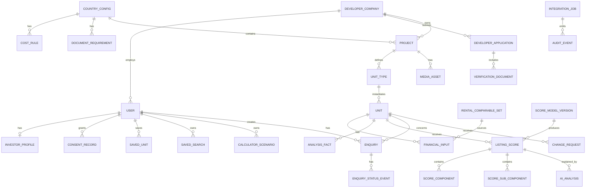

# Database Architecture — Best Invest Properties

Date: 25 September 2026  
Storage: Bubble database  
Participating systems: Bubble, Make, OpenAI API

## 1. Purpose and principles

The model must support the three real MVP loops:

- an investor finds, compares, saves and enquires about a specific available unit;
- a developer gets verified, submits a project and maintains price/availability;
- an admin checks documents, publishes content and controls introductions, the score and the AI narrative.

There is one database — Bubble. It holds **30 data types** and **23 Option Sets**.

Principles:

1. **Bubble is the source of truth.** The Make Data Store is not a business database.
2. **Unit is the public listing object.** Project describes the building/complex, Unit Type the repeated configuration, Unit the specific offer.
3. **A single property does not get its own table.** It is a project with one type and one unit.
4. **Finance is deterministic.** AI never writes price, rent, yield, score or tax.
5. **History only where it is needed:** the score model and scores, user consents, and the sources of financial figures. Other changes overwrite the value, and the Audit Event records who changed it and when.
6. **Privacy by default.** New types are created private; only whitelisted fields of published listings are public.
7. **Minimal denormalisation for Bubble.** Fields needed by privacy rules and frequent searches are duplicated on the protected record.
8. **Idempotent integrations.** Every asynchronous process has an Integration Job and a unique idempotency key.

Bubble privacy rules run on the server and must be the primary mechanism that keeps data out of the browser. Visually hiding a group or button is not access control.

## 2. Conceptual schema



Market Benchmark is tied to a country and district rather than to a specific unit, so it is not shown separately on the diagram.

## 3. Naming rules in Bubble

- Data types: singular English, Pascal Case: `Developer Company`, `Score Model Version`.
- Fields: snake_case English: `publication_status`, `price_eur`.
- Option sets: Pascal Case: `Project Status`; options are stable lower-case machine keys.
- Every business type has `public_id` (text for URLs/references), and `is_archived` where the record can be archived.
- The Bubble `unique id` is used internally only; `public_id` is what goes outside.
- Money in the MVP: numeric fields with the `_eur` suffix; the currency is always EUR.
- Percentages: store the decimal fraction (`0.0725`), display as `7.25%`.
- Time: all timestamps in UTC; timezone is used only for display.
- Bubble adds `Created Date`, `Modified Date` and `Creator` automatically — they are not repeated in the tables below.

## 4. Option Sets

Option Sets are for fixed, rarely changing, non-secret values. Bubble states explicitly that option sets are part of the app code, are not protected by privacy rules and are unsuitable for sensitive data. Changing them requires a deploy.

| Option Set | MVP values |
|---|---|
| User Role | `investor`, `developer`, `admin` |
| Account Status | `pending_email`, `active`, `suspended`, `closed` |
| Application Status | `draft`, `submitted`, `under_review`, `more_info_required`, `approved`, `rejected`, `withdrawn` |
| Project Status | `draft`, `submitted`, `under_review`, `changes_requested`, `approved`, `published`, `paused`, `sold_out`, `archived`, `rejected` |
| Publication Status | `not_published`, `published`, `hidden`, `archived` |
| Unit Availability | `available`, `reserved`, `sold`, `withdrawn` |
| Financial Input Source | `developer_claim`, `portal_comparable`, `analyst_verified`, `platform_default`, `calculated` |
| Analysis Fact Tag | `source`, `developer`, `estimate`, `gap` |
| Change Request Status | `submitted`, `queried`, `approved`, `rejected`, `applied`, `cancelled` |
| Enquiry Status | `submitted`, `screening`, `on_hold`, `declined`, `approved_for_intro`, `introduced`, `developer_responded`, `qualified`, `closed_won`, `closed_lost`, `cancelled` |
| Score Verdict | `strong`, `good`, `watch`, `high_risk`, `not_scored` |
| Review Status | `not_required`, `pending`, `approved`, `changes_requested`, `rejected` |
| Analysis Status | `queued`, `generating`, `generated`, `failed`, `stale`, `published` |
| Job Status | `queued`, `processing`, `succeeded`, `retry_wait`, `failed`, `dead_letter`, `cancelled` |
| Document Kind | `company_registration`, `licence`, `ownership`, `planning`, `title`, `brochure`, `floor_plan`, `legal`, `other` |
| Financing Mode | `cash`, `mortgage` |
| Strategy | `long_term_rental`, `short_term_rental`, `capital_growth`, `mixed` |
| Score Criterion | 5 criteria — see below |
| Score Sub-criterion | 13 sub-criteria — see below |
| Amenity | `communal_pool`, `gym`, `gated_area`, `underground_parking`, `tennis_golf`, `concierge`, `lift`, `landscaped_gardens` |
| Data Provider | approved portals / market-data providers; attributes: `name`, `country`, `access_method` (`api` / `feed` / `manual`), `terms_reference`, `fetch_frequency_days`, `is_active` |
| Media Kind | `photo`, `floor_plan`, `brochure`, `document` |
| Consent Type | `terms`, `privacy`, `marketing`, `contact_sharing` |

**What is not an Option Set.** Country Config, Cost Rule, Document Requirement and Market Benchmark are data types, because the admin edits them from the admin area without a deploy (screen A11). Legal texts (Terms, Privacy, Cookie, disclaimers) are static pages; the version the user agreed to is stored on the Consent Record.

**`Unit Availability`.** A developer may set only `available`, `reserved` or `sold`, and every such change goes through a Change Request with approval. Only an admin sets `withdrawn`. This must be enforced in the backend workflow whitelist, not in the UI.

### Score Criterion — attributes

| key | label | max_points | default_weight | Note |
|---|---|---:|---:|---|
| `income` | Rental Income & Net Yield | 30 | 0.30 | rating derived automatically from net yield bands |
| `demand` | Rental Demand & Tenant Quality | 20 | 0.20 | from sub-criteria |
| `value` | Purchase Value & Market Position | 20 | 0.20 | from the deviation of price per m² from the Market Benchmark |
| `growth` | Growth & Resale Potential | 15 | 0.15 | from sub-criteria |
| `risk` | Risk & Investor Protection | 15 | 0.15 | from sub-criteria; more points = **lower** risk, scale label mandatory in the UI |

Each criterion gets a `rating` of 0–10, then `weighted_points = rating / 10 × weight`. The full scales are in FR-03b of the project specification.

### Score Sub-criterion — attributes

| criterion | key | label | max_points |
|---|---|---|---:|
| demand | `market_activity` | Market activity and number of comparable listings | 3 |
| demand | `year_round` | Year-round demand | 3 |
| demand | `tenant_mix` | Diversity of potential tenants | 2 |
| demand | `seasonality` | Seasonality and vacancy risk | 2 |
| growth | `price_trend` | Price trend | 4 |
| growth | `liquidity` | Liquidity and number of transactions | 3 |
| growth | `infrastructure` | Infrastructure and economic factors | 2 |
| growth | `data_quality` | Recency and completeness of data | 1 |
| risk | `legal_title` | Legal status / title | 3 |
| risk | `permits` | Building permits and documents | 2 |
| risk | `payment_protection` | Payment / escrow protection | 2 |
| risk | `developer_check` | Developer check | 2 |
| risk | `stage_risk` | Construction stage risk | 1 |

The `max_points` of each criterion's sub-criteria add up to **10**.

### Role-specific Enquiry status labels

The eleven `Enquiry Status` values are **canonical**. Role labels are three display attributes of the same Option Set (`label_admin`, `label_investor`, `label_developer`), not additional statuses.

| Canonical status | Admin | Investor | Developer |
|---|---|---|---|
| `submitted` | New | Request received | not shown |
| `screening` | Qualifying | Awaiting analysis | not shown |
| `qualified` | Hot lead / Awaiting you | Awaiting admin approval | Awaiting admin approval |
| `on_hold` | On hold | Under review | On hold |
| `declined` | Declined | Not available | Filtered out by Best Invest |
| `approved_for_intro` | Connecting | Introduction being prepared | Introduction being prepared |
| `introduced` | Connected | Developer contacted | Introduced |
| `developer_responded` | In progress | Developer responded | Contacted |
| `closed_won` | Converted | Completed | Converted |
| `closed_lost` | Closed | Closed | Closed |
| `cancelled` | Cancelled | Cancelled | Cancelled |

An empty label means the record is not shown to that role at all — this is enforced by a privacy rule, not just hidden in the UI.

**`AWAITING YOU` is not a status.** It is the admin label meaning a lead in `qualified` is waiting for their decision. Likewise, "Hot lead" is a label for the same status, not a separate stage.

## 5. Data types

30 types in six groups.

| Group | Types |
|---|---|
| 5.1 People and access | User, Investor Profile, Developer Company, Developer Application, Verification Document, Consent Record |
| 5.2 Market settings | Country Config, Cost Rule, Document Requirement, Market Benchmark |
| 5.3 Catalogue | Project, Unit Type, Unit, Media Asset |
| 5.4 Finance, rent, score | Financial Input, Rental Comparable Set, Analysis Fact, Score Model Version, Listing Score, Score Component, Score Sub-component, AI Analysis |
| 5.5 Investor and enquiries | Saved Unit, Saved Search, Calculator Scenario, Enquiry, Enquiry Status Event, Change Request |
| 5.6 System | Integration Job, Audit Event |

### 5.1 People and access

#### User (Bubble built-in)

| Field | Type | Required | Note |
|---|---|---:|---|
| public_id | text | yes | `usr_...`, not the email |
| full_name | text | yes | do not use as an identifier |
| phone_e164 | text | no | private |
| country_of_residence | text | no | private |
| roles | list of User Role | yes | at least one role after activation |
| account_status | Account Status | yes | route guard |
| email_verified | yes/no | yes | false by default |
| developer_company | Developer Company | no | for developers; one user per company in the MVP |
| admin_permission_keys | list of text | no | admin only; permissions are checked by key, not just by role |
| last_login_at | date | no | audit |

Do not store the password in a custom field. Use Bubble authentication.

#### Investor Profile

| Field | Type | Required | Note |
|---|---|---:|---|
| user | User | yes | one active profile per User |
| budget_min_eur | number | no | |
| budget_max_eur | number | no | |
| target_gross_yield | number | no | decimal fraction |
| target_net_yield | number | no | decimal fraction |
| time_horizon_months | number | no | |
| countries | list of Country Config | no | preferred countries |
| strategies | list of Strategy | no | |
| bedrooms_min | number | no | |
| marketing_email_opt_in | yes/no | yes | mirrors the latest `marketing` consent for fast filtering |
| match_email_frequency | text | no | `off` / `daily` / `weekly` |

Profile uniqueness is checked by a backend workflow before creation.

#### Developer Company

| Field | Type | Required | Note |
|---|---|---:|---|
| public_id | text | yes | |
| legal_name | text | yes | |
| registration_number | text | yes | |
| registration_country | Country Config | yes | |
| licence_number | text | yes | |
| website_url | text | no | |
| years_active | number | no | |
| projects_completed | number | no | |
| projects_selling | number | no | |
| typical_unit_price_eur | number | no | |
| verification_status | Application Status | yes | mirrored from the latest application for privacy rules |
| verified_at | date | no | |
| is_suspended | yes/no | yes | |

The Company owns the Project. Never link a Project directly to a single developer User.

#### Developer Application

| Field | Type | Required | Note |
|---|---|---:|---|
| public_id | text | yes | `APP-0142` |
| company | Developer Company | yes | |
| submitted_by_user | User | yes | |
| status | Application Status | yes | |
| markets | list of Country Config | yes | |
| submitted_at | date | no | |
| decided_at | date | no | |
| decision_reason_private | text | no | admin only |
| decision_message_public | text | no | visible to the developer |

#### Verification Document

| Field | Type | Required | Note |
|---|---|---:|---|
| application | Developer Application | yes | |
| company | Developer Company | yes | duplicated for privacy rules |
| document_kind | Document Kind | yes | |
| file | file | yes | always private |
| expires_at | date | no | |
| verification_status | Review Status | yes | |
| review_note_public | text | no | visible to the developer |
| reviewed_at | date | no | |
| is_current | yes/no | yes | a re-upload sets the previous one to `no` |

The file is always private and attached to the Verification Document. Removing the URL does not delete the file; the delete workflow must first run the Bubble action "Delete an uploaded file".

#### Consent Record

| Field | Type | Required | Note |
|---|---|---:|---|
| user | User | yes | |
| consent_type | Consent Type | yes | |
| granted | yes/no | yes | |
| document_version | text | yes | version of the text the user agreed to, e.g. `terms-2026-09` |
| source_page | text | no | where consent was given |
| withdrawn_at | date | no | |

Consent is never overwritten: every change is a new record. This is a GDPR requirement — you must be able to prove what exactly the user agreed to.

### 5.2 Market settings

#### Country Config

| Field | Type | Required | Note |
|---|---|---:|---|
| iso2 | text | yes | `CY`, `ES` |
| name | text | yes | |
| is_live | yes/no | yes | |
| coming_soon | yes/no | yes | for Greece/Portugal if needed |
| default_vacancy_rate | number | yes | decimal fraction |
| default_management_fee_rate | number | yes | |
| default_maintenance_rate | number | yes | |
| default_insurance_annual_eur | number | yes | |
| legal_disclaimer | text | no | |
| min_comparable_listings | number | yes | default **5** — below this the sample **cannot be approved** |
| sufficient_comparable_listings | number | yes | default **10** — below this the sample is approved with a "thin sample" flag |
| max_comparable_age_days | number | yes | default **90** — after this the sample is stale |

Sample thresholds are stored per country because market liquidity differs: Nicosia has fewer listings than Málaga. A median of four listings is not a market figure — one outlier moves it too much, so 5 is the absolute minimum. From 10 listings the median is stable. 90 days is a quarter: no need to re-collect every week, and the estimate keeps up with the market. The admin changes all values without code changes.

#### Cost Rule

| Field | Type | Required | Note |
|---|---|---:|---|
| country | Country Config | yes | |
| rule_key | text | yes | `transfer_tax`, `stamp_duty`, `legal_fees`, … |
| label | text | yes | |
| applies_to_new_build | yes/no | no | empty = applies to all |
| calculation_method | text | yes | `flat` / `percent_price` / `banded` |
| rate | number | no | for `percent_price` |
| fixed_amount_eur | number | no | for `flat` |
| bands_json | text | no | for `banded` |
| source_url | text | yes | official source |
| source_checked_at | date | yes | |
| approved_by | text | no | who checked the rate (consultant) |

Do not store all tax rules as one text. Edited from the admin area (A11); the value is overwritten and the Audit Event records the change history.

#### Document Requirement

| Field | Type | Required | Note |
|---|---|---:|---|
| country | Country Config | yes | |
| subject_type | text | yes | `developer` / `project` |
| document_kind | Document Kind | yes | |
| required_for_account_creation | yes/no | yes | e.g. company registration, licence |
| required_for_submission | yes/no | yes | |
| required_for_publication | yes/no | yes | e.g. building permit, escrow |
| expiry_months | number | no | empty = no expiry |
| instructions | text | no | hint for the developer |
| is_active | yes/no | yes | |

The three `required_for_*` fields express the three levels on the application screen: `REQUIRED` / `TO CONFIRM` / `OPTIONAL`. The matrix is **fully configurable** by the admin per country and is not hard-coded.

#### Market Benchmark

Needed for the `Purchase Value & Market Position` criterion, which compares the price per m² with the district median.

| Field | Type | Required | Note |
|---|---|---:|---|
| country | Country Config | yes | |
| city | text | yes | |
| area_name | text | no | empty = whole city |
| property_type | text | no | |
| median_price_per_m2_eur | number | yes | median for new builds |
| sample_size | number | no | number of properties in the sample |
| source_reference | text | yes | public listings / transaction register |
| checked_at | date | yes | date checked |

### 5.3 Property catalogue

#### Project

| Field | Type | Required | Note |
|---|---|---:|---|
| public_id | text | yes | `PRJ-0311` |
| company | Developer Company | yes | **never** returned to an anonymous request |
| country | Country Config | yes | |
| city | text | yes | |
| area_name | text | no | |
| address_private | text | no | not published |
| map_lat_rounded | number | no | rounded for the public map |
| map_lng_rounded | number | no | |
| name | text | yes | |
| project_type | text | yes | `single` / `complex` |
| description_public | text | no | |
| completion_date | date | yes | |
| declared_unit_count | number | yes | |
| amenities | list of Amenity | no | |
| cover_media | Media Asset | no | required for publication |
| status | Project Status | yes | |
| publication_status | Publication Status | yes | |
| published_at | date | no | |

Country/city/area are enough for search cards; `address_private` is never exposed publicly.

**Developer anonymity.** The developer's name and contacts are not shown in the catalogue or on the property page; the public label is "Introduced by Best Invest". The privacy rule on Project does not return `company` to an anonymous request at all — do not rely on the UI not showing it.

#### Unit Type

| Field | Type | Required | Note |
|---|---|---:|---|
| public_id | text | yes | |
| project | Project | yes | |
| name | text | yes | e.g. "Type B — 2 bed" |
| bedrooms | number | yes | |
| bathrooms | number | yes | |
| indoor_area_m2 | number | yes | |
| outdoor_area_m2 | number | no | |
| floor_plan | Media Asset | no | |

#### Unit

The central listing record. It also holds the current financial metrics — there is no separate type for them.

| Field | Type | Required | Note |
|---|---|---:|---|
| public_id | text | yes | URL and external references |
| project | Project | yes | |
| unit_type | Unit Type | yes | |
| unit_number | text | yes | may be hidden until introduction |
| floor | number | no | |
| price_eur | number | yes | current approved price |
| availability | Unit Availability | yes | |
| has_pending_change | yes/no | yes | a Change Request is in progress — the portal row shows "pending approval" |
| monthly_rent_eur | number | no | approved rent used for scoring |
| purchase_costs_eur | number | no | calculated from Cost Rules |
| annual_net_income_eur | number | no | calculated |
| gross_yield | number | no | calculated |
| net_yield | number | no | calculated |
| financials_calculated_at | date | no | date of the last calculation |
| investment_score | number | no | current score |
| score_verdict | Score Verdict | no | badge |
| current_score | Listing Score | no | components and model version |
| country_cached | Country Config | yes | for search and privacy without a deep chain |
| city_cached | text | yes | search |
| bedrooms_cached | number | yes | search |
| area_m2_cached | number | yes | search |
| property_type_cached | text | yes | search |
| completion_date_cached | date | yes | completion filter |
| strategy_keys | list of Strategy | no | search |
| publication_status | Publication Status | yes | only `published` is public |

Financial and cached fields are updated by the atomic backend workflow `recalculate_unit`. Do not build the public search over many nested relations.

Base MVP formulas:

```text
annual_gross_rent = monthly_rent × 12
annual_effective_rent = annual_gross_rent × (1 − vacancy_rate)
gross_yield = annual_gross_rent / price
annual_net_income = annual_effective_rent
  - management - maintenance - insurance - property_tax - other_costs
net_yield = annual_net_income / (price + purchase_costs)
```

Inputs are approved Financial Inputs (rent comes from comparable listings via Make), plus the Country Config settings and Cost Rules for the country. The values used for a particular score are recorded on the Listing Score.

#### Media Asset

| Field | Type | Required | Note |
|---|---|---:|---|
| project | Project | yes | |
| unit_type | Unit Type | no | for floor plans |
| kind | Media Kind | yes | |
| image | image | no | for `photo` |
| file | file | no | for PDFs/documents |
| is_private | yes/no | yes | legal documents — `yes` |
| is_cover | yes/no | yes | |
| sort_order | number | yes | |
| caption | text | no | |

Public photos/brochures and private documents are different records with different privacy rules.

### 5.4 Finance, rent, score

#### Financial Input

The Project Review screen shows a panel where every figure has its own source, and three rent values side by side (claimed by the developer, Best Invest's comparable estimate, and the one actually used for scoring). So each input value is a separate record.

| Field | Type | Required | Note |
|---|---|---:|---|
| unit | Unit | yes | |
| input_key | text | yes | `monthly_rent`, `recurring_costs`, `vacancy_allowance`, … |
| label | text | yes | label in the review |
| value_number | number | yes | |
| source | Financial Input Source | yes | |
| source_reference | text | no | "Larnaca district, 14 lettings" |
| comparable_set | Rental Comparable Set | no | required for `portal_comparable` |
| is_used_for_scoring | yes/no | yes | only one active value per `input_key` |
| review_status | Review Status | yes | `pending` until approved by the admin |
| approved_at | date | no | |
| superseded_by | Financial Input | no | a new value does not overwrite the old one |

Rules:

- only values with `review_status = approved` reach the public listing;
- the Unit's financial metrics are calculated **only** from approved Financial Inputs;
- a value with `source = developer_claim` can never have `is_used_for_scoring = yes` without separate analyst approval (BR-02);
- `source = portal_comparable` requires a `comparable_set` with `review_status = approved`;
- for rent there are always at least two records: the developer's claim (`developer_claim`) and the value derived from comparable listings (`portal_comparable`) — these are shown side by side on Project Review;
- `developer_claim` never turns into `portal_comparable` automatically;
- a record is not edited: a new value creates a new record and sets `superseded_by` on the old one. This shows where every published figure came from.

#### Rental Comparable Set

The result of collecting comparable rental listings via Make. One record = one sample for one parameter set on a given date.

| Field | Type | Required | Note |
|---|---|---:|---|
| public_id | text | yes | |
| provider | Data Provider | yes | Option Set |
| retrieved_at | date | yes | date the data was retrieved |
| country | Country Config | yes | normalisation parameter |
| city | text | yes | normalisation parameter |
| area_name | text | no | district |
| property_type | text | yes | normalisation parameter |
| bedrooms | number | yes | normalisation parameter |
| area_m2_min | number | no | sample floor-area bound |
| area_m2_max | number | no | sample floor-area bound |
| listings_count | number | yes | number of comparable listings |
| rent_min_eur | number | yes | lower end of the range |
| rent_median_eur | number | yes | median — basis of the base estimate |
| rent_max_eur | number | yes | upper end of the range |
| collection_method | text | yes | `api` / `feed` / `manual_import` / `manual_entry` |
| integration_job | Integration Job | no | empty for manual entry |
| review_status | Review Status | yes | `pending` until checked by the admin |
| is_current | yes/no | yes | current sample for this parameter set |

Rules:

- a sample with `review_status ≠ approved` cannot be a source for a Financial Input and is not shown to the investor;
- `listings_count` below `Country Config.min_comparable_listings` (default **5**) **blocks approval**;
- `listings_count` between the minimum and `sufficient_comparable_listings` (default **10**) is approved with a **thin sample** flag: shown to the admin on review and added for the investor as an Analysis Fact tagged `estimate`;
- a sample older than `max_comparable_age_days` (default **90**) gets `is_current = no` and cannot be the source of a new Financial Input; published values do not disappear but are queued for refresh;
- a new sample does not overwrite the previous one: the old one gets `is_current = no`;
- a manual fallback (`manual_import` / `manual_entry`) is stored with the same type and fields, so the provenance of the figure stays visible.

> The legal basis for using each portal's data (API terms, data licence) is
> checked before connecting it. The link to the terms is the `terms_reference`
> attribute in the `Data Provider` Option Set.

#### Analysis Fact

The "Sources, assumptions & gaps" block on the analysis and review screens.

| Field | Type | Required | Note |
|---|---|---:|---|
| unit | Unit | yes | |
| tag | Analysis Fact Tag | yes | |
| body | text | yes | fact text |
| source_url | text | no | |
| sort_order | number | yes | |
| is_active | yes/no | yes | |

The `gap` tag marks a known absence of data and must be visible to the investor — it is a legally significant part of the disclosure.

#### Score Model Version

| Field | Type | Required | Note |
|---|---|---:|---|
| version_number | number | yes | v1, v2, … |
| status | text | yes | `draft` / `active` / `retired` |
| weight_income | number | yes | decimal fraction, default 0.30 |
| weight_demand | number | yes | default 0.20 |
| weight_value | number | yes | default 0.20 |
| weight_growth | number | yes | default 0.15 |
| weight_risk | number | yes | default 0.15 |
| change_reason | text | yes | shown in the versions table |
| properties_rescored | number | no | filled in after recalculation |
| activated_at | date | no | |

Weight rules:

- the five weights of the active model add up to `1.0`; until they do, Save is blocked (checked by a backend workflow);
- the editor works in percentages, 0–100 per criterion; there is **no** hard cap on a single criterion;
- the UI shows a soft warning if any criterion exceeds **50%** — one criterion would then effectively determine the whole score. The warning does not block saving; the threshold is a UI constant;
- the weights are the same for Cyprus and Spain;
- `Revert` creates a **new** version with the previous parameters rather than deleting history.

#### Listing Score

| Field | Type | Required | Note |
|---|---|---:|---|
| unit | Unit | yes | |
| model_version | Score Model Version | yes | |
| total_score | number | yes | 0–100 |
| verdict | Score Verdict | yes | |
| price_eur_used | number | yes | price at calculation time |
| monthly_rent_eur_used | number | yes | rent at calculation time |
| net_yield_used | number | yes | |
| gross_yield_used | number | yes | |
| calculated_at | date | yes | |
| is_current | yes/no | yes | a new calculation sets the previous one to `no` |

The `*_used` fields record the inputs the score was calculated from, so the score stays reproducible even after the price or rent on the Unit changes.

#### Score Component

| Field | Type | Required | Note |
|---|---|---:|---|
| listing_score | Listing Score | yes | |
| criterion | Score Criterion | yes | Option Set |
| raw_value | number | no | e.g. net yield or deviation from the median; empty for assessed criteria |
| rating | number | yes | 0–10 |
| weighted_points | number | yes | `rating / 10 × weight × 100` |
| explanation | text | no | deterministic explanation for the analysis screen |

Each Listing Score has exactly five components; they add up to the total score within `0.01`.

#### Score Sub-component

The actual assessment of a sub-criterion for a specific Listing Score.

| Field | Type | Required | Note |
|---|---|---:|---|
| listing_score | Listing Score | yes | |
| sub_criterion | Score Sub-criterion | yes | Option Set |
| points_awarded | number | yes | no more than the sub-criterion's `max_points` |
| note | text | no | analyst comment |

The sum of `points_awarded` within a criterion gives its `rating`.

#### AI Analysis

| Field | Type | Required | Note |
|---|---|---:|---|
| unit | Unit | yes | |
| listing_score | Listing Score | yes | the score the text is based on |
| status | Analysis Status | yes | |
| review_status | Review Status | yes | |
| prompt_version | text | yes | |
| model_id | text | yes | |
| summary | text | no | |
| strengths_json | text | no | |
| risks_json | text | no | |
| missing_data_json | text | no | |
| input_tokens | number | no | |
| output_tokens | number | no | |
| reviewed_at | date | no | |
| published_at | date | no | |
| failure_code | text | no | |

Only `review_status = approved` is published, and only while the linked Listing Score is still `is_current = yes`.

### 5.5 Investor and enquiries

#### Saved Unit

| Field | Type | Required | Note |
|---|---|---:|---|
| user | User | yes | |
| unit | Unit | yes | |
| price_at_save_eur | number | yes | for the "price changed" badge |
| availability_at_save | Unit Availability | yes | for the "status changed" badge |
| is_active | yes/no | yes | check for an active duplicate before creating |

#### Saved Search

| Field | Type | Required | Note |
|---|---|---:|---|
| public_id | text | yes | |
| user | User | yes | |
| name | text | yes | |
| countries | list of Country Config | no | |
| property_types | list of text | no | |
| bedrooms | list of text | no | `studio`, `1`, `2`, `3+` |
| strategies | list of Strategy | no | |
| completion | list of text | no | `ready`, `lt_12m`, `12_24m` |
| price_max_eur | number | no | |
| gross_yield_min | number | no | |
| net_yield_min | number | no | |
| alert_frequency | text | yes | `off` / `daily` / `weekly` |
| is_active | yes/no | yes | |

#### Calculator Scenario

| Field | Type | Required | Note |
|---|---|---:|---|
| public_id | text | yes | |
| user | User | yes | anonymous calculations are not stored |
| unit | Unit | yes | |
| name | text | yes | |
| strategy | Strategy | yes | long / short term |
| rent_scenario | text | yes | `base` / `average` / `best` |
| financing_mode | Financing Mode | yes | |
| purchase_price_eur | number | yes | |
| deposit_eur | number | no | for `mortgage` |
| interest_rate | number | no | for `mortgage` |
| term_years | number | no | for `mortgage` |
| monthly_rent_eur | number | yes | |
| occupancy_rate | number | yes | |
| management_fee_rate | number | yes | |
| annual_net_income_eur | number | yes | result at save time |
| cash_on_cash_return | number | no | result at save time |

#### Enquiry

The contact release fields are stored right here — there is no separate type for them.

| Field | Type | Required | Note |
|---|---|---:|---|
| public_id | text | yes | `ENQ-YYYY-...` / for the developer `LEAD-0412` |
| investor_user | User | yes | private |
| unit | Unit | yes | the specific subject of the enquiry |
| project | Project | yes | denormalised |
| developer_company | Developer Company | yes | denormalised for privacy rules |
| status | Enquiry Status | yes | canonical status |
| budget_eur | number | no | value at submission time |
| consent_to_share_contact | yes/no | yes | separate consent |
| fit_summary_private | text | no | admin only |
| follow_up_date | date | no | required for `on_hold` |
| submitted_at | date | yes | SLA start |
| contact_released_at | date | no | filled in on Approve & connect |
| released_investor_name | text | no | copy the developer sees after release |
| released_investor_email | text | no | |
| released_investor_phone | text | no | |
| released_developer_contact | text | no | developer contact the investor sees |
| developer_outcome | text | no | lead outcome (D11): `viewing_booked` / `reserved` / `not_interested` |
| closed_at | date | no | |

The developer **never** gets access to the investor's User record. Before release the `released_*` fields are empty; the privacy rule returns them to the developer only once `contact_released_at` is filled in.

#### Enquiry Status Event

| Field | Type | Required | Note |
|---|---|---:|---|
| enquiry | Enquiry | yes | |
| from_status | Enquiry Status | no | |
| to_status | Enquiry Status | yes | |
| actor_user | User | no | empty for automatic transitions |
| reason_private | text | no | required for `on_hold` / `declined`; never shown to the investor |
| note_investor | text | no | what the investor sees in the history (P12) |

A status never changes without a Status Event. These records are what the investor sees as the status history.

#### Change Request

One request = one change to one unit, or a content review request.

| Field | Type | Required | Note |
|---|---|---:|---|
| public_id | text | yes | |
| project | Project | yes | |
| unit | Unit | no | empty for content review |
| company | Developer Company | yes | for privacy rules |
| request_type | text | yes | `price` / `availability` / `content_review` |
| old_price_eur | number | no | |
| new_price_eur | number | no | |
| old_availability | Unit Availability | no | |
| new_availability | Unit Availability | no | only `available` / `reserved` / `sold` |
| content_message | text | no | for `content_review`: what the developer wants to change |
| status | Change Request Status | yes | |
| decision_reason | text | no | required for `queried` / `rejected`; visible to the developer |
| submitted_at | date | yes | |
| decided_at | date | no | |

After publication the developer changes only price and availability; both go through **prior** approval. Locked fields (project name, location, completion date, unit mix, specification, media) change through `content_review`. The Change Request is kept after it is applied — this is the change history on screen D08.

### 5.6 System

#### Integration Job

Every asynchronous action through Make, including every email.

| Field | Type | Required | Note |
|---|---|---:|---|
| public_id | text | yes | correlation id |
| job_type | text | yes | `ai_analysis_generate`, `email`, `introduction`, `rental_comparables`, `score_rescore_batch`, … |
| entity_type | text | yes | |
| entity_public_id | text | yes | |
| recipient_user | User | no | for emails |
| template_key | text | no | for emails |
| status | Job Status | yes | |
| idempotency_key | text | yes | unique |
| attempt_count | number | yes | |
| processed_count | number | no | batch recalculation progress |
| last_error_redacted | text | no | no PII or secrets |
| provider_message_id | text | no | email id / OpenAI response id |
| completed_at | date | no | |

Uniqueness is enforced by `idempotency_key`. Make reads the Job first; if it is `succeeded`, the repeat ends without side effects. This same type is the log of sent emails.

#### Audit Event

| Field | Type | Required | Note |
|---|---|---:|---|
| actor_user | User | no | empty for system actions |
| action_key | text | yes | `project.published`, `cost_rule.updated`, … |
| entity_type | text | yes | |
| entity_public_id | text | yes | |
| before_json | text | no | no PII |
| after_json | text | no | no PII |
| reason | text | no | |
| source | text | yes | `bubble_ui` / `bubble_backend` / `make` / `openai` |

Audit Event is append-only; user workflows may not change or delete records. It records who changed settings (rates, thresholds, documents) and when, instead of keeping separate versions of each record.

## 6. Status transitions

### Project lifecycle

```text
draft → submitted → under_review
under_review → changes_requested → submitted
under_review → approved → published
under_review → rejected
published → paused | sold_out | archived
```

The admin performs `approved → published` as a separate action. Publishing is not allowed without approved verification, at least one available unit, a cover photo, calculated financials, a current score, and an approved AI analysis or an explicit deterministic-only fallback.

A developer can **submit** a project with an incomplete set of units (modal: "12 units declared · 3 entered. You can submit and add the rest before publication"). So unit completeness is a condition of `approved → published`, not of `draft → submitted`. In addition, publishing requires every Financial Input used in the score to have `review_status = approved`.

### Enquiry decision

| UI action | Canonical transition | Emails |
|---|---|---|
| Approve & connect | `qualified → approved_for_intro → introduced` | to both parties |
| Hold | `qualified → on_hold` | none |
| Decline | `qualified → declined` | investor only, neutral text without a reason |

`on_hold` and `declined` require `reason_private`. The text the investor sees on a decline comes from a template and does **not** contain the reason. `on_hold` additionally requires `follow_up_date` on the Enquiry.

### Developer Application lifecycle

```text
draft → submitted → under_review
under_review → more_info_required → submitted
under_review → approved | rejected
submitted/under_review → withdrawn
```

### Enquiry lifecycle

```text
submitted → screening → qualified → approved_for_intro → introduced
screening | qualified → on_hold | declined
on_hold → qualified | declined
introduced → developer_responded → closed_won | closed_lost
submitted | screening | qualified → cancelled
```

`qualified` means "the lead has been checked by the analyst and is waiting for the admin's decision", so it comes **before** `approved_for_intro`. The stage after the developer responds is `developer_responded`, then `closed_won` / `closed_lost`.

## 7. Privacy rules matrix

| Data type | Anonymous | Investor owner | Developer company member | Admin |
|---|---|---|---|---|
| User | none | own whitelisted fields | own only | full |
| Investor Profile | none | own | none | full |
| Developer Company | none | none | own | full |
| Developer Application / Verification Document | none | none | own company | full |
| Consent Record | none | own | own | full |
| Project | published public subset, without `company` | published public subset | own company | full |
| Unit | published + available public subset | same | own company units | full |
| Media Asset public | published records | published records | own company | full |
| Media Asset private | none | none | own company | full |
| Financial Input | none | none | own project, `approved` only | full |
| Rental Comparable Set | none | none | none | full |
| Analysis Fact / Listing Score / Score Component | published subset | published subset | own project | full |
| AI Analysis | approved/published only | approved/published only | own project published view | full |
| Enquiry | none | own, investor-safe fields | own company; `released_*` fields only after release | full |
| Enquiry Status Event | none | own, without `reason_private` | own company, without `reason_private` | full |
| Change Request | none | none | own company | full |
| Integration Job / Audit Event | none | none | none | full |

Implementation details:

- privacy conditions check direct fields on the record itself; do not build multi-level chains;
- duplicate `company`, `publication_status` on protected types where that simplifies the rule;
- the workflow `Only when` checks role, company, account status and the allowed transition; privacy rules do not replace workflow authorisation;
- do not allow auto-binding for critical fields;
- do not expose the Data API for business types publicly; Make calls narrow authenticated Workflow API endpoints.

## 8. Bubble workflows that maintain integrity

| Workflow | Trigger | Result |
|---|---|---|
| `create_developer_application` | submit form | User + Company + Application without duplicates, consent, audit |
| `submit_project` | developer action | validation, status event, review |
| `publish_project` | admin action | server validation, publication, audit |
| `store_rental_comparables` | callback from MK-10 | Rental Comparable Set `pending`, previous one → `is_current = no` |
| `approve_rental_comparables` | admin action | sample `approved`, becomes available as a Financial Input source |
| `approve_financial_input` | admin action on A04 | Financial Input `approved`, previous one → `superseded_by` |
| `recalculate_unit` | approved price/rent/settings change | updated Unit financial and cached fields |
| `calculate_unit_score` | financials or model change | new Listing Score + components |
| `queue_ai_analysis` | current score created | Integration Job `ai_analysis_generate` |
| `rescore_all_published` | admin saved a new Score Model Version | batch recalculation with progress, a new Listing Score per unit, old ones → `is_current = no` |
| `submit_enquiry` | investor action | consent check, Enquiry + status event |
| `approve_introduction` | admin action | release fields on the Enquiry + delivery Integration Job |
| `submit_change_request` | developer action | Change Request `submitted`, `has_pending_change = yes` |
| `apply_change_request` | admin approval | apply the change once, recalc, audit |
| `close_account` | confirmed request | suspend access, queue export/anonymisation review |

Use database triggers only as a safety net for changes from the Bubble editor/API. Main second-order updates are better called from the primary backend workflow, so workload is not spent checking every change.

## 9. Search and performance

- The screen 02 search runs over Unit, with constraints: `publication_status`, `availability`, `country_cached`, `price_eur`, `bedrooms_cached`, `gross_yield`, `net_yield`, `strategy_keys`, `completion_date_cached`.
- Do not use `:filtered` for the server-filtered catalogue; all main conditions must be search constraints.
- Debounce slider changes by 300–500 ms.
- Sorting by `net_yield`, `gross_yield`, `price_eur`, `investment_score`.
- Pagination: **8 records per page**, numbered pager.
- The "Top 5" rail takes the first five records of the same sorted set — no separate query is needed.
- Do not store record lists on User if they grow without bound; Saved Unit and Enquiry are separate types.

## 10. Retention and deletion

Retention periods are set in the platform's legal policy. MVP technical policy:

- account closure blocks login immediately; the actual delete/anonymise is a controlled backend process;
- open enquiries, consent, audit and transactional records are not deleted automatically before the legal hold ends;
- investor PII in closed records is replaced with a pseudonymous reference after the approved period;
- an uploaded file is deleted by a separate action before the URL is cleared;
- an Integration Job contains no full PII — only a reference to the record;
- the OpenAI input contains property facts but no investor contact data.

## 11. Seed data before build

1. Country Config: Spain, Cyprus (with sample thresholds); Greece/Portugal as `coming_soon` if needed.
2. Cost Rules for both countries — with source and check date.
3. `Data Provider` Option Set: approved portals for Spain and Cyprus.
4. Market Benchmark: median price per m² for the launch districts.
5. Document Requirements per country.
6. The first Score Model Version (30/20/20/15/15).
7. Email templates and role-specific Enquiry Status labels.

## 12. Migration between Bubble Development and Live

- deploy structure/option sets through Bubble version control;
- export/import settings (Country Config, Cost Rule, Document Requirement, Market Benchmark) in a defined order;
- do not copy Live PII into Development without a written basis and masking;
- OpenAI/Make credentials are separate for Development and Live;
- smoke dataset: 2 countries, 2 companies, 4 projects, 8 unit types, 20 units, all availability/status cases.

## 13. Architecture acceptance criteria

- no anonymous request receives an email, phone, exact private address or private document URL;
- before introduction the developer sees the lead without PII; after approval sees only the `released_*` fields;
- a repeated Make webhook with the same idempotency key creates no duplicate and sends no repeat email;
- every published unit has calculated financials, a current Listing Score and a Score Model Version;
- every number on Analysis is traceable to a Financial Input or a Listing Score;
- score components equal the total score within 0.01, and there are exactly five;
- a change to an approved price creates a Change Request, an Audit Event, a Unit recalculation and a new Listing Score;
- an availability change likewise goes through a Change Request and is not applied before approval;
- an anonymous request does not receive `Project.company` or any developer field;
- no Financial Input with `source = developer_claim` takes part in scoring without separate approval;
- every published unit has at least one Analysis Fact or an explicit note that there are no gaps;
- deleting a private record does not leave an accessible attached file;
- every status change creates a Status Event/Audit Event;
- admin publish and contact release are impossible without server-side authorisation.
