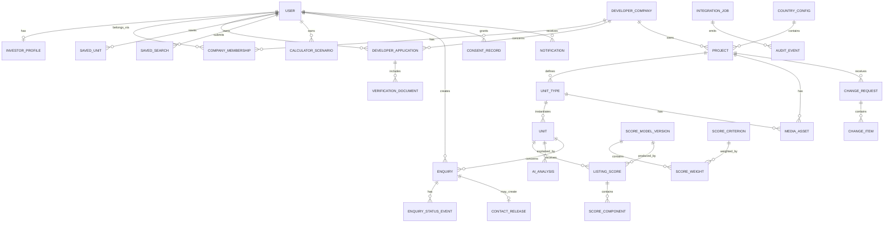

# Database Architecture — Best Invest Properties

Date: 25 September 2026  
Storage: Bubble database  
Participating systems: Bubble, Make, OpenAI API

## 1. Purpose and principles

The model must support the three real MVP loops:

- an investor finds, compares, saves and enquires about a specific available unit;
- a developer gets verified, submits a project and maintains price/availability;
- an admin checks documents, publishes content and controls introductions, the score and the AI narrative.

Principles:

1. **Bubble is the source of truth.** The Make Data Store is not a business database.
2. **Unit is the public listing object.** Project describes the building/complex, Unit Type the repeated configuration, Unit the specific offer.
3. **A single property does not get its own table.** It is a project with one type and one unit.
4. **Finance is deterministic.** AI never writes price, rent, yield, score or tax.
5. **Published data is versioned.** Critical changes have a history and an author.
6. **Privacy by default.** New types are created private; only whitelisted fields of published listings are public.
7. **Minimal denormalisation for Bubble.** Fields needed by privacy rules and frequent searches are duplicated on the protected record.
8. **Idempotent integrations.** Every asynchronous process has an Integration Job and a unique idempotency key.

Bubble privacy rules run on the server and must be the primary mechanism that keeps data out of the browser. Visually hiding a group or button is not access control.

## 2. Conceptual schema



## 3. Naming rules in Bubble

- Data types: singular English, Pascal Case: `Developer Company`, `Score Model Version`.
- Fields: snake_case English: `publication_status`, `price_eur`.
- Option sets: Pascal Case: `Project Status`; options are stable lower-case machine keys.
- Every business type has: `public_id` (text for URLs/references), `is_archived`, `created_by_user`, and `version_number` where needed.
- The Bubble `unique id` is used internally only; `public_id` is what goes outside.
- Money in the MVP: numeric fields with the `_eur` suffix; `currency_code` is stored even if the value is always EUR.
- Percentages: store the decimal fraction (`0.0725`), display as `7.25%`.
- Time: all timestamps in UTC; timezone is used only for display.

## 4. Option Sets

Option Sets are only for non-secret, rarely changing values. Bubble states explicitly that option sets are part of the app code, are not protected by privacy rules and are unsuitable for sensitive data.

| Option Set | MVP values |
|---|---|
| User Role | `investor`, `developer`, `admin` (roles `senior_admin`, `support` reserved for later) |
| Account Status | `pending_email`, `active`, `suspended`, `closed` |
| Application Status | `draft`, `submitted`, `under_review`, `more_info_required`, `approved`, `rejected`, `withdrawn` |
| Project Status | `draft`, `submitted`, `under_review`, `changes_requested`, `approved`, `published`, `paused`, `sold_out`, `archived`, `rejected` |
| Publication Status | `not_published`, `published`, `hidden`, `archived` |
| Unit Availability | `available`, `reserved`, `sold`, `withdrawn` |
| Financial Input Source | `developer_claim`, `portal_comparable`, `analyst_verified`, `platform_default`, `calculated` |
| Analysis Fact Tag | `source`, `developer`, `estimate`, `gap` |
| Change Request Status | `draft`, `submitted`, `under_review`, `queried`, `approved`, `rejected`, `applied`, `cancelled` |
| Enquiry Status | `submitted`, `screening`, `on_hold`, `declined`, `approved_for_intro`, `introduced`, `developer_responded`, `qualified`, `closed_won`, `closed_lost`, `cancelled` |
| Score Verdict | `strong`, `good`, `watch`, `high_risk`, `not_scored` |
| Review Status | `not_required`, `pending`, `approved`, `changes_requested`, `rejected` |
| Analysis Status | `queued`, `generating`, `generated`, `failed`, `stale`, `published` |
| Job Status | `queued`, `processing`, `succeeded`, `retry_wait`, `failed`, `dead_letter`, `cancelled` |
| Notification Status | `queued`, `sending`, `sent`, `failed`, `cancelled` |
| Notification Channel | `in_app`, `email` |
| Document Kind | `company_registration`, `licence`, `ownership`, `planning`, `title`, `brochure`, `floor_plan`, `legal`, `other` |
| Financing Mode | `cash`, `mortgage` |
| Strategy | `long_term_rental`, `short_term_rental`, `capital_growth`, `mixed` |

Country, city, amenities, document requirements, scoring criteria, tax rules and legal documents are **not** option sets: they must be editable without a deploy and have a history.

**`Unit Availability`.** A developer may set only `available`, `reserved` or `sold`, and every such change goes through a Change Request with approval. Only an admin sets `withdrawn`. This must be enforced in the backend workflow whitelist, not in the UI.

**`Enquiry Status`.** The set of eleven values is **canonical**. Role-specific labels are a separate lookup, not additional statuses.

#### Role-specific status labels

| Canonical status | Admin | Investor | Developer |
|---|---|---|---|
| `submitted` | New | Request received | not shown |
| `screening` | Qualifying | Awaiting analysis | not shown |
| `qualified` | Hot lead / Awaiting you | Awaiting admin approval | Awaiting admin approval |
| `on_hold` | On hold | Under review | On hold |
| `declined` | Declined | Not available | Filtered out by Best Invest |
| `approved_for_intro` | Connecting | Introduction being prepared | Introduction being prepared |
| `introduced` | Connected | Developer contacted | Introduced |
| `developer_responded` | In progress | Developer responded | Contacted |
| `closed_won` | Converted | Completed | Converted |
| `closed_lost` | Closed | Closed | Closed |
| `cancelled` | Cancelled | Cancelled | Cancelled |

Implementation: the `Enquiry Status` Option Set with three display attributes (`label_admin`, `label_investor`, `label_developer`). An empty label means the record is not shown to that role at all — this is enforced by a privacy rule, not just hidden in the UI.

**`AWAITING YOU` is not a status.** It is the admin label meaning a lead in `qualified` is waiting for their decision. Likewise, "Hot lead" is a label for the same status, not a separate stage.

## 5. Data types

### 5.1 Identity and access

#### User (Bubble built-in)

| Field | Type | Required | Note |
|---|---|---:|---|
| public_id | text | yes | `usr_...`, not the email |
| full_name | text | yes | do not use as an identifier |
| phone_e164 | text | no | private |
| country_of_residence | Country Config | no | private |
| roles | list of User Role | yes | at least one role after activation |
| account_status | Account Status | yes | route guard |
| email_verified | yes/no | yes | false by default |
| locale | text | yes | `en` in the MVP |
| last_login_at | date | no | audit |
| terms_version_accepted | text | no | UI cache; source is the Consent Record |
| privacy_version_accepted | text | no | UI cache |
| admin_permission_keys | list of text | no | admin only; do not rely on the role alone |

Do not store the password in a custom field. Use Bubble authentication.

#### Investor Profile

`user`, `budget_min_eur`, `budget_max_eur`, `target_gross_yield`, `target_net_yield`, `time_horizon_months`, `countries` (list Country Config), `strategies` (list Strategy), `bedrooms_min`, `profile_completed_at`, `marketing_email_opt_in`, `match_email_frequency`, `assigned_admin_user`.

One active Investor Profile per User. Uniqueness is checked by a backend workflow before creation.

#### Developer Company

`public_id`, `legal_name`, `trading_name`, `registration_number`, `registration_country`, `registered_address`, `website_url`, `vat_number`, `verification_status`, `verified_at`, `verified_by_user`, `relationship_owner_user`, `anonymity_default`, `is_suspended`, `is_archived`.

The Company owns the Project. Never link a Project directly to a single developer User.

#### Company Membership

`company`, `user`, `member_role_key`, `can_manage_projects`, `can_change_prices`, `can_view_leads`, `status`, `invited_at`, `joined_at`.

The MVP creates one membership, but the structure is ready for a team.

#### Developer Application

`public_id`, `company`, `submitted_by_user`, `status`, `markets` (list Country Config), `years_active`, `completed_projects_count`, `submitted_at`, `review_started_at`, `decided_at`, `decision_by_user`, `decision_reason_private`, `decision_message_public`, `current_review_round`, `terms_version_accepted`.

#### Verification Document

`application`, `company`, `country`, `document_kind`, `file`, `original_filename`, `mime_type`, `size_bytes`, `expires_at`, `verification_status`, `review_note_private`, `review_note_public`, `reviewed_by_user`, `reviewed_at`, `is_current`.

The file is always private and attached to the Verification Document. Removing the URL does not delete the file; the delete workflow must first run the Bubble action "Delete an uploaded file".

### 5.2 Market configuration

#### Country Config

`iso2`, `name`, `currency_code`, `is_live`, `coming_soon`, `default_vacancy_rate`, `default_management_fee_rate`, `default_maintenance_rate`, `default_insurance_annual_eur`, `legal_disclaimer`, `calculator_config_version`, `effective_from`, `effective_to`.

Do not store all tax rules as one text. Use Cost Rule for a transparent calculation.

**Comparable-listing sample thresholds.** Stored here rather than globally, because market liquidity differs: Nicosia has fewer listings than Málaga, and a single threshold would be either too strict or meaningless.

| Field | Type | Default | Purpose |
|---|---|---:|---|
| `min_comparable_listings` | number | **5** | below this the sample **cannot be approved** at all |
| `sufficient_comparable_listings` | number | **10** | below this the sample is approved but flagged "thin sample" |
| `max_comparable_age_days` | number | **90** | after this the sample is stale and needs refreshing |

Reasoning for the defaults: a median of four listings is not a market figure — one outlier moves it too much, so 5 is the absolute minimum. From 10 listings the median is stable, so the 5–9 band stays usable but explicitly flagged. 90 days is a quarter: long enough not to re-collect every week, short enough for the estimate to keep up with the market.

The values are **configurable per country** by the admin without code changes.

#### Cost Rule

`country`, `rule_key`, `label`, `applies_to_property_type`, `applies_to_new_build`, `calculation_method` (`flat`, `percent_price`, `banded`, `manual`), `rate`, `fixed_amount_eur`, `bands_json`, `effective_from`, `effective_to`, `source_url`, `source_checked_at`, `approved_by_user`, `version_number`.

`bands_json` is for configuration only; the final calculated amounts are stored in separate numeric fields on the Financial Snapshot.

#### Document Requirement

`country`, `subject_type` (`developer`, `project`), `document_kind`, `required_for_account_creation`, `required_for_submission`, `required_for_publication`, `expires`, `expiry_months`, `instructions`, `is_active`, `effective_from`.

The `required_for_account_creation` field separates documents needed to open a developer account (company registration, licence) from those needed only before a project is published (building permit, escrow). This expresses the three levels on the application screen: `REQUIRED` / `TO CONFIRM` / `OPTIONAL`.

The matrix is **fully configurable** by the admin per country and is not hard-coded.

#### Amenity

`key`, `label`, `scope` (`project`, `unit_type`, `unit`), `countries`, `is_filterable`, `sort_order`, `is_active`.

### 5.3 Property catalogue

#### Project

`public_id`, `company`, `country`, `city`, `area_name`, `address_private`, `map_lat_public_rounded`, `map_lng_public_rounded`, `name_internal`, `name_public`, `project_type`, `description_source`, `description_public`, `completion_date`, `declared_unit_count`, `status`, `publication_status`, `published_at`, `published_by_user`, `cover_media`, `amenities`, `developer_visible_publicly`, `current_content_version`, `is_archived`.

Do not expose `address_private` publicly if the business wants to anonymise the exact location. Country/city/area are enough for search cards.

**Developer anonymity.** The developer's name and contacts are not shown in the catalogue or on the property page; the public label is "Introduced by Best Invest". So in the MVP `developer_visible_publicly` is **always `no`**: the field stays in the schema for a future policy change but is not shown in the UI and cannot be edited by the developer. The privacy rule on Project must not return `company` to an anonymous request at all — do not rely on the UI not showing it.

#### Unit Type

`public_id`, `project`, `type_code`, `display_name`, `bedrooms`, `bathrooms`, `indoor_area_m2`, `outdoor_area_m2`, `floor_plan_media`, `default_expected_monthly_rent_eur`, `features`, `is_active`.

#### Unit

This is the central listing record.

| Field | Type | Purpose |
|---|---|---|
| public_id | text | URL and external references |
| project | Project | parent project |
| unit_type | Unit Type | standard configuration |
| unit_number_internal | text | private until introduction if needed |
| display_reference | text | public number/name |
| floor | number | filter/details |
| orientation | text | optional |
| price_eur | number | current approved price |
| expected_monthly_rent_eur | number | cache of the approved Financial Input used for scoring |
| rent_source_type | Financial Input Source | source cache for quick display |
| rent_source_reference | text | traceability |
| has_pending_change | yes/no | a Change Request is in progress — the portal row shows "pending approval" |
| availability | Unit Availability | current state |
| reservation_expires_at | date | if reserved |
| gross_yield | number | cache of the deterministic formula |
| net_yield | number | cache of the deterministic formula |
| investment_score | number | current published score |
| score_verdict | Score Verdict | badge |
| current_score_record | Listing Score | version/components |
| completion_date_cached | date | for fast search |
| country_cached | Country Config | for privacy/search without a deep chain |
| city_cached | text | search |
| bedrooms_cached | number | search |
| area_m2_cached | number | search |
| project_type_cached | text | search |
| strategy_keys | list of Strategy | search |
| publication_status | text | only `published` is public |
| published_at | date | audit |
| last_financial_recalc_at | date | freshness |

Cached fields are updated by the atomic backend workflow `rebuild_unit_public_snapshot`. Do not build the public search over many nested relations.

#### Media Asset

`public_id`, `project`, `unit_type`, `unit`, `kind`, `image`, `file`, `is_private`, `is_cover`, `sort_order`, `caption`, `mime_type`, `size_bytes`, `width_px`, `height_px`, `upload_status`, `uploaded_by_user`, `review_status`, `rights_confirmed`, `is_archived`.

Public photos/brochures and private legal documents are different records with different privacy rules.

#### Project Content Version

`project`, `version_number`, `snapshot_json`, `created_by_user`, `created_at`, `reason`, `source_change_request`, `is_published_version`.

Stores a reconstruction of the published state. For frequently needed fields the live value stays on Project/Unit.

### 5.4 Finance and score

#### Financial Snapshot

`unit`, `version_number`, `price_eur`, `monthly_rent_eur`, `annual_gross_rent_eur`, `occupancy_rate`, `annual_effective_rent_eur`, `annual_management_eur`, `annual_maintenance_eur`, `annual_insurance_eur`, `annual_property_tax_eur`, `annual_other_costs_eur`, `purchase_costs_eur`, `annual_net_income_eur`, `gross_yield`, `net_yield`, `country_config_version`, `calculated_at`, `calculated_by_workflow_version`, `is_current`.

Base MVP formulas:

```text
annual_gross_rent = monthly_rent × 12
annual_effective_rent = annual_gross_rent × occupancy_rate
gross_yield = annual_gross_rent / price
annual_net_income = annual_effective_rent
  - management - maintenance - insurance - property_tax - other_costs
net_yield = annual_net_income / (price + purchase_costs)
```

A formula change creates a new version rather than rewriting history. The inputs to the formulas are approved Financial Inputs (rent comes from comparable listings via Make) and the Cost Rules for each country.

#### Financial Input

The Project Review screen shows a panel where every figure has its own source, and three different rent values side by side (claimed by the developer, Best Invest's comparable estimate, and the one actually used for scoring). So each input value is stored as a separate record.

| Field | Type | Required | Purpose |
|---|---|---:|---|
| unit | Unit | yes | which unit it belongs to |
| input_key | text | yes | `expected_annual_rent`, `recurring_costs`, `vacancy_allowance`, … |
| label | text | yes | label in the review |
| value_number | number | yes | value |
| unit_of_measure | text | no | `eur_per_month`, `eur_per_year`, `rate` |
| source | Financial Input Source | yes | `developer_claim` / `portal_comparable` / `analyst_verified` / `platform_default` / `calculated` |
| source_reference | text | no | "Larnaca district, 14 lettings" |
| comparable_set | Rental Comparable Set | no | required for `portal_comparable` — all sample details live there |
| verified_at | date | no | date checked by the admin |
| verified_by_user | User | no | who checked |
| is_used_for_scoring | yes/no | yes | only one active value per `input_key` |
| review_status | Review Status | yes | `pending` until approved by the admin |
| approved_by_user | User | no | who approved |
| approved_at | date | no | when |
| superseded_by | Financial Input | no | history instead of overwrite |

Rules:

- only values with `review_status = approved` reach the public listing;
- the `Financial Snapshot` is built **only** from approved Financial Inputs;
- a value with `source = developer_claim` can never have `is_used_for_scoring = yes` without separate analyst approval (BR-02);
- `source = portal_comparable` requires a `comparable_set` with `review_status = approved` — without an approved sample the value cannot be approved;
- for rent there are always at least two records in the database: the developer's claim (`developer_claim`) and the value derived from comparable listings (`portal_comparable`). These are what the Project Review screen shows side by side;
- `developer_claim` never turns into `portal_comparable` automatically — they are different records with different provenance;
- a record is not edited: a new value creates a new record and sets `superseded_by` on the old one.

#### Rental Comparable Set

The result of collecting comparable rental listings via Make. One record = one sample for one parameter set on a given date.

| Field | Type | Required | Note |
|---|---|---:|---|
| public_id | text | yes | |
| provider | Data Provider | yes | portal or market-data provider |
| retrieved_at | date | yes | date the data was retrieved |
| country | Country Config | yes | normalisation parameter |
| city | text | yes | normalisation parameter |
| area_name | text | no | district |
| property_type | text | yes | normalisation parameter |
| bedrooms | number | yes | normalisation parameter |
| area_m2_min | number | no | sample floor-area bound |
| area_m2_max | number | no | sample floor-area bound |
| listings_count | number | yes | number of comparable listings |
| rent_min_eur | number | yes | lower end of the range |
| rent_median_eur | number | yes | median — basis of the base estimate |
| rent_max_eur | number | yes | upper end of the range |
| collection_method | text | yes | `api` / `feed` / `manual_import` / `manual_entry` |
| integration_job | Integration Job | no | empty for manual entry |
| review_status | Review Status | yes | `pending` until checked by the admin |
| reviewed_by_user | User | no | |
| reviewed_at | date | no | |
| is_current | yes/no | yes | current sample for this parameter set |

Rules:

- a sample with `review_status ≠ approved` cannot be a source for a Financial Input and is not shown to the investor;
- `listings_count` below `Country Config.min_comparable_listings` (default **5**) **blocks approval** — an estimate from four listings is not a market figure;
- `listings_count` between the minimum and `sufficient_comparable_listings` (default **10**) is approved but flagged **thin sample**: the flag is shown to the admin on the review screen and added for the investor as an Analysis Fact tagged `estimate`;
- a sample older than `max_comparable_age_days` (default **90**) gets `is_current = no` and cannot be the source of a new Financial Input; existing published values do not disappear but are queued for refresh;
- a new sample does not overwrite the previous one: the old one gets `is_current = no`, so historical scores remain reproducible;
- a manual fallback (`collection_method = manual_import|manual_entry`) is stored with **the same type** and the same set of fields, so the provenance of the figure stays visible on the review screen.

#### Data Provider

Reference table of approved sources. Not an option set: the list changes without a deploy and needs a history.

`key`, `name`, `country`, `access_method` (`api` / `feed` / `manual`), `terms_reference`, `is_active`, `approved_by_user`, `approved_at`, `last_successful_fetch_at`, `notes`.

> The legal basis for using each portal's data (API terms, data licence) must be checked before connecting it. The `terms_reference` field stores a link to the relevant document.

#### Analysis Fact

The "Sources, assumptions & gaps" block on the analysis and review screens.

`unit`, `tag` (Analysis Fact Tag), `body`, `source_url`, `source_checked_at`, `sort_order`, `is_active`, `created_by_user`.

The `gap` tag marks a known absence of data and must be visible to the investor — it is a legally significant part of the disclosure.

#### Score Criterion

`key`, `label`, `description`, `direction` (`higher_better`, `lower_better`, `target_range`), `input_source`, `calculation_rule_version`, `is_active`, `sort_order`.

**Seed — five criteria.** This set is used on the Analysis, Compare, Score Editor and Project Review screens:

| sort_order | key | label | max_points | weight_fraction | direction |
|---:|---|---|---:|---:|---|
| 1 | `income` | Rental Income & Net Yield | 30 | 0.30 | higher_better |
| 2 | `demand` | Rental Demand & Tenant Quality | 20 | 0.20 | higher_better |
| 3 | `value` | Purchase Value & Market Position | 20 | 0.20 | higher_better |
| 4 | `growth` | Growth & Resale Potential | 15 | 0.15 | higher_better |
| 5 | `risk` | Risk & Investor Protection | 15 | 0.15 | higher_better |

For `risk`, more points means **lower** risk, so `direction` is `higher_better`, not `lower_better`. The scale label is mandatory in the UI.

**Normalisation rubric.** Each criterion gets a `rating` of 0–10, then `weighted_points = rating / 10 × weight`. The full scales are in FR-03b of the project specification. For the `income` criterion the rating is derived automatically from net yield bands; for the other four it is built from sub-criteria assessed by the analyst.

#### Score Sub-criterion

Reference table of sub-criteria for the four manually assessed criteria.

`criterion`, `key`, `label`, `max_points`, `sort_order`, `guidance`, `is_active`.

Seed:

| criterion | key | label | max_points |
|---|---|---|---:|
| demand | `market_activity` | Market activity and number of comparable listings | 3 |
| demand | `year_round` | Year-round demand | 3 |
| demand | `tenant_mix` | Diversity of potential tenants | 2 |
| demand | `seasonality` | Seasonality and vacancy risk | 2 |
| growth | `price_trend` | Price trend | 4 |
| growth | `liquidity` | Liquidity and number of transactions | 3 |
| growth | `infrastructure` | Infrastructure and economic factors | 2 |
| growth | `data_quality` | Recency and completeness of data | 1 |
| risk | `legal_title` | Legal status / title | 3 |
| risk | `permits` | Building permits and documents | 2 |
| risk | `payment_protection` | Payment / escrow protection | 2 |
| risk | `developer_check` | Developer check | 2 |
| risk | `stage_risk` | Construction stage risk | 1 |

The `value` criterion has no sub-criteria: its rating is derived from how far the price per m² deviates from the median (see Market Benchmark).

The `max_points` of each criterion's sub-criteria must add up to **10**. A backend workflow checks this when the reference table is saved.

#### Score Sub-component

The actual assessment of a sub-criterion for a specific Listing Score.

`listing_score`, `sub_criterion`, `points_awarded`, `note`, `assessed_by_user`, `assessed_at`.

`points_awarded` may not exceed `sub_criterion.max_points`. The sum of `points_awarded` within a criterion gives its `rating`.

#### Market Benchmark

Needed for the `Purchase Value & Market Position` criterion, which compares the price per m² with the district median.

| Field | Type | Required | Note |
|---|---|---:|---|
| country | Country Config | yes | |
| city | text | yes | |
| area_name | text | no | empty = whole city |
| property_type | text | no | |
| benchmark_key | text | yes | `median_price_per_m2_new_build` |
| value_number | number | yes | €/m² |
| sample_size | number | no | number of properties in the sample |
| source_type | text | yes | public listings / transaction register |
| source_reference | text | no | |
| checked_at | date | yes | date checked |
| checked_by_user | User | yes | |
| effective_from | date | yes | |
| effective_to | date | no | |

Benchmarks are versioned by date, not overwritten: historical scores must stay reproducible.

#### Score Model Version

`public_id`, `version_number`, `country` (empty = global), `strategy` (optional), `status` (`draft`, `active`, `retired`), `effective_from`, `created_by_user`, `approved_by_user`, `approved_at`, `change_reason`.

#### Score Weight

`model_version`, `criterion`, `weight_fraction`, `max_points`. For the active model the sum of `weight_fraction` must equal `1.0`; Save is disabled otherwise.

The weights editor works in percentages (0–100 per criterion, total = 100). The database stores the decimal fraction (`0.30`); conversion happens in the UI. There is **no** hard cap on a single criterion's weight: the only rule the backend workflow checks is that the active model's `weight_fraction` values add up to `1.0`.

The UI shows a soft warning if any criterion exceeds **50%** — in that case one criterion effectively determines the whole score and the other four become decorative. The warning **does not block** saving.

The 50% threshold is a UI constant, not a database field: changing it needs no migration.

#### Listing Score

`unit`, `model_version`, `financial_snapshot`, `total_score`, `verdict`, `calculated_at`, `calculation_run_id`, `is_current`, `superseded_at`, `review_status`.

#### Score Component

`listing_score`, `criterion`, `raw_value_number`, `rating`, `weighted_points`, `source_type`, `source_record_id`, `explanation_deterministic`.

`rating` is a 0–10 score. `weighted_points` is calculated as `rating / 10 × criterion.weight_fraction × 100`.

Components must add up to the total score within a rounding tolerance of `0.01`.

#### AI Analysis

`unit`, `listing_score`, `financial_snapshot`, `status`, `review_status`, `prompt_version`, `schema_version`, `model_id`, `input_snapshot_json`, `output_json`, `summary`, `strengths_json`, `risks_json`, `source_keys_json`, `openai_response_id`, `input_tokens`, `output_tokens`, `estimated_cost_usd`, `generated_at`, `reviewed_by_user`, `reviewed_at`, `published_at`, `failure_code`, `failure_message_private`.

Only `review_status = approved` is published, and only if the linked score/financial snapshot is still current.

### 5.5 Investor journey

#### Saved Unit

`user`, `unit`, `saved_at`, `is_active`, `removed_at`, `price_at_save_eur`, `availability_at_save`. Check for an active duplicate before creating.

#### Saved Search

`public_id`, `user`, `name`, `country`, `price_min_eur`, `price_max_eur`, `property_types`, `bedrooms_min`, `gross_yield_min`, `net_yield_min`, `strategies`, `completion_from`, `completion_to`, `alert_frequency`, `is_active`, `last_matched_at`.

#### Calculator Scenario

`public_id`, `user`, `unit`, `name`, `financing_mode`, `purchase_price_eur`, `deposit_eur`, `loan_amount_eur`, `interest_rate`, `term_years`, `monthly_rent_eur`, `occupancy_rate`, `management_fee_rate`, `purchase_costs_eur`, `annual_net_income_eur`, `cash_on_cash_return`, `formula_version`, `is_saved`, `created_at`.

Anonymous calculations are not stored. Saving requires login.

#### Enquiry

| Field | Type | Note |
|---|---|---|
| public_id | text | `ENQ-YYYY-...` |
| investor_user | User | private |
| investor_profile | Investor Profile | snapshot source |
| unit | Unit | the specific subject of the enquiry |
| project | Project | denormalised |
| developer_company | Developer Company | denormalised |
| status | Enquiry Status | canonical status |
| budget_snapshot_eur | number | value at submit time |
| criteria_snapshot_json | text | immutable context |
| consent_to_share_contact | yes/no | separate consent |
| fit_score | number | deterministic/analyst; not AI without explanation |
| fit_summary_private | text | admin-only |
| assigned_admin_user | User | owner |
| submitted_at | date | SLA start |
| admin_decision_at | date | SLA |
| developer_response_due_at | date | 48h |
| closed_at | date | lifecycle |
| outcome_reason | text | controlled values + note |

#### Enquiry Status Event

`enquiry`, `from_status`, `to_status`, `actor_user`, `actor_role`, `occurred_at`, `reason_code`, `note_private`, `note_investor`, `note_developer`, `automation_job`.

A status never changes without a Status Event. Role-specific UI labels may differ, but there is one canonical status.

#### Contact Release

`enquiry`, `approved_by_user`, `approved_at`, `consent_record`, `investor_fields_released`, `developer_fields_released`, `delivery_job`, `delivered_at`, `revoked_at`, `revocation_reason`.

The developer privacy rule on User is never opened. The developer sees the permitted contact fields through the Contact Release / a separate projection, not through broad access to User.

### 5.6 Changes, consent, notification, audit

#### Change Request

`public_id`, `project`, `requested_by_user`, `company`, `status`, `request_type`, `submitted_at`, `assigned_admin_user`, `decision_at`, `decision_by_user`, `decision_reason_private`, `decision_message_public`, `applied_at`, `idempotency_key`.

#### Change Item

`change_request`, `target_type`, `target_public_id`, `field_key`, `old_value_text`, `new_value_text`, `old_value_number`, `new_value_number`, `old_value_date`, `new_value_date`, `old_value_option_key`, `new_value_option_key`, `review_status`, `review_note`, `applied_at`.

MVP whitelist of editable fields for a published project: `Unit.price_eur`, `Unit.availability`. Any other change triggers a full content review.

Both fields go through **prior** approval — there is no immediate availability change. Availability values a developer may set: `available`, `reserved`, `sold`. Only the admin sets `withdrawn`.

Locked fields, shown in the "LOCKED — ADMIN REVIEW REQUIRED" panel on the Project & Units screen: project name, location, completion date, unit mix, specification, media. A request to change them creates a Change Request with `request_type = content_review`.

Admin decisions on a Change Request in the queue: `approved`, `queried`, `rejected`. `queried` and `rejected` require a reason, which is stored in `decision_reason_private` and sent to the developer in `decision_message_public`.

#### Consent Record

`user`, `consent_type`, `granted`, `document_version`, `occurred_at`, `source_page`, `ip_hash`, `user_agent_hash`, `withdrawn_at`, `supersedes_record`.

Do not overwrite consent with a single yes/no without history.

#### Notification

`user`, `channel`, `template_key`, `entity_type`, `entity_public_id`, `title`, `body_preview`, `status`, `scheduled_at`, `sent_at`, `read_at`, `integration_job`, `failure_code`.

#### Legal Document Version

`document_type`, `country`, `language`, `version`, `status`, `effective_from`, `content`, `file`, `approved_by_user`, `approved_at`, `supersedes_version`.

#### Integration Job

`public_id`, `job_type`, `entity_type`, `entity_public_id`, `status`, `idempotency_key`, `payload_version`, `payload_hash`, `attempt_count`, `max_attempts`, `next_retry_at`, `make_execution_id`, `external_request_id`, `started_at`, `completed_at`, `last_error_code`, `last_error_message_redacted`, `result_record_type`, `result_record_public_id`.

Uniqueness is enforced logically by `idempotency_key`. Make reads the Job first; if it is `succeeded`, the repeat ends without side effects.

#### Audit Event

`occurred_at`, `actor_user`, `actor_role`, `action_key`, `entity_type`, `entity_public_id`, `before_json_redacted`, `after_json_redacted`, `reason`, `source` (`bubble_ui`, `bubble_backend`, `make`, `openai`), `integration_job`, `correlation_id`, `ip_hash`.

Audit Event is append-only; user workflows may not change or delete records.

## 6. Status transitions

### Project lifecycle

```text
draft → submitted → under_review
under_review → changes_requested → submitted
under_review → approved → published
under_review → rejected
published → paused | sold_out | archived
```

The admin performs `approved → published` as a separate action. Publishing is not allowed without approved verification, at least one available unit, a cover photo, a current financial snapshot, a current score, and an approved AI analysis or an explicit deterministic-only fallback.

A developer can **submit** a project with an incomplete set of units (modal: "12 units declared · 3 entered. You can submit and add the rest before publication"). So unit completeness is a condition of `approved → published`, not of `draft → submitted`. In addition, publishing requires every Financial Input used in the score to have `review_status = approved`.

### Enquiry decision

Admin decisions on an introduction in the queue map to canonical statuses as follows:

| UI action | Canonical transition | Emails |
|---|---|---|
| Approve & connect | `qualified → approved_for_intro → introduced` | to both parties |
| Hold | `qualified → on_hold` | none |
| Decline | `qualified → declined` | investor only, neutral text without a reason |

`on_hold` and `declined` require `reason_code`/`note_private`. The text the investor sees on a decline comes from a template and does **not** contain the reason — the reason stays in `note_private` and the Audit Event.

`on_hold` additionally requires `follow_up_date` and `assigned_admin_user` (see FR-11 of the project specification).

### Developer Application lifecycle

```text
draft → submitted → under_review
under_review → more_info_required → submitted
under_review → approved | rejected
submitted/under_review → withdrawn
```

### Enquiry lifecycle

```text
submitted → screening → qualified → approved_for_intro → introduced
screening | qualified → on_hold | declined
on_hold → qualified | declined
introduced → developer_responded → closed_won | closed_lost
submitted | screening | qualified → cancelled
```

`qualified` means "the lead has been checked by the analyst and is waiting for the admin's decision", so it comes **before** `approved_for_intro`. The stage after the developer responds is described by `developer_responded` and then `closed_won` / `closed_lost`.

## 7. Privacy rules matrix

| Data type | Anonymous | Investor owner | Developer company member | Admin |
|---|---|---|---|---|
| User | none | own whitelisted fields | own only | permitted admins |
| Investor Profile | none | own | none | assigned/permitted admins |
| Developer Company | public brand subset if approved | public subset | own company full allowed subset | full |
| Verification Document | none | none | own company/app | verification admins |
| Project | published public subset | published public subset | own company | full |
| Unit | published + available public subset | same + own saved links | own company units | full |
| Media Asset public | published records | published records | own company | full |
| Media Asset private | none | none unless specifically released | own company where allowed | full |
| Financial Snapshot | current public metrics only | current public metrics | own project | full |
| Financial Input | none | none | own project, `approved` only | full |
| Analysis Fact | approved/published subset | approved/published subset | own project published view | full |
| AI Analysis | approved/published subset only | approved/published subset | own project published view | full |
| Enquiry | none | own, investor-safe fields | own company, masked until release | full |
| Contact Release | none | own | own company | full |
| Change Request | none | none | own company | full |
| Audit Event / Integration Job | none | none | none | admin only |

Implementation details:

- privacy conditions must check direct fields on the record itself; do not build multi-level chains for search access;
- duplicate `owner_user`, `company`, `publication_status` on protected types where that simplifies the rule;
- the workflow `Only when` checks role, membership, account status and the allowed transition; privacy rules do not replace workflow authorisation;
- do not allow auto-binding for critical fields;
- do not expose the Data API for business types publicly; Make calls narrow authenticated Workflow API endpoints.

## 8. Bubble workflows that maintain integrity

| Workflow | Trigger | Result |
|---|---|---|
| `create_developer_application` | submit form | User/Company/Application without duplicates, consent, audit |
| `submit_project` | developer action | validation, content version, status event, review job |
| `publish_project` | admin action | server validation, publish unit snapshots, audit |
| `store_rental_comparables` | callback from MK-10 | Rental Comparable Set `pending`, previous one → `is_current = no` |
| `approve_rental_comparables` | admin action | sample `approved`, becomes available as a Financial Input source |
| `approve_financial_input` | admin action on A04 | Financial Input `approved`, previous one → `superseded_by` |
| `recalculate_unit_financials` | approved price/rent/config change | new Financial Snapshot, Unit cached metrics |
| `calculate_unit_score` | current financial/model change | Listing Score + components |
| `queue_ai_analysis` | current score created | Integration Job `ai_analysis_generate` |
| `rescore_all_published` | admin saved a new Score Model Version | batch recalculation with progress, a new Listing Score per unit, old ones → `is_current = no` |
| `submit_enquiry` | investor action | consent check, Enquiry + status event |
| `approve_introduction` | admin action | Contact Release + delivery Integration Job |
| `submit_change_request` | developer action | immutable Change Items |
| `apply_change_request` | admin approval | apply whitelisted fields once, recalc, audit |
| `close_account` | confirmed request | suspend access, queue export/anonymisation review |

Use database triggers only as a safety net for changes that can come from the Bubble editor/API. Main second-order updates are better called from the primary backend workflow, so workload is not spent checking every change.

## 9. Search and performance

- The Screen 02 search runs over Unit, with constraints: `publication_status`, `availability`, `country_cached`, `price_eur`, `bedrooms_cached`, `gross_yield`, `net_yield`, `strategy_keys`, `completion_date_cached`.
- Do not use `:filtered` for the server-filtered catalogue; all main conditions must be search constraints.
- Debounce slider changes by 300–500 ms.
- Sorting by `net_yield`, `gross_yield`, `price_eur`, `investment_score`. The `completion_date_cached` field is used for the completion-range filter.
- Pagination: **8 records per page**, numbered pager.
- The "Top 5" rail takes the first five records of the same sorted set — no separate query is needed.
- Do not store record lists on User if they grow without bound; Saved Unit, Enquiry, Notification are separate types.
- For dashboard counts, create an `Admin Metrics Snapshot` if needed rather than running dozens of live count searches on every open.

## 10. Retention and deletion

Retention periods are set in the platform's legal policy. MVP technical policy:

- account closure blocks login immediately; the actual delete/anonymise is a controlled backend process;
- open enquiries, consent, audit and legal/transactional records are not deleted automatically before the legal hold ends;
- investor PII in closed records is replaced with a pseudonymous reference after the approved period;
- an uploaded file is deleted by a separate action before the URL is cleared;
- the Integration Job payload must not contain full PII; store a hash and an entity reference;
- the OpenAI input snapshot contains property facts but no investor contact data.

## 11. Seed data before build

Required seed sets:

1. Country Config: Spain, Cyprus; Greece/Portugal as `coming_soon` if needed.
2. Cost Rules with source, effective date and approver.
2a. Data Provider: approved portals / market-data providers for Spain and Cyprus, with access method and a link to the terms of use.
2b. Market Benchmark: median price per m² for the launch districts.
3. Document Requirements per country.
4. Amenities and project/unit features.
5. Score Criteria (**five**, listed in §5.4) and the first approved Score Model Version.
6. Legal Document Versions: Terms, Privacy, Cookie, Investment Disclaimer, AI Disclaimer, Developer Agreement.
7. Notification templates and role-specific labels for Enquiry Status.

## 12. Migration between Bubble Development and Live

- deploy structure/option sets through Bubble version control;
- export/import reference data in a defined order using `public_id`/`key`;
- do not copy Live PII into Development without a written basis and masking;
- OpenAI/Make credentials are separate for Development and Live;
- smoke dataset: 2 countries, 2 companies, 4 projects, 8 unit types, 20 units, all availability/status cases.

## 13. Architecture acceptance criteria

- no anonymous request receives an email, phone, exact private address or private document URL;
- before introduction the developer sees the lead without PII; after approval sees only whitelisted contact fields;
- a repeated Make webhook with the same idempotency key creates no duplicate and sends no repeat email;
- every published unit has a current Financial Snapshot, Listing Score and Score Model Version;
- every number on Analysis is traceable to a specific snapshot/source key;
- score components equal the total score within 0.01, and there are exactly five;
- a change to an approved price creates a Change Request, an Audit Event, a new Financial Snapshot and a new Listing Score;
- an availability change likewise goes through a Change Request and is not applied before approval;
- an anonymous request does not receive `Project.company` or any developer field;
- no Financial Input with `source = developer_claim` takes part in scoring without separate approval;
- every published unit has at least one Analysis Fact or an explicit note that there are no gaps;
- deleting a private record does not leave an accessible attached file;
- every status change creates a Status Event/Audit Event;
- admin publish and contact release are impossible without server-side authorisation.
