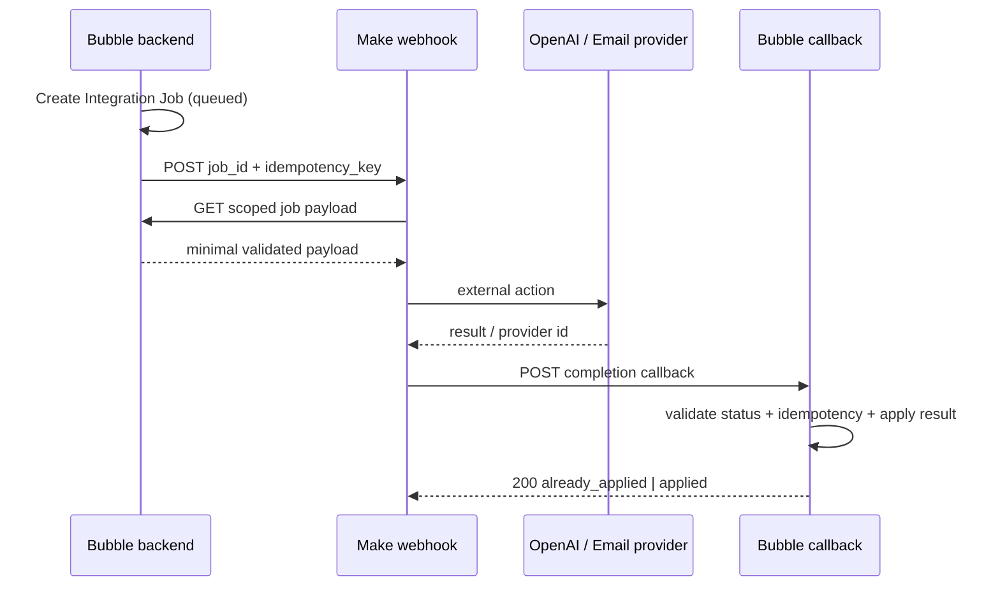

# Make Specification — Best Invest Properties

Date: 25 September 2026  
Orchestrator: Make  
Source of truth: Bubble

> **Division of responsibility:** Make **collects** data, Bubble **stores and
> calculates**, OpenAI **explains**. No Make scenario writes a published
> financial figure.

## 1. Role of Make in the system

Make is used for long-running, external and repeatable processes:

- **collecting comparable rental listings** from approved portals and market-data providers;
- generating the AI narrative via OpenAI;
- notifying the team about its own failures (built-in error notifications);
- future CRM synchronisation (after the MVP).

All emails and the saved-search digest are sent **by Bubble**, not Make — see §6 "Emails and saved-search digest".

Make must **not**:

- be the primary business database;
- decide score, yield, tax or approval on its own;
- hold a Bubble admin token with unrestricted access when a narrow Workflow API endpoint can do the job;
- change published records directly without server-side validation in Bubble;
- make any final legal or investment decision.

## 2. Integration overview



Bubble creates the Integration Job **before** calling Make. The webhook carries the minimum data; Make fetches the full scoped payload with a separate authenticated request. This reduces PII in Make queues/logs and prevents entity data from being spoofed through the webhook body.

## 3. Environments and connections

Separate Make Teams/folders, or at least separate connections, for:

- `BIP - Development`
- `BIP - Production`

Connections/secrets:

| Name | Where stored | Rule |
|---|---|---|
| Bubble Workflow API bearer token | Make connection/secret | separate Dev/Live; rotate quarterly or after an incident |
| Make custom webhook API key | Bubble API Connector private header | `X-Make-Apikey`; never in URL/Option Set |
| OpenAI API key | Make OpenAI/HTTP connection | production project key with budget/rate limits |
| Email (SendGrid) API key | Bubble settings, not Make | separate sending domain/environment |
| Callback shared secret | Make secret + Bubble API Connector/private config | separate Dev/Live |

Bubble outgoing calls must use private header parameters. The Bubble API Connector keeps private keys server-side; Development and Live keys are set separately.

## 4. Common webhook envelope

### Request Bubble → Make

```json
{
  "event_version": "1.0",
  "event_type": "ai.analysis.requested",
  "job_id": "job_01J...",
  "entity_type": "unit",
  "entity_id": "unt_01J...",
  "idempotency_key": "ai-analysis:unt_01J:score-v12:prompt-v1",
  "occurred_at": "2026-09-17T12:00:00Z",
  "environment": "live"
}
```

The idempotency key includes the prompt version. When the analysis prompt gets a new version, previous keys automatically become invalid and regeneration happens correctly without manual cleanup.

Headers:

```text
Content-Type: application/json
X-Make-Apikey: <private>
X-Correlation-Id: <job_id>
```

Never send in the envelope: email, phone, documents, exact address, OpenAI key, Bubble admin key.

### Immediate Make response

```json
{
  "accepted": true,
  "job_id": "job_01J..."
}
```

The Make webhook must respond quickly. For long scenarios, do not wait for the result in a Bubble page workflow; the UI reads the Integration Job status.

### Callback Make → Bubble

```json
{
  "event_version": "1.0",
  "job_id": "job_01J...",
  "idempotency_key": "ai-analysis:unt_01J:score-v12:prompt-v1",
  "status": "succeeded",
  "provider_request_id": "resp_...",
  "result": {},
  "metrics": {
    "duration_ms": 4820,
    "input_tokens": 1850,
    "output_tokens": 620
  },
  "completed_at": "2026-09-17T12:00:05Z"
}
```

Bubble callback workflow:

1. checks the bearer/shared secret;
2. finds the Integration Job by `job_id`;
3. checks `idempotency_key`, job type and the allowed status transition;
4. if the job is already `succeeded`, returns `200 {"result":"already_applied"}`;
5. validates result fields and the current related records;
6. writes the business result, the Audit Event and `succeeded` in one backend flow;
7. returns `200 {"result":"applied"}`.

## 5. Scenario register

The MVP needs **two** Make scenarios. The other IDs are kept for reference: emails and the digest moved to Bubble, and three scenarios are not built.

| ID | Scenario | Trigger | MVP |
|---|---|---|---|
| MK-10 | Comparable rental data collection | scheduled | **yes** — the main reason Make is used |
| MK-01 | Generate investment analysis | instant webhook | **yes** |
| MK-02 | Transactional email dispatcher | — | in **Bubble** (`Send email` in backend workflows) |
| MK-06 | Saved-search match digest | — | in **Bubble** (recurring backend workflow) |
| MK-03 | Approved introduction delivery | — | Bubble email (two emails, per-recipient retry) |
| MK-04 | Decision notification | — | Bubble email (templates) |
| MK-05 | Price and availability alerts | — | Bubble email (one job per recipient) |
| MK-07 | Integration dead-letter alert | — | not built: Make's built-in error notifications + the A10 Automation Monitor in Bubble |
| MK-08 | CRM export | — | after the MVP |
| MK-09 | Bulk re-score progress relay | — | not built: Bubble runs the recalculation and shows progress itself |

## 6. Scenario details

### MK-01 Generate investment analysis

**Trigger:** Integration Job `job_type = ai_analysis_generate`.

Modules/steps:

1. Webhooks — Custom webhook with API key.
2. JSON parse + schema/version check.
3. HTTP GET/POST to the Bubble endpoint `make_get_ai_payload` with `job_id`.
4. Filter: job status `queued|retry_wait`, entity current, payload hash matches.
5. HTTP POST `https://api.openai.com/v1/responses`, or the current Make OpenAI module if it can pass the full Responses API payload without losing Structured Outputs.
6. Parse the JSON Structured Output.
7. Validate: schema version, source keys, forbidden claims, numbers unchanged.
8. HTTP POST Bubble `make_complete_ai_job`.
9. Webhook response/finish.

The result is not published directly: Bubble creates an AI Analysis with `review_status = pending`.

Error route:

- 429/connection/timeout → Retry handler + incomplete execution;
- invalid model JSON → one regeneration with the same input and a repair instruction; then `failed_validation`;
- Bubble 409 stale snapshot → mark the job `cancelled_stale`, no retry;
- OpenAI policy/refusal → `failed_refusal`, show the admin the deterministic fallback;
- callback failure → retry the callback; do not repeat the OpenAI call if the provider result is already stored in the execution bundle.

### Emails and saved-search digest — in Bubble, not Make

All platform emails (MK-02 … MK-05 in earlier drafts) and the saved-search digest (MK-06) are sent **by Bubble** in the MVP, with the `Send email` action in backend workflows. Setup: Bubble's own SendGrid API key setting and a platform domain with SPF/DKIM, so emails do not land in spam.

Each email is recorded as an Integration Job (`job_type = email`, `recipient_user`, `template_key`, `idempotency_key`). Before sending, the workflow checks the Job: if it is already `succeeded`, nothing is sent again. A failed email stays `failed` and appears on the A10 Automation Monitor screen with a Retry button. A failed email never rolls back the business decision.

| Event | Recipient |
|---|---|
| Registration / password reset | the user |
| Developer application received | the developer |
| Verification decision: more info required / approved / rejected | the developer |
| Project decision: changes requested / approved / published / rejected | the developer |
| Change request: queried / approved / rejected | the developer |
| Enquiry received | the investor |
| Introduction approved (Approve & connect) | the investor **and** the developer, each with the other's whitelisted contact |
| Enquiry `on_hold` | **nobody** |
| Enquiry `declined` | the investor only — neutral template, three similar properties, **no reason** |
| Price/availability of a unit changed | investors who saved the unit or have an open enquiry about it (one job per recipient) |
| Saved-search digest | investors with active saved searches, per their `alert_frequency` |

Rules:

- **Introduction:** two separate jobs (`intro:<enquiry_id>:investor`, `intro:<enquiry_id>:developer`); if one fails, only that one is retried. The Enquiry moves `approved_for_intro → introduced` only when both are sent.
- **Decline:** the reason is never put into the email job; the developer receives no email and sees only a count of filtered-out requests.
- **Hold:** a job with an email template for `on_hold` is a configuration error and must not be sent.
- **Marketing vs transactional:** the digest and alerts are sent only with an active marketing/alerts consent; security and service emails are always sent.
- **Digest:** a Bubble recurring backend workflow (daily at 08:00 UTC; weekly on Mondays) builds one email per investor; investors with `alert_frequency = off` get nothing. Recurring workflows require a paid Bubble plan.
- Template key and language are stored on the Integration Job.

### MK-07 and MK-09 — not built in the MVP

- **Failure alerts:** Make's built-in scenario error notifications (email to the team) plus the A10 Automation Monitor in Bubble, which lists failed and stuck Integration Jobs with a Retry button. No separate alert scenario.
- **Bulk re-score:** Bubble recalculates in batches in a backend workflow and updates `processed_count` on the Integration Job; the Score Editor reads progress from it directly. Historical Listing Scores are never overwritten (BR-04); rolling back is a new batch, not a deletion.

### MK-10 Comparable rental data collection

**Trigger:** schedule. The frequency depends on each provider's terms and is set in the attributes of the `Data Provider` Option Set.

The market rent estimate is built from collected comparable listings, not entered manually by an analyst.

Steps:

1. Get from Bubble the list of active providers (the `Data Provider` Option Set) and the parameter sets that need a fresh sample. "Needs" means the current sample is older than `Country Config.max_comparable_age_days` (default **90**) or does not exist. Bubble builds the list — Make does not decide on its own what is stale.
2. For each set, call the provider's official API or feed.
3. Normalise the response by country, city/district, property type, number of bedrooms and floor area.
4. Compute `listings_count`, `rent_min`, `rent_median`, `rent_max`.
5. Send the result to Bubble in one callback — a **Rental Comparable Set** is created with `review_status = pending`.

Rules:

- Make does **not** write the result into a Financial Input and does not change any published figure. It creates a sample for the admin to review;
- a sample with `listings_count` below `Country Config.min_comparable_listings` (default **5**) is still stored but marked insufficient and cannot be approved — Make does not discard it; Bubble makes the decision;
- a sample between the minimum and `sufficient_comparable_listings` (default **10**) is stored with a **thin sample** flag;
- a new sample does not overwrite the previous one (Bubble switches `is_current`);
- `collection_method` records how the data was obtained — `api`, `feed`, or `manual_import` for the fallback;
- rate limits and terms of use are configured per provider; hitting a limit is not an error but a reason to lower the schedule frequency;
- if a provider is unavailable for several cycles in a row, an operational alert is raised: otherwise the rent estimate would go stale silently.

**Fallback without an API.** If a portal has no permitted API or feed, the sample is entered manually through the Bubble admin. Make is not involved in that case, but the record is created with the same type and the same fields.

**Legal note.** Connecting each source requires a check of its data terms of use. This is a contractual matter, not a technical one — see the `terms_reference` attribute in the `Data Provider` Option Set.

## 7. Idempotency and concurrency

Rules for every scenario:

- Bubble creates the `idempotency_key`; Make never generates it;
- before a side effect, Make checks the current Job status;
- after a side effect, it stores the provider id and returns it in the callback;
- a repeated bundle with the same key does not resend the email/AI request if a provider id already exists;
- for Unit change jobs, the key includes the target version;
- for webhook scenarios where order matters, enable **Process data in order**;
- independent jobs may run in parallel within the provider rate limit.

Make webhooks are processed in parallel by default, so ordering cannot be assumed without the corresponding scenario setting.

## 8. Error handling policy

In all production scenarios:

- `Store incomplete executions = Yes`;
- automatic retry for connection/rate-limit/timeouts;
- Retry error handler for important external modules;
- no silent Ignore/Skip for AI, introductions, decisions or transactional email;
- invalid business data → callback `failed_validation`, no endless retries;
- temporary failure → exponential/backoff retry;
- permanent 4xx authentication/configuration failure → dead letter + alert;
- 3–5 attempts depending on the provider, then manual resolution;
- `Discard data if storage is full = No` for critical scenarios;
- do not enable `Commit after each module` without a specific need; control side effects with your own channel-level idempotency.

Make incomplete executions are a recovery mechanism, not long-term storage. Critical data stays in the Bubble Integration Job.

## 9. Data Store in Make

Allowed:

- short-lived dedup/lock by idempotency key, if a scenario module requires it;
- cache of non-sensitive reference data;
- cursor for a technical scheduled batch.

Forbidden:

- master records for Users, Projects, Units, Enquiries;
- copies of verification documents;
- long-term storage of contact data;
- being the only source of delivery status.

If a Data Store is used for dedup, record key = idempotency key, TTL is cleared by scheduled maintenance, and the authoritative status is still checked in Bubble.

## 10. Logs and confidentiality

- Do not pass more data into Make scenario logs than necessary.
- For introductions and PII-heavy flows, consider `Keep data confidential`, bearing in mind it limits debugging; the choice must be aligned with the incident procedure.
- Error messages returned to Bubble are redacted: no token, email, document URL or raw OpenAI prompt.
- Correlation ID = Integration Job public_id in Bubble, Make and external metadata.
- Retention of Make logs/incomplete executions is documented separately as a subprocessor setting.

## 11. Monitoring and SLA

Dashboard metrics:

| Metric | MVP target |
|---|---:|
| Webhook acceptance p95 | < 2 s |
| AI job complete p95 | < 60 s |
| Transactional email queued p95 | < 2 min |
| Introduction complete p95 | < 5 min |
| Failed jobs after retries | < 1% |
| Duplicate side effects | 0 |
| Jobs stuck processing > 15 min | 0 |

Alert levels:

- P1: introduction delivered to one party only; possible data leak; credential compromise.
- P2: AI/transactional scenario dead-letter, >5 consecutive failures, provider auth error.
- P3: digest delay, individual non-critical email failure.

## 12. Naming convention in Make

```text
BIP | PROD | MK-01 | Generate investment analysis
BIP | DEV  | MK-01 | Generate investment analysis
```

Webhook names, connections and data stores must include the environment. Scenario notes must include owner, purpose, payload version, Bubble endpoints, retry policy and last review date.

## 13. Test scenarios

Must be verified (items 6–8, 11 and 13–15 test emails sent by Bubble; the rest test Make):

1. valid AI job → pending-review AI Analysis;
2. duplicate webhook → one AI call / one result;
3. OpenAI 429 → retry without a duplicate callback;
4. stale score version → cancel without publication;
5. malformed structured output → one repair attempt → failure;
6. approved introduction → two unique emails and status `introduced`;
7. failure of the second introduction email → retry only the second;
8. invalid/missing consent → no job is created;
9. Bubble callback timeout after external success → retry the callback, not the side effect;
10. Make queue/rate-limit response → the Bubble job stays retryable;
11. email opt-out → the marketing digest is not sent; transactional email is sent per the rules;
12. private data is not visible in a non-admin Make alert;
13. enquiry `on_hold` → no email; a job with an email template for this status ends as `failed_validation`;
14. enquiry `declined` → exactly one email to the investor; the reason is absent from the email body and the email job;
15. an availability change without an approved Change Request does not create an alert job;
16. a score recalculation with a partial failure leaves historical Listing Scores untouched and shows the failure state on the Score Editor with the processed count;
17. MK-10 creates a Rental Comparable Set with `review_status = pending` and does not change any Financial Input;
18. a sample with `listings_count` = 4 against a minimum of 5 is stored but cannot be approved; a sample of 7 is approved with a thin sample flag; a sample older than 90 days is not offered as a source;
19. a provider being unavailable for several cycles in a row raises an alert rather than letting the estimate go stale silently;
20. re-running MK-10 with the same parameters does not create a duplicate of the current sample.

## 14. Make readiness criteria

- all production webhooks are protected by an API key/secret and have a versioned schema;
- all critical scenarios have incomplete executions, a retry route and a dead-letter alert;
- secrets are separated Dev/Live and never appear in payload/URL/log text;
- every scenario has a documented owner and a rollback/disable procedure;
- a manual replay does not produce a duplicate email, AI analysis or status event;
- the Bubble admin sees the status, attempts and redacted error for every job;
- financial/approval decisions do not depend on the Make Data Store;
- introduction PII is passed only after explicit Bubble authorisation and consent validation.
