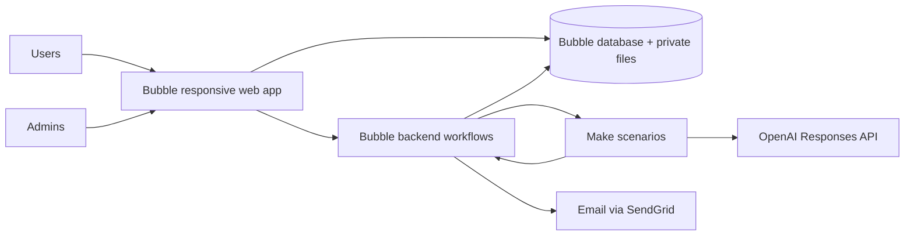

# Full MVP Specification — Best Invest Properties

Date: 25 September 2026  
Target platform: Bubble.io  
Integrations: Make, OpenAI API, transactional email provider

> This specification is based on the approved visual prototype, which defines
> the interface and visible behaviour. Numbers in the prototype are test data.

## 1. Executive summary

Best Invest Properties is a marketplace / controlled introduction platform for investment property in Spain and Cyprus. The platform lets:

- an investor find a specific available unit, compare financial metrics, see the score and request an introduction;
- a developer get verified, submit a project and keep price and availability up to date;
- the Best Invest team review all public data, the score, the AI narrative and every contact disclosure.

The MVP is not a financial adviser, a transaction platform or a full CRM. Its value is a controlled catalogue with transparent metrics, reviewed written analysis and a managed lead/introduction flow.

## 2. Goals and success metrics

### Product goals

1. Give the investor a clear path from criteria to an enquiry on a specific unit.
2. Give the verified developer a managed self-service submission flow.
3. Keep editorial/approval control with Best Invest.
4. Make every score, yield and narrative reproducible and auditable.
5. Launch Spain/Cyprus without hard-coded country logic, so adding a new market does not require rebuilding the database.

### Launch KPIs

| KPI | Initial target |
|---|---:|
| Search → property detail CTR | measure baseline; target after 30 days |
| Property detail → enquiry conversion | ≥ 3% qualified traffic |
| Registration completion | ≥ 55% of those who started the form |
| Developer application completion | ≥ 40% |
| Project submission without support intervention | ≥ 70% |
| Admin introduction decision within SLA | ≥ 90% |
| Duplicate enquiries/automations | 0 critical duplicates |
| Published records with complete traceability | 100% |

## 3. Roles

| Role | Main permissions |
|---|---|
| Anonymous visitor | landing, search, public unit detail, investment analysis and score |
| Investor | save, saved search, calculator scenarios, enquiry, dashboard, settings/data rights |
| Developer applicant | application status, requested information, draft preparation by rule |
| Verified developer member | own company/projects/units, change requests, masked leads |
| Admin | developer verification, project review and publication, introduction decisions, score model, users and automations |

One User may have several roles, but the MVP UI shows one active workspace at a time.

**In the MVP there is one admin type, `admin`.** The "four eyes" rule does not apply; instead, confirmation is mandatory for every important action, with a full history in the audit log. The admin area has the navigation Dashboard · Approvals · Investors · Investment Scores.

**Architecture requirement:** the access model is built so that `support`, `reviewer` and `senior_admin` roles can be added later without rework. So permissions are checked through `admin_permission_keys` in backend workflows, not by checking "role = admin".

## 4. Architecture decisions (ADR)

| ID | Decision | Consequence |
|---|---|---|
| ADR-01 | Investor browses Unit | search/detail/enquiry tied to concrete availability/price |
| ADR-02 | Project → Unit Type → Unit | repeated floor plans without duplication; individual price/status |
| ADR-03 | Single villa = one-unit Project | one model and one workflow |
| ADR-04 | One User, multiple roles | single auth store; role-based routing |
| ADR-05 | Application creates User/Company immediately | applicant can see status and add data |
| ADR-06 | Enquiry is aggregate root | one canonical lifecycle; role-specific labels are presentation only |
| ADR-07 | Score/financials deterministic, AI narrative only | figures reproducible; AI failure does not block the core product |
| ADR-07a | Financial input estimates are produced by Make from collected comparable listings, not by AI; they are not published without admin approval; all derived values and the score are calculated by the deterministic Bubble service | the principle "OpenAI does not calculate money" applies without exception |
| ADR-08 | Bubble source of truth, Make orchestrator | simpler audit, retry, privacy and recovery |

## 5. Technical architecture



### Component responsibilities

- Bubble pages: UI, route guards, forms, client calculations for preview only.
- Bubble backend workflows: authorisation, validation, deterministic calculations, status transitions, final writes.
- Bubble database: authoritative state, versions, audit, consent, integration jobs.
- Make: collecting rental listings from portals and generating the AI narrative via OpenAI; retry of external calls.
- OpenAI: reviewed narrative only.
- Email: all emails and the saved-search digest are sent by Bubble (backend workflows, own SendGrid key and domain with SPF/DKIM).

## 6. Information architecture and screens

The "Prototype" column shows the screen number in the approved prototype. `—` means a minimal screen that is being added to the prototype (contents in §6.4).

### Public / investor

| ID | Screen | Prototype | MVP status |
|---|---|---|---|
| P01 | Landing / Home | 01 | approved |
| P02 | Investment Search & Results (Browse) | 02 | approved |
| P03 | Property/Unit Detail | 04 | approved |
| P04 | Investment Analysis | 05 | approved |
| P05 | Financial Calculator | 06 | approved |
| P06 | Compare Investments | 07 | approved |
| P07 | Investor Registration | 08 | approved |
| P08 | Login | 15 | approved |
| P09 | Forgot Password / expired link | 24 | approved |
| P10 | Investor Dashboard | 09 | approved |
| P11 | Saved Searches | 09 (panel) | panel on the P10 dashboard, no separate screen |
| P12 | Enquiry Detail | — | minimal screen — §6.4 |
| P13 | Account Settings | 25 | approved |
| P14 | Privacy, Terms | 17, 18 | layout approved; text prepared by the lawyer |
| P14b | Cookie Policy, Investment/AI Disclaimer | — | minimal pages — §6.4 |
| P15 | How It Works / About / Contact | partly | "How it works" is an anchor section on P01; no separate About/Contact |

### Developer

| ID | Screen | Prototype | MVP status |
|---|---|---|---|
| D01 | For Developers | 16 | approved |
| D02 | Developer Sign-up | 19 | approved |
| D03 | Verification Status / Re-upload | 26 | approved |
| D04 | Developer Portal | 10 | approved |
| D05 | Company Profile | 27 | approved |
| D06 | Add/Edit Draft Project | 11 | approved |
| D07 | My Projects | 20 | approved |
| D08 | Project & Units | 21 | approved |
| D09 | Changes Requested | 10 (`changes` state) | implemented as a state of the D04 portal, not a separate screen |
| D10 | Leads | 22 | approved |
| D11 | Lead Detail / outcome | — | minimal screen — §6.4 |

### Admin

| ID | Screen | Prototype | MVP status |
|---|---|---|---|
| A01 | Admin Login / role gate | 31 | approved |
| A02 | Dashboard | 12 | approved |
| A03 | Unified Approvals Queue | 23 | approved; four sections (see §6.1) |
| A04 | Project Review | 28 | approved |
| A05 | Developer Verification | 29 | approved |
| A06 | AI / Analysis Review | 28 (panel) | panel inside A04, no separate screen — §6.2 |
| A07 | Score Model Versions | 13 | approved; includes a compact versions table — FR-11b |
| A08 | Enquiries / contact release | 12 + 23 | split: enquiries table on A02, decisions in the Introductions section of A03 |
| A09 | Users and Companies lookup | 30 | approved as "User Management" (investors + developer contacts) |
| A10 | Automation Monitor | — | minimal block — §6.4 |
| A11 | Country & Cost Settings | — | minimal form — §6.4 |
| A12 | User Journeys (internal diagram) | 14 | reference screen for the team; not part of the client-facing product |

The admin navigation has exactly four items: **Dashboard · Approvals · Investors · Investment Scores**. A04 and A05 open from the A03 queue and have a "← Approvals queue" back button; they have no menu items of their own.

### 6.1 Approvals queue structure (A03)

One queue with a type switch — five tabs: **All · Project submissions · Developer applications · Introductions · Listing changes**. Sections:

| Section | Source | Row actions |
|---|---|---|
| New project submissions | Project `submitted` | "Open review" → A04 |
| Developer applications | Developer Application `submitted/under_review` | "Open verification" → A05 |
| Investor introductions | Enquiry awaiting a decision | Approve & connect · Hold · Decline |
| Listing change requests | Change Request for price/availability | Approve · Query · Reject |

Each section shows an "N WAITING" counter that goes down after a decision. After a decision the row is replaced by a result block listing the emails sent (chips "✉ Investor notified", "✉ Developer notified") and a **Reopen** button (for Hold / Decline) or **Correct status** (for Connected) — see FR-11. "Queue clear" is a separate empty state for the whole screen.

`Hold`, `Decline`, `Query` and `Reject` require a written reason (the modal cannot be confirmed without it). `Hold` and `Query` additionally require a follow-up date and an owner — in the MVP the owner is filled in automatically. `Approve` for an introduction or a project submission needs no reason but shows a warning that contact disclosure cannot be undone.

### 6.2 Analysis panel in Project Review (A04)

The A04 screen contains an "Investment analysis" panel with two states (`Awaiting review` / `Reviewed & approved`) and these blocks:

1. **Metrics**: Investment score, Gross yield, Net yield.
2. **Proposed financial estimates** — rows with a provenance label: `Proposed` (proposed by the analyst), `Assumption` (platform default value), `Calculated` (calculated deterministically). These values are not produced by AI — see FR-03a.
3. **Category assessments** — five criteria with points and an explanation.
4. **Sources, assumptions & gaps** — tags `SOURCE`, `DEVELOPER`, `ESTIMATE`, `GAP`.
5. Note: "Analysis uses the agreed free/open sources. Information gaps are flagged for review or manual input".

Before approval the panel is labelled "Not yet visible to investors"; after — "Published … Investors see this saved version".

### 6.3 Screen states

The list of states below is a mandatory part of the implementation scope.

| Screen | States |
|---|---|
| P02 Browse | `Results` · `Loading` (skeletons) · `Query failed` (error with retry); separately `Signed in` / `Signed out`; empty filter result |
| P03 Detail | `Published` · `Enquiry sent` · `Analysis not ready` · `Withdrawn / 404` |
| P04 Analysis | `Full analysis` · `Narrative unavailable` (deterministic fallback) |
| P05 Calculator | field validation; the result block is not calculated while there are errors |
| P06 Compare | empty (<2 properties) · 2–3 properties · limit when trying to add a 4th |
| P08 Login | `Credentials` · `Two-factor` · `Locked`; login error state |
| P09 Forgot password | `Request` · `Sent` · `Reset` · `Done` |
| P10 Dashboard | `Active investor` · `First day — nothing yet` (empty state) |
| P13 Account settings | `idle` · `Saving…` · `Saved` |
| D04 Developer portal | `verified` · `pending` · `changes` · `approved` |
| D03 Verification status | `pending` · `more info required` · `rejected`; document upload progress |
| D06 Add project | required-field errors; file upload progress and error |
| A02 Admin dashboard | `Queue has work` · `Nothing to review`; decision result per card |
| A03 Approvals queue | `Queue has work` · `Queue clear`; decision result per row |
| A04 Project review | `Awaiting review` · `Reviewed & approved` |
| A07 Score editor | `idle` · `running` (progress N of 83) · `done` · `failed` |

Cross-cutting system states are also mandatory: `403`, maintenance, session expired, offline/network error, stale record/conflict, duplicate submit, unsaved changes guard. `404` is shown as the "Withdrawn" state on P03.

**Toast and modals are global.** One toast (auto-dismiss ~3.8 s, click to close) and one confirmation modal for the whole app. The modal has: a title, text, an optional note, an optional required reason field, and Cancel / confirm buttons. Confirmation tone: regular (blue) or destructive (dark red).

### 6.4 Minimal screens

Five screens are needed for the MVP **in minimal form** — one screen each, in the style of the approved design.

| Screen | Minimal contents |
|---|---|
| **A10 Automation Monitor** | a small block in the admin area: list of stuck/failed jobs, type, entity, error text (redacted), Retry button. No large separate dashboard |
| **A11 Country & Cost Settings** | a form for editing taxes and costs per country. Mandatory: these values must not be edited directly in the database |
| **P12 Investor Enquiry Detail** | property/unit, enquiry date, current status (investor label), status history, contact disclosure state |
| **D11 Developer Lead Detail** | lead reference, unit/project, status, contacts permitted for display, a field for the lead outcome |
| **P14b Cookie Policy + disclaimers** | pages with the Privacy/Terms structure; text prepared by the lawyer. Cookie banner if non-essential analytics or marketing cookies are used |

## 7. End-to-end flows

### 7.1 Investor discovery → enquiry

1. Visitor sets country, budget, bedrooms/type and minimum yield on Landing.
2. P02 opens with query parameters and live search constraints.
3. Visitor sorts/filters, saves to compare in session.
4. P03 shows one Unit with project context, approved media, availability, financials and score.
5. P04 explains the deterministic score; the AI narrative is labelled reviewed/AI-assisted.
6. P05 recalculates the scenario locally and optionally saves after login.
7. P06 compares 2–3 Units; each row has a canonical better direction.
8. "Request information/analysis" opens login/registration when anonymous.
9. Investor reviews contact-sharing consent and submits the Enquiry.
10. Confirmation shows the reference and `submitted` status.
11. Admin screens the enquiry; on approval, confirms the contact release.
12. Bubble sends both introduction emails; the Enquiry moves to `introduced` after both are sent.
13. Investor sees the history in P12; developer sees a role-safe status in D10/D11.

### 7.2 Developer application → verified portal

1. D02 creates the User, Developer Company and Application draft.
2. Applicant fills in company/contact/markets and uploads private documents.
3. Submit validates required fields/document matrix and records consents.
4. D03 shows `submitted/under_review` with the application reference.
5. Admin A05 reviews document by document.
6. `more_info_required` unlocks the relevant uploads/fields and shows the public reviewer message.
7. An approved application links the User to the Developer Company and activates the developer role.
8. A rejected application keeps the reason, support path and allowed resubmission policy.

### 7.3 Project submission → publication

1. Verified developer creates a Project draft.
2. Adds Unit Types, Units, media and private documents.
3. The readiness checklist is calculated from explicit submission rules.
4. Save draft is autosave/manual; the unsaved changes guard works.
5. Submit sets status `submitted`; the project cannot be edited during review.
6. Admin A04 sees full media/documents/financial inputs and a validation summary.
7. Request Changes creates a structured request; D09 shows fields/reason and the resubmit path.
8. Approve and Publish are separate actions.
9. Publish requires admin permission and a complete current score/analysis.
10. Published Units appear in P02; Project/Unit history remains reconstructable.

### 7.4 Price/availability update

1. Developer edits only the allowed fields on D08: **price** and **availability**.
2. The UI collects a Change Request batch with old/new values.
3. Submit freezes the items and shows pending per Unit ("Price change pending approval" in the unit row).
4. Admin A03 approves/rejects/queries each batch in the **Listing change requests** section.
5. Approval applies once, recalculates financials/score, marks AI stale and queues regeneration.
6. Investors who saved the unit receive the configured notifications.

Rules:

- **both** changes — price and availability — go through prior admin approval; there is no immediate availability change;
- availability values the developer can set: `Available`, `Reserved`, `Sold`;
- `Withdrawn` is not available to the developer — it is an admin action (P03 has the matching "Withdrawn / 404" state);
- all other fields of a published project are locked and shown in the **"LOCKED — ADMIN REVIEW REQUIRED"** panel: project name, location, completion, unit mix, specification, media. A request to change them is queued alongside the original submission;
- the D08 screen keeps a **Change history** with rows "date · what changed · state" (`Awaiting approval`, `Approved`).

## 8. Functional requirements

### FR-01 Search and catalogue

- Search object: published and available Unit.
- Filters (left column, applied immediately, no Apply button):

  | Filter | Control | Values |
  |---|---|---|
  | Country | checkboxes | Cyprus, Spain |
  | Property type | checkboxes | Apartment, Villa, House |
  | Bedrooms | checkboxes | Studio, 1, 2, 3+ |
  | Strategy | checkboxes | Long-term rental, Short-term rental, Mixed with private use, Capital growth |
  | Completion | checkboxes | Ready, `<12 months`, `12–24 months` |
  | Max price | slider | up to €400,000 |
  | Min gross yield | slider | from 6% |
  | Min net yield | slider | from 4.5% |

- Default sort: **net yield descending**.
- Sort options: **net yield, gross yield, investment score, price**.
- Debounce filter changes; update count and ranking. The match counter sits in the filter column header and shows `0` on an empty result.
- Rank number is the rank within the current filtered result set.
- **Pagination: 8 cards per page**, numbered pager with "Previous / Next" and the label "Showing X–Y of N properties". No infinite scroll.
- **"Top 5" rail** — a side block with the five best properties by the current sort; the label changes: `BY NET YIELD` / `BY GROSS YIELD` / `BY SCORE` / `BY PRICE`. On mobile it moves above the list. Hidden in the `loading` and `error` states.
- Empty state recommends widening named constraints.
- On mobile, filters collapse into a drawer with a selected-count badge.
- Compare is selected directly from result cards; limit is 3 properties, trying to add a fourth shows a toast.
- Anonymous compare persists in the browser session; account persistence optional in the MVP.
- Greece/Portugal never look live unless Country Config says `coming_soon` with a clear label.

**Gating.** Search, cards, the detail page, score, net yield and the full Investment Analysis are available **anonymously**. Sign-in is required to: save a property to the shortlist, save a search, send an enquiry and save a calculator scenario. Trying to save without signing in shows the toast "Sign in to save properties to your shortlist" / "Sign in to save this search".

### FR-02 Unit detail

- Show price, availability, unit attributes, project facilities, approved media, score/version date, financial assumptions.
- **Developer identity is never shown.** The developer's name and contacts are not shown in the catalogue; the label is "Introduced by Best Invest", and every introduction is approved by the admin first (BR-07). The `Project.developer_visible_publicly` flag is fixed at "hidden".
- Exact unit number/address can be masked.
- An unavailable/sold/withdrawn link shows the current status and alternatives, not a generic 404. This is the `Withdrawn / 404` state with an explanation and a link to similar properties.
- The `Analysis not ready` state shows the property without the analysis block and without a score.
- The `Enquiry sent` state replaces the CTA with a confirmation and the enquiry reference.
- The CTA captures the chosen Unit.
- No listing may publish without a cover image, calculated financials and a current score.

### FR-03 Analysis and score

The score has **five** categories — the same on the Investment Analysis, Compare, Score Editor and Project Review screens:

| # | Category | Max points | Default weight |
|---|---|---:|---:|
| 1 | Rental Income & Net Yield | 30 | 30% |
| 2 | Rental Demand & Tenant Quality | 20 | 20% |
| 3 | Purchase Value & Market Position | 20 | 20% |
| 4 | Growth & Resale Potential | 15 | 15% |
| 5 | Risk & Investor Protection | 15 | 15% |
| | **Total** | **100** | **100%** |

- Model requirements:
  - weights total 100%; saving is blocked until the total equals 100;
  - the components add up to the displayed score (rounding tolerance ≤ 0.01);
  - every category has an explanation on the analysis screen;
  - for "Risk & Investor Protection", more points means **lower** risk — the scale direction is labelled in the UI.
- The analysis screen shows the calculation date, the model version and links to sources/disclaimer, and separates: calculated figures, deterministic explanation and the AI-assisted reviewed narrative.
- The **"Sources, assumptions & gaps"** block with provenance tags: `SOURCE` (external source), `DEVELOPER` (developer data, not independently verified), `ESTIMATE` (modelled assumption), `GAP` (missing data). The tags are mandatory — they carry legal weight.
- If AI is pending/failed, the page still renders the score breakdown (`Narrative unavailable` state).
- Admin confirmation required before re-scoring everything.
- Previous scores remain in history.

### FR-03b Scoring rubric

Each criterion first gets a **rating from 0 to 10**, which is then converted into points by the criterion weight:

```text
weighted_points = rating / 10 × criterion_weight
total_score = Σ weighted_points   (maximum 100)
```

In the MVP the weights are the same for Cyprus and Spain. What differs is the **country input data**, the legal requirements and the market benchmarks, not the weights themselves.

#### 1. Rental Income & Net Yield — weight 30

The rating is set directly by net yield:

| Net yield | Rating | Points out of 30 |
|---|---:|---:|
| < 2% | 0 | 0 |
| 2 – 2.99% | 2 | 6 |
| 3 – 3.99% | 4 | 12 |
| 4 – 4.99% | 6 | 18 |
| 5 – 5.99% | 7 | 21 |
| 6 – 6.99% | 8 | 24 |
| 7 – 7.99% | 9 | 27 |
| ≥ 8% | 10 | 30 |

#### 2. Rental Demand & Tenant Quality — weight 20

A structured assessment; the sub-criteria add up to a 0–10 rating:

| Sub-criterion | Points |
|---|---:|
| Market activity and number of comparable listings | 0–3 |
| Year-round demand | 0–3 |
| Diversity of potential tenants | 0–2 |
| Seasonality and vacancy risk | 0–2 |

#### 3. Purchase Value & Market Position — weight 20

The price per m² is compared with the median price of similar new builds in the district:

| Deviation from the median | Rating |
|---|---:|
| ≥ 15% cheaper | 10 |
| 10–15% cheaper | 9 |
| 5–10% cheaper | 8 |
| within ±5% | 7 |
| 5–10% more expensive | 5 |
| 10–15% more expensive | 3 |
| > 15% more expensive | 1 |

This needs a separate input — the **median price per m² for the district** — stored as a benchmark with its source and check date.

#### 4. Growth & Resale Potential — weight 15

| Sub-criterion | Points |
|---|---:|
| Price trend | 0–4 |
| Liquidity and number of transactions | 0–3 |
| Infrastructure and economic factors | 0–2 |
| Recency and completeness of data | 0–1 |

#### 5. Risk & Investor Protection — weight 15

More points means **lower** risk.

| Sub-criterion | Points |
|---|---:|
| Legal status / title | 0–3 |
| Building permits and documents | 0–2 |
| Payment / escrow protection | 0–2 |
| Developer check | 0–2 |
| Construction stage risk | 0–1 |

#### Worked example

| Criterion | Rating | Points |
|---|---:|---:|
| Rental Income & Net Yield (net 5.6%) | 7 | 21/30 |
| Rental Demand & Tenant Quality | 8 | 16/20 |
| Purchase Value & Market Position | 8 | 16/20 |
| Growth & Resale Potential | 8 | 12/15 |
| Risk & Investor Protection | 8 | 12/15 |
| **Total** | | **77/100** |

### FR-03a Financial inputs and their approval

**Source of each figure:**

| Figure | Source |
|---|---|
| Price, floor area, completion date | developer |
| Claimed rent | developer (stored separately, never used automatically) |
| Market rent estimate | integration with approved property portals / market-data providers |
| Recurring costs | approved averages for the country/region |
| Vacancy allowance | platform settings |
| Acquisition cost, gross yield, net yield | calculated automatically by formula |
| Cost/tax tables | official Cyprus and Spain sources, checked by a tax/legal consultant |

**OpenAI takes no part in producing these figures.** The model only writes an explanation of an already verified result. Division of responsibility: **Make** collects data, **Bubble** stores it and calculates the formulas, **OpenAI** explains the finished result. That is why the A04 panel is called **Proposed financial estimates**, with no mention of AI.

**How the market rent estimate is produced:**

1. Make regularly retrieves comparable rental listings through an official API, a feed or another permitted method from approved portals for Spain and Cyprus.
2. The data is normalised by country, city/district, property type, number of bedrooms and floor area.
3. The system calculates a **recommended rental range** and a base rent estimate.
4. The admin checks the result; it is not published before this check.

For every estimate the following is stored:

- portal or data provider;
- data retrieval date;
- district;
- sample parameters;
- number of comparable listings;
- range and median;
- admin review status.

**Sample acceptance thresholds.** Configurable per country, because market liquidity differs.

| Threshold | Default | Behaviour |
|---|---:|---|
| Minimum listings | **5** | below this, the sample **cannot be approved** |
| Sufficient sample | **10** | between 5 and 9 the sample is approved but flagged **thin sample** |
| Maximum age | **90 days** | after this the sample is stale and cannot be the source of a new value |

The "thin sample" flag is shown to the admin on the review screen and added for the investor as a fact tagged `ESTIMATE` — the investor should see that the estimate is based on a small sample.

**Fallback.** If a portal has no permitted API or feed, the MVP uses manual entry or import of comparable listings. The fallback is stored with the same set of fields and a different source value, so the provenance of the figure stays visible. The acceptance thresholds apply equally to the automatic and the manual method.

**The developer's rent claim is stored separately** and is never automatically used as verified market rent.

> Cost/tax tables do **not** come from property portals. They are a separate
> source: official data for Cyprus and Spain, checked by a local legal or tax
> consultant. They are stored as country settings (A11), not hard-coded into
> the formulas.

**Approval rules:**

- every row has a provenance label: `Proposed` (proposed by the analyst), `Assumption` (platform default value), `Calculated` (deterministically derived from the others);
- derived values (acquisition cost, net rental income, yields, score) are **always** calculated by the deterministic service;
- proposed values do not reach the public listing until the admin approves them on A04. Before approval the panel is labelled "Not yet visible to investors";
- approval records the reviewer and time (Audit Event);
- alongside each figure, the **Financial inputs** control panel shows the source of every number ("Developer rent claim", "Our comparable rent", "Rent used for scoring").

### FR-04 Calculator

- Inputs: purchase price, cash/mortgage, deposit, loan, interest, term, rent, occupancy, management fee.
- A strategy switch (`Long-term` / `Short-term`) and a rent scenario switch — **base / average / best case**. The chosen scenario substitutes its rent for the manual value.
- Country costs: transfer/VAT, legal/notary/registration and configured recurring costs.
- Validation (messages are shown under the field; the result block is not calculated while there are errors):

  | Field | Rule | Message |
  |---|---|---|
  | Purchase price | > 0 | Enter a purchase price above zero. |
  | Deposit (mortgage) | ≥ 0 | Deposit cannot be negative. |
  | Deposit (mortgage) | ≤ purchase price | Deposit cannot exceed the purchase price. |
  | Term (mortgage) | ≥ 1 year | Term must be at least 1 year. |
  | Interest (mortgage) | ≥ 0 | Interest cannot be negative. |
  | Monthly rent | ≥ 0 | Monthly rent cannot be negative. |

  Occupancy (50–100%) and management fee (0–25%) are limited by the slider range, not by an error message.
- Live calculation is deterministic and uses the formula version.
- Clearly state why a personalised scenario may differ from the published yield.
- Saving/naming a scenario requires login.
- The calculator uses the same formulas as the Unit financial fields (database architecture §5.4) and the same approved rent estimate.

### FR-05 Compare

- 2–3 Units; adding a fourth shows a limit toast.
- Add/remove and return to results.
- Comparison rows:

  1. Price / total acquisition cost
  2. Monthly / annual rent — base case
  3. Net yield — base case
  4. Monthly / annual rent — average case
  5. Net yield — average case
  6. Monthly / annual rent — best case
  7. Net yield — best case
  8. Gross yield
  9. Investment score
  10–14. The five score categories as separate rows (points / maximum)
  15. Size
  16. Completion

- Best marker based on the configured direction; availability/risk use an explicit order, not a numeric guess.
- Mobile horizontal scroll with a pinned metric column.

### FR-06 Registration and authentication

- Investor registration (screen 08) — fields:

  | Field | Type | Required | Error message |
  |---|---|---|---|
  | Full name | text | yes | Enter your full name. |
  | Email | email | yes | This address is already registered. Sign in instead? |
  | Password | password | yes | Use at least 8 characters, including one number. |
  | Phone | tel | no | — |
  | Country of residence | text | no | — |

  Plus consent to Terms/Privacy and a **separate** marketing consent.
- Sign-in with Google is not included in the MVP — email + password only.
- Email verification required before enquiry/contact sharing; browsing policy is configurable.
- Duplicate email, weak password, wrong credentials, locked/suspended/unverified states.
- **Login (screen 15)** has three states: `Credentials`, `Two-factor`, `Locked`, plus the error state "We do not recognise this email and password combination."
- **Admin login (screen 31)** — a separate login with its own two-step process (credentials → 2FA) and a locked state.
- **Forgot password (screen 24)** — four steps: `Request` → `Sent` (a neutral message that does not reveal whether the account exists) → `Reset` → `Done`. Handling of an expired/used token is shown in text.
- Route by active role/workspace.
- Admin accounts require a stronger access policy/2FA, subject to Bubble capability and plan.

### FR-07 Investor dashboard

- Profile criteria with an edit link: Budget, Target yield, Preferred countries, Strategy.
- Recommendations = the same catalogue ranking with saved criteria, unless a separate documented model is approved.
- Saved Units with changed price/availability badges; removing from the list has a confirmation step ("removing" state).
- Saved Searches and alert frequency.
- Enquiries with canonical history and public notes.
- Empty/loading/error states for each panel independently, plus a separate full empty dashboard state "First day — nothing yet".

### FR-07a Account settings (screen 25)

- Contact fields: Full name (required), Email (required, duplicate check), Phone, Country of residence.
- Editable investment criteria: Budget, Target yield, Time horizon.
- Consent and notification management.
- The save button has three states: `Save changes` → `Saving…` → `Saved`; a repeated click during saving is ignored.
- Password change — through a confirmation modal warning that sessions on other devices will be ended.
- **Account closure** — a modal with a required reason and text explaining that records linked to a completed introduction are kept for seven years as required by law.

### FR-08 Developer application

- Required fields explicitly marked: every field is labelled `Required` / `Optional`.
- Application fields (screen 19), three groups:

  **Company:** Registered company name\*, Registration number\*, Country of registration\*, Developer licence number\*, Company website, Years active.
  **Contact:** Contact name\*, Work email\* (corporate domain only), Phone\* (with country code), Password\*, Confirm password\*, Role.
  **Portfolio:** Projects completed, Projects currently selling, Typical unit price.

- Application documents are split into three levels:

  | Document | Level |
  |---|---|
  | Company registration certificate | REQUIRED — before verification |
  | Developer licence | REQUIRED — before verification |
  | Building permit for first project | TO CONFIRM — needed before project publication, not before account opening |
  | Escrow or bank guarantee confirmation | TO CONFIRM — off-plan only |
  | Two client or bank references | OPTIONAL — strengthens the application |

  **The document matrix is configurable.** The list is not hard-coded; it is defined by records with these parameters: country · document type · developer or project · required for account creation · required for project submission · required for publication · validity period.

  The matrix is set separately for Cyprus and Spain; building permit and escrow are not hard-coded as required for all countries.
- Private uploads with type/size/progress/cancel/error.
- Application received confirmation and email with a reference like `APP-0142`.
- Applicant can resume and answer `more_info_required`. Screen 26 (Verification Status) has three states: `pending` ("Under review", decision expected within 2–5 working days), `more info required` (a list of what must be replaced, plus an upload button with progress) and `rejected`.
- Terms/listing agreement acceptance version recorded.

### FR-09 Project editor

- Project fields (screen 11): Project name, Location, GPS coordinates, Completion date, Number of units.
- A project type switch: **single property** (villa/house) or **complex** with several units. For a single property the units block is replaced by one form.
- Facilities — a set of checkboxes: Communal pool, Gym, Gated area, Underground parking, Tennis / golf, Concierge, Lift, Landscaped gardens.
- Unit fields: Unit number, Bedrooms, Bathrooms, Area m², Price, Expected rent.
- Unit spreadsheet import is excluded from the first release unless separately budgeted; provide a disabled/coming-soon state or remove the link.
- Reorder photos, choose cover, assign a floor plan to a Unit Type. Floor plans (PDF/PNG) are kept in a separate list and assigned to a type or to the whole project.
- Unit create/edit/duplicate/remove with confirmations. Duplicating automatically increments the unit number and sets `Available`.
- Media upload has a percentage progress bar, cancel and an error state.
- Explicit actions, no ambiguous button: **Save draft**, **Discard draft**, **Submit for review**, each with a confirmation modal.
- The readiness checklist distinguishes "ready to submit" and "ready to publish". Four rows: Project details, Developer profile, Photos (N of 30), Units (N of declared). A project **can** be submitted with an incomplete set of units, with a warning in the modal: "12 units declared · 3 entered. You can submit and add the rest before publication." — so unit completeness is a condition of **publication**, not of submission.
- The submission confirmation says the project cannot be edited during review and gives a typical timeframe of 3–5 working days.
- Duplicate submit protected by idempotency; reference like `PRJ-0311`.

### FR-10 Leads/introduction

- Before release the developer sees the enquiry reference, Unit/project, budget band, fit summary and stage without investor PII.
- The Leads screen (22) shows rows with: reference (`LEAD-0412`), project/unit, budget band, stage, contact, date. Until a decision is made, the contact field shows a lock and the text **"Contact details released after Best Invest approves"** — no PII. After approval, the name and email/phone appear in the same field.
- After contact release, show only the approved contact fields.
- The developer can acknowledge/respond and record the outcome.
- SLA age indicator after introduction. The developer has **five working days** for first contact (text of the "Approve & connect" modal).
- **Behaviour on decline:**
  - the investor receives a neutral message **without a reason** and three similar properties;
  - the developer sees **neither** the fact of the specific decline nor the reason — only a count of filtered-out requests;
  - the reason is stored in the audit log and shared only within the team.
- Introduction decisions in the A03 queue and their consequences:

  | Action | Emails | Result |
  |---|---|---|
  | Approve & connect | to the investor **and** the developer | contacts disclosed, status "CONNECTED" |
  | Hold | **none** | status "ON HOLD", reason required |
  | Decline | investor only (neutral text) | status "DECLINED", reason required |

  The Approve modal warns explicitly: "Contact details cannot be recalled once sent".

### FR-11 Admin approvals

- One queue (A03) holds four types: project submission, developer application, introduction, listing change. **AI review is not a separate queue type** — it is the analysis panel on A04 (see §6.2).
- Type filter — five tabs; plus filters by request age, `overdue` (follow-up date in the past) and status.
- Every decision that rejects or requests changes has a reason; the modal does not allow confirming an empty reason and shows "A reason is required before this can be sent."
- The approval UI shows full context and stale-record detection.
- Publish and contact release require confirmation.
- All decisions append an Audit Event.

**No Undo after a decision.** After `Approve & connect` the contacts are already disclosed and the emails sent, so cancellation is impossible. Rules:

- confirmation is shown **before** sending, not after;
- after sending, `Reopen` (for Hold / Decline) or `Correct status` are available — they move the status forward rather than rolling the action back;
- no label claims that contacts or emails were recalled.

**Hold and Query require three fields:**

| Field | Required | Note |
|---|---|---|
| Reason | yes | |
| Follow-up date | yes | date to return to the item |
| Owner | yes | in the MVP filled in automatically = current admin, not chosen each time |

A filter by owner will be added later, when there is more than one admin.

### FR-11a Admin dashboard (A02)

- Five counters: Registered investors, Active developers, Published properties, New enquiries, Hot leads. The last two are highlighted with the accent colour.
- A card for the next project awaiting approval with the actions Open full review / Approve / Request Changes / Reject.
- New enquiries table: Investor, Property, Budget, Stage, Age.
- "Nothing to review" state with a link to User Management.

**Statuses: one canonical status, three sets of labels.** Different words on A02, A03 and D10 are role labels for one status, not different stages. Full table:

| Canonical status | Admin | Investor | Developer |
|---|---|---|---|
| `submitted` | New | Request received | not shown |
| `screening` | Qualifying | Awaiting analysis | not shown |
| `qualified` | Hot lead / Awaiting you | Awaiting admin approval | Awaiting admin approval |
| `on_hold` | On hold | Under review | On hold |
| `declined` | Declined | Not available | Filtered out by Best Invest |
| `approved_for_intro` | Connecting | Introduction being prepared | Introduction being prepared |
| `introduced` | Connected | Developer contacted | Introduced |
| `developer_responded` | In progress | Developer responded | Contacted |
| `closed_won` | Converted | Completed | Converted |
| `closed_lost` | Closed | Closed | Closed |
| `cancelled` | Cancelled | Cancelled | Cancelled |

`AWAITING YOU` and `Hot lead` are admin labels for the `qualified` status, not separate stages. "Not shown" means the record is unavailable to that role at the privacy-rule level, not just hidden in the layout.

### FR-11b Score model editor (A07)

- Five weight sliders, each 0–100%, step 1.
- The total is shown as a large figure; while it is ≠ 100, a warning is shown: "Weights must total 100 before saving. Currently over/under by N".
- A Reset button restores the default weights.
- Saving goes through a confirmation modal that states the number of properties to be recalculated.
- The recalculation has progress ("N of 83"), a completion state (with **Revert** to the previous version) and a failure state with a reference (`SCORE-9C04`) and the buttons "Retry the remainder" and "Roll back".
- The **Impact preview** panel shows how the scores of three properties would change.

**Model version history.** No large separate screen is needed. A small table or slide-out panel on the Score Model page is enough, with: version number · date · author · weights · reason for change · number of properties recalculated.

`Revert` **creates a new version** with the parameters of the previous one; it does not delete history (BR-04).

**Weight rules:**

- slider range — **0–100%**, no hard cap on a single criterion;
- one mandatory rule: **weights total 100%**; until they do, saving is blocked;
- a soft warning if any criterion exceeds **50%**: in that case one criterion determines the whole score and the other four become decorative. The warning **does not block** saving — it informs.

The 50% threshold is a UI constant; it can be changed without a database migration.

### FR-11c User management (A09)

- Table: Name + email, Role, Registered, State, actions.
- Account states: `Active`, `Pending verification`, `Suspended`.
- Row action: **Suspend** (requires a reason).

"View as user" (signing in as a user) is not included in the MVP.

### FR-12 Notifications

Transactional templates:

1. verify email;
2. password reset/security notice;
3. developer application received;
4. verification more info/approved/rejected;
5. project submitted/changes requested/approved/published/rejected;
6. change request queried/approved/rejected;
7. enquiry received/on hold/declined/introduction approved;
8. introduction emails to both parties;
9. price/availability alert;
10. saved-search digest.

## 9. Business rules

### BR-01 Publication

A public listing exists only when the Project is `published`, the Unit has `publication_status = published`, the Unit availability is displayable, the developer is verified, required media/documents pass and a current score exists.

### BR-02 Financial source

Every rent input has `source_type`, `source_reference`, `verified_at`, `verified_by`. A developer estimate is never silently treated as a verified Best Invest estimate.

This is implemented in two ways, both mandatory:

1. On the analysis screen (P04) and in the review (A04), every source row has a `SOURCE` / `DEVELOPER` / `ESTIMATE` / `GAP` tag.
2. In the Financial inputs panel on A04, the developer's claimed rent ("Developer rent claim €1,200 / month") is shown **next to** Best Invest's own estimate ("Our comparable rent €1,100 – €1,250") and the value actually used for the score ("Rent used for scoring").

### BR-03 Contact privacy

Contact data is released only after investor consent + admin approval. Approval alone without consent is insufficient.

### BR-04 Score changes

A new score model creates new scores; it never overwrites a historical Listing Score. Publishing a model requires admin confirmation.

### BR-05 AI content

AI content cannot be public with a pending/rejected review or stale source versions.

### BR-06 Account closure

Closure blocks access immediately, explains retained records and queues export/anonymisation according to the approved retention policy.

### BR-07 Developer anonymity

The developer's name and contacts are never shown in the public catalogue or on the property page. The public label is "Introduced by Best Invest". Contacts are disclosed only through the contact release on the Enquiry, after investor consent and admin approval.

### BR-08 Editable fields after publication

After publication the developer changes only `Unit.price` and `Unit.availability` (values `Available` / `Reserved` / `Sold`). Any change takes effect only after admin approval. All other fields are locked and change through a full content review.

## 10. Permissions and security

- All private data types receive privacy rules before real data.
- UI visibility is never the only permission control.
- Sensitive writes use backend workflows with `Only when` authorisation.
- Make calls narrow authenticated Workflow API endpoints, not the public Data API.
- The Bubble admin token, OpenAI key and Make key are private server-side secrets.
- Uploaded verification/legal files are private and attached to protected records.
- Option Sets contain no secrets or mutable country/legal configuration.
- URL/query parameters use public IDs only; never email, token, exact address or private note.
- Development and Live use separate databases and credentials.
- Run the Bubble security checklist and privacy rule tests before launch.

## 11. Non-functional requirements

### Performance

- Landing LCP target < 2.5 s on modern mobile/4G for core content.
- Search filter update p95 < 1.5 s on the agreed test dataset.
- Dashboard initial useful content p95 < 2.5 s.
- Avoid N+1 searches in repeating groups; denormalised public fields on Unit.
- Images responsive/compressed; original assets retained only where needed.

### Reliability

- Critical external side effects are idempotent.
- AI/email failure never corrupts core records.
- Every async job is visible to the admin with its retry state.
- The standard error banner includes retry and a correlation reference.

### Accessibility

- WCAG 2.2 AA target for public and core authenticated flows.
- Keyboard navigation, visible focus, labels/errors associated with fields.
- Meaning is not conveyed by colour only; score/risk includes text.
- Touch targets at least 44×44 CSS px where practical.
- Tables get a mobile alternative/scroll affordance.

### Responsive support

- Mobile-first 360 px, tablet 768 px, desktop 1280+ px.
- The interface switches layout at **one breakpoint — 760 px** (below it, the mobile layout). This is not a fluid grid: the mobile and desktop versions differ structurally, not just in spacing. Details are in `05-design-system.md` §7.
- Search filters become a drawer/bottom sheet with a selected count.
- The Top 5 rail moves above the result list on mobile.
- The developer portal and admin side navigation become a horizontal scrolling strip on mobile.
- The legal page contents become a horizontal strip on mobile.
- The gallery becomes a swipe carousel; the enquiry CTA may become sticky.
- Admin tables may scroll, but primary actions remain accessible.

### Privacy/GDPR

- consent version history;
- data export and closure workflow;
- cookie banner/preferences for non-essential cookies;
- retention table and subprocessor list;
- no Live PII in Development without masking.

### Auditability

- actor, action, entity, before/after redacted snapshot, time, source and correlation id for critical changes;
- audit records are append-only and admin-restricted;
- the displayed score/analysis is reconstructable by version.

## 12. Analytics events

No PII in event properties.

| Event | Key properties |
|---|---|
| `search_started` | country, price band, source |
| `search_filter_changed` | filter key, result count band |
| `unit_viewed` | unit public id, position, search id |
| `compare_added` | unit public id, count |
| `registration_started/completed` | role, source |
| `unit_saved/unsaved` | unit public id |
| `analysis_viewed` | model version, narrative state |
| `calculator_used/saved` | financing mode |
| `enquiry_started/submitted` | unit public id, source |
| `developer_application_submitted` | country count, documents complete |
| `project_submitted` | units count band, media count band |
| `approval_decided` | type, decision, age band |

The analytics provider and consent mode are defined before implementation.

## 13. Delivery plan

### Phase 0 — Data preparation

Outputs:

- cost/tax tables for Cyprus and Spain;
- document matrix per country;
- list of portals for collecting comparable rental listings;
- legal texts, retention and consent.

Exit: frozen v1 schema and seed data.

### Phase 1 — Foundation

- Bubble data types, option sets, privacy rules;
- authentication/roles;
- Country Config, costs, score model;
- design system and standard state components;
- audit/integration job framework;
- Dev/Live credentials.

### Phase 2 — Investor core

- P01–P06;
- deterministic financial/score services;
- responsive catalogue and public detail;
- registration/login/reset.

### Phase 3 — Portals and approvals

- investor dashboard/settings/saves/enquiries;
- developer application/status/portal/project editor;
- admin verification/project review/approvals;
- end-to-end introduction.

### Phase 4 — Make/OpenAI/notifications

- integration scenarios;
- AI review queue and fallback;
- transactional email;
- alerts and operational monitor.

### Phase 5 — QA, legal, launch

- privacy/security tests;
- browser/mobile/accessibility QA;
- data seed and migration rehearsal;
- AI eval;
- load/workload test;
- legal content sign-off;
- incident/rollback runbook;
- production smoke test.

## 14. Test strategy

### Functional

- happy path and all status branches for investor/developer/admin;
- required/optional validations;
- all empty/loading/error/permission states;
- back/refresh/deep-link/session-expiry behaviour;
- duplicate submit and stale admin decision.

### Security

- anonymous cannot query private fields/files;
- investor A cannot see investor B data;
- developer company A cannot see company B projects/docs/leads;
- a masked lead cannot reveal PII through search, URL, API response or page source;
- role escalation via UI/API is blocked;
- a Make callback with the wrong job/entity/key is rejected;
- public file URLs tested both authorised and unauthorised.

### Data integrity

- Unit cached fields match Project/Unit Type after rebuild;
- published filters return only allowed records;
- financial formula golden tests;
- score component/weight totals;
- a Change Request applies once;
- historical versions stay unchanged.

### Integration

- retry, timeout, 429, partial email, callback failure, stale AI, duplicate webhook;
- Dev cannot modify Live;
- secrets absent from client code/log output.

## 15. Definition of Done

A feature is complete only when:

- the functional requirement and role permissions are implemented;
- loading, empty, error, success and unauthorised states are present;
- server-side validation and the privacy rule are verified;
- audit/integration events are added where required;
- responsive mobile/desktop is checked;
- accessibility basics are checked;
- the analytics event is documented/implemented if applicable;
- the acceptance test passes in Development and a staging/live-safe environment;
- the related specification is updated.

## 16. Launch acceptance criteria

1. An investor completes search → unit → registration → enquiry without manual database intervention.
2. A developer completes application → approval → project submission → changes → publication.
3. The admin can inspect full context before every approval.
4. Contact data remains masked until explicit release and is delivered once.
5. Published figures are traceable to input/version and match the calculator rules.
6. AI failure degrades to deterministic analysis, not a broken page.
7. All critical Make scenarios recover from transient errors without duplicates.
8. Private documents fail access tests for anonymous and unrelated roles.
9. Account settings cover preferences, an export request and a closure request.
10. Legal pages, cookies and disclaimers have a named owner and approval date.
11. No prototype-only/superseded/internal pages are public.
12. The admin automation monitor shows failed/stuck jobs with correlation IDs.

## 17. Out of scope for the MVP

- multiple team members per developer company / invitations (one user per company in the MVP);
- in-platform chat;
- CRM sync/export;
- map search and location intelligence;
- investor conversational AI;
- mortgage/lender referral;
- multi-currency and full localisation;
- transaction/success-fee/invoice accounting;
- public partner API/feed;
- investor post-purchase portfolio tracking;
- bulk spreadsheet unit import unless separately estimated;
- advanced analytics dashboard.

## 18. Risks

| Risk | Impact | Mitigation |
|---|---|---|
| Unverified tax/cost assumptions | misleading net yield | versioned country rules + expert approval |
| Bubble privacy misconfiguration | PII/document exposure | privacy-first schema + role penetration tests |
| Duplicate execution (Make or Bubble) | duplicate emails/contact release | Integration Job + idempotency key |
| AI unsupported claim | reputational/legal | structured facts, validation, human review, fallback |
| Different status labels per role | broken journey/reporting | one canonical Enquiry Status |
| Published edits without history | audit failure | Change Request + Audit Event |
| Heavy live searches/workload | cost/performance | denormalised Unit fields, constraints, pagination |
| Legal text remains draft | launch blocker | named counsel/owner and approval gate |

## 19. Official implementation references

- Bubble: [Privacy rules](https://manual.bubble.io/help-guides/data/the-database/protecting-data-with-privacy-rules), [API workflows](https://manual.bubble.io/help-guides/integrations/api/the-bubble-api/the-workflow-api/api-workflows), [API authentication](https://manual.bubble.io/help-guides/integrations/api/the-bubble-api/authentication/how-to-authenticate), [API Connector security](https://manual.bubble.io/help-guides/security/api-security/api-connector-security), [private files](https://manual.bubble.io/help-guides/data/files), [option sets](https://manual.bubble.io/help-guides/data/static-data/option-sets), [search optimization](https://manual.bubble.io/help-guides/workload/optimizing-workload/optimization-checklist/searches).
- Make: [Webhooks](https://help.make.com/webhooks), [Scenario settings](https://help.make.com/scenario-settings), [Incomplete executions](https://help.make.com/incomplete-executions), [Retry error handler](https://help.make.com/retry-error-handler), [Data stores](https://help.make.com/data-stores).
- OpenAI: [Models](https://developers.openai.com/api/docs/models), [Responses API](https://developers.openai.com/api/reference/cli/resources/responses/methods/create), [Moderations](https://developers.openai.com/api/reference/cli/resources/moderations).
