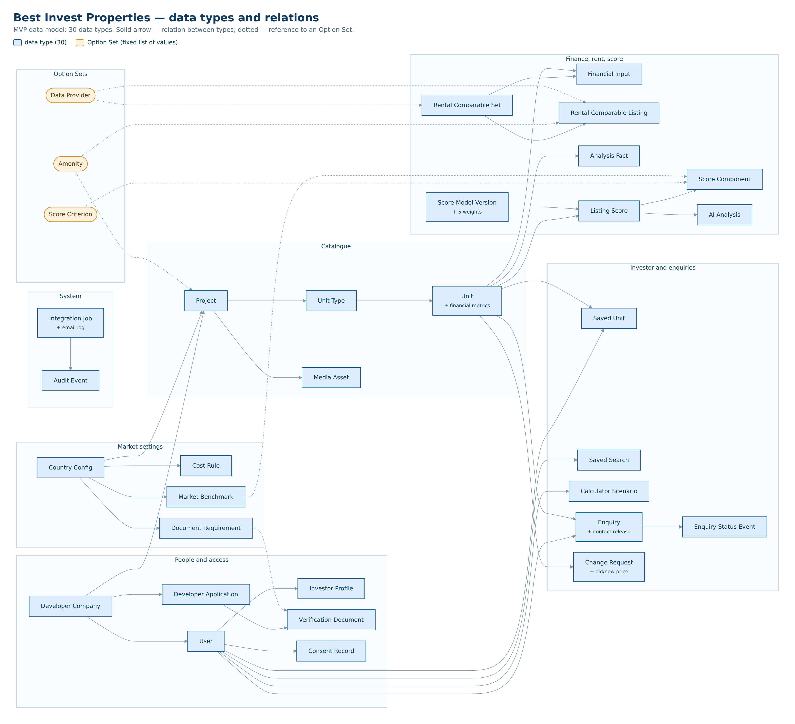

# Database Architecture — Best Invest Properties

Version: 1.2  
Date: 29 September 2026  
Storage: Bubble database  
Participating systems: Bubble, Make, OpenAI API, SendGrid

## 1. Purpose and principles

The model must support the three real MVP loops:

- an investor finds, compares, saves and enquires about a specific available unit;
- a developer gets verified, submits a project and maintains price/availability;
- an admin checks documents, publishes content and controls introductions, the score and the AI narrative.

There is one database — Bubble. It holds **30 data types** and **21 Option Sets**.

Principles:

1. **Bubble is the source of truth.** The Make Data Store is not a business database.
2. **Unit is the public listing object.** Project describes the building/complex, Unit Type the repeated configuration, Unit the specific offer.
3. **A single property does not get its own table.** It is a project with one type and one unit.
4. **Fixed calculations are deterministic.** Bubble applies the fixed formulas for acquisition cost, yields, points and the total score, always the same way, to approved values only. Inputs and assessments — for example rent, operating costs, purchase costs and the category assessments — may be proposed with AI assistance from documented sources. They are stored as pending and used only after the admin approves them.
5. **History only where it is needed:** the score model and scores, user consents, and the sources of financial figures. Other changes overwrite the value, and the Audit Event records who changed it and when.
6. **Privacy by default.** New types are created private; only whitelisted fields of published listings are public.
7. **Minimal denormalisation for Bubble.** Fields needed by privacy rules and frequent searches are duplicated on the protected record.
8. **Idempotent integrations.** Every asynchronous process has an Integration Job and a unique idempotency key.

Bubble privacy rules run on the server and must be the primary mechanism that keeps data out of the browser. Visually hiding a group or button is not access control.

## 2. Conceptual schema



## 3. Naming rules in Bubble

- Data types: singular English, Pascal Case: `Developer Company`, `Score Model Version`.
- Fields: snake_case English: `publication_status`, `price_eur`.
- Option sets: Pascal Case: `Project Status`; options are stable lower-case machine keys.
- Every business type has `public_id` (text for URLs/references), and `is_archived` where the record can be archived.
- The Bubble `unique id` is used internally only; `public_id` is what goes outside.
- Money in the MVP: numeric fields with the `_eur` suffix; the currency is always EUR.
- Percentages: store the decimal fraction (`0.0725`), display as `7.25%`.
- Time: all timestamps in UTC; timezone is used only for display.
- Bubble adds `Created Date`, `Modified Date` and `Creator` automatically — they are not repeated in the tables below.

## 4. Option Sets

Option Sets are for fixed, rarely changing, non-secret values. Bubble states explicitly that option sets are part of the app code, are not protected by privacy rules and are unsuitable for sensitive data. Changing them requires a deploy.

| Option Set | MVP values |
|---|---|
| User Role | `investor`, `developer`, `admin` |
| Account Status | `pending_email`, `active`, `suspended`, `closed` |
| Application Status | `draft`, `submitted`, `under_review`, `more_info_required`, `approved`, `rejected`, `withdrawn` |
| Project Status | `draft`, `submitted`, `under_review`, `changes_requested`, `approved`, `published`, `paused`, `sold_out`, `archived`, `rejected` |
| Publication Status | `not_published`, `published`, `hidden`, `archived` |
| Unit Availability | `available`, `reserved`, `sold`, `withdrawn` |
| Financial Input Source | `developer_claim`, `portal_comparable`, `ai_proposed`, `analyst_verified`, `platform_default`, `calculated` |
| Analysis Fact Tag | `source`, `developer`, `estimate`, `gap` |
| Change Request Status | `submitted`, `queried`, `approved`, `rejected`, `applied`, `cancelled` |
| Enquiry Status | `submitted`, `screening`, `on_hold`, `declined`, `approved_for_intro`, `introduced`, `developer_responded`, `qualified`, `closed_won`, `closed_lost`, `cancelled` |
| Score Verdict | `strong`, `good`, `watch`, `high_risk`, `not_scored` |
| Review Status | `not_required`, `pending`, `approved`, `changes_requested`, `rejected` |
| Analysis Status | `queued`, `generating`, `generated`, `failed`, `stale`, `published` |
| Job Status | `queued`, `processing`, `succeeded`, `retry_wait`, `failed`, `dead_letter`, `cancelled` |
| Document Kind | `company_registration`, `licence`, `ownership`, `planning`, `title`, `brochure`, `floor_plan`, `legal`, `other` |
| Strategy | `long_term_rental`, `short_term_rental`, `capital_growth`, `mixed` |
| Score Criterion | 5 criteria — see below |
| Amenity | `communal_pool`, `gym`, `gated_area`, `underground_parking`, `tennis_golf`, `concierge`, `lift`, `landscaped_gardens` |
| Data Provider | approved rental data sources; attributes: `name`, `country`, `access_method` (`api` / `feed` / `manual`), `terms_reference`, `is_active` |
| Media Kind | `photo`, `floor_plan`, `brochure`, `document` |
| Consent Type | `terms`, `privacy`, `marketing`, `contact_sharing` |

**What is not an Option Set.** Country Config, Cost Rule, Document Requirement and Market Benchmark are data types, because their values change without a deploy. There is no separate settings screen for them in the MVP. Legal texts (Terms, Privacy, Cookie, disclaimers) are static pages; the version the user agreed to is stored on the Consent Record.

**`Unit Availability`.** A developer may set only `available`, `reserved` or `sold`, and every such change goes through a Change Request with approval. Only an admin sets `withdrawn`. This must be enforced in the backend workflow whitelist, not in the UI.

### Score Criterion — attributes

| key | label | max_points | default_weight | Note |
|---|---|---:|---:|---|
| `income` | Rental Income & Net Yield | 30 | 0.30 | based on the property's net yield |
| `demand` | Rental Demand & Tenant Quality | 20 | 0.20 | assessed; may be proposed with AI assistance, approved by the admin |
| `value` | Purchase Value & Market Position | 20 | 0.20 | assessed; may be proposed with AI assistance, approved by the admin |
| `growth` | Growth & Resale Potential | 15 | 0.15 | assessed; may be proposed with AI assistance, approved by the admin |
| `risk` | Risk & Investor Protection | 15 | 0.15 | assessed, as above; more points = **lower** risk, scale label mandatory in the UI |

The total score is the sum of the five criterion points (maximum 100). The detailed scoring methodology — the rating scale and how a rating becomes points — will be agreed separately. The fields below store the rating and the points without fixing that scale.

### Role-specific Enquiry status labels

The eleven `Enquiry Status` values are **canonical**. Role labels are three display attributes of the same Option Set (`label_admin`, `label_investor`, `label_developer`), not additional statuses.

| Canonical status | Admin | Investor | Developer |
|---|---|---|---|
| `submitted` | New | Request received | not shown |
| `screening` | Qualifying | Awaiting analysis | not shown |
| `qualified` | Hot lead / Awaiting you | Awaiting admin approval | Awaiting admin approval |
| `on_hold` | On hold | Under review | On hold |
| `declined` | Declined | Not available | Filtered out by Best Invest |
| `approved_for_intro` | Connecting | Introduction being prepared | Introduction being prepared |
| `introduced` | Connected | Developer contacted | Introduced |
| `developer_responded` | In progress | Developer responded | Contacted |
| `closed_won` | Converted | Completed | Converted |
| `closed_lost` | Closed | Closed | Closed |
| `cancelled` | Cancelled | Cancelled | Cancelled |

An empty label means the record is not shown to that role at all — this is enforced by a privacy rule, not just hidden in the UI.

**`AWAITING YOU` is not a status.** It is the admin label meaning a lead in `qualified` is waiting for their decision. Likewise, "Hot lead" is a label for the same status, not a separate stage.

## 5. Data types

30 types in six groups.

| Group | Types |
|---|---|
| 5.1 People and access | User, Investor Profile, Developer Company, Developer Application, Verification Document, Consent Record |
| 5.2 Market settings | Country Config, Cost Rule, Document Requirement, Market Benchmark |
| 5.3 Catalogue | Project, Unit Type, Unit, Media Asset |
| 5.4 Finance, rent, score | Financial Input, Rental Comparable Set, Rental Comparable Listing, Analysis Fact, Score Model Version, Listing Score, Score Component, AI Analysis |
| 5.5 Investor and enquiries | Saved Unit, Saved Search, Calculator Scenario, Enquiry, Enquiry Status Event, Change Request |
| 5.6 System | Integration Job, Audit Event |

### 5.1 People and access

#### User (Bubble built-in)

| Field | Type | Required | Note |
|---|---|---:|---|
| public_id | text | yes | `usr_...`, not the email |
| full_name | text | yes | do not use as an identifier |
| phone_e164 | text | no | private |
| country_of_residence | text | no | private |
| roles | list of User Role | yes | at least one role after activation |
| account_status | Account Status | yes | route guard |
| email_verified | yes/no | yes | false by default |
| developer_company | Developer Company | no | for developers; one user per company in the MVP |
| admin_permission_keys | list of text | no | admin only; permissions are checked by key, not just by role |
| last_login_at | date | no | audit |

Do not store the password in a custom field. Use Bubble authentication.

#### Investor Profile

| Field | Type | Required | Note |
|---|---|---:|---|
| user | User | yes | one active profile per User |
| budget_min_eur | number | no | |
| budget_max_eur | number | no | |
| target_gross_yield | number | no | decimal fraction |
| target_net_yield | number | no | decimal fraction |
| time_horizon_months | number | no | |
| countries | list of Country Config | no | preferred countries |
| strategies | list of Strategy | no | |
| bedrooms_min | number | no | |
| marketing_email_opt_in | yes/no | yes | mirrors the latest `marketing` consent for fast filtering |

Profile uniqueness is checked by a backend workflow before creation.

#### Developer Company

| Field | Type | Required | Note |
|---|---|---:|---|
| public_id | text | yes | |
| legal_name | text | yes | |
| registration_number | text | yes | |
| registration_country | Country Config | yes | |
| licence_number | text | yes | |
| website_url | text | no | |
| years_active | number | no | |
| projects_completed | number | no | |
| projects_selling | number | no | |
| typical_unit_price_eur | number | no | |
| verification_status | Application Status | yes | mirrored from the latest application for privacy rules |
| verified_at | date | no | |
| is_suspended | yes/no | yes | |

The Company owns the Project. Never link a Project directly to a single developer User.

#### Developer Application

| Field | Type | Required | Note |
|---|---|---:|---|
| public_id | text | yes | `APP-0142` |
| company | Developer Company | yes | |
| submitted_by_user | User | yes | |
| status | Application Status | yes | |
| markets | list of Country Config | yes | |
| submitted_at | date | no | |
| decided_at | date | no | |
| decision_reason_private | text | no | admin only |
| decision_message_public | text | no | visible to the developer |

#### Verification Document

| Field | Type | Required | Note |
|---|---|---:|---|
| application | Developer Application | yes | |
| company | Developer Company | yes | duplicated for privacy rules |
| document_kind | Document Kind | yes | |
| file | file | yes | always private |
| expires_at | date | no | |
| verification_status | Review Status | yes | |
| review_note_public | text | no | visible to the developer |
| reviewed_at | date | no | |
| is_current | yes/no | yes | a re-upload sets the previous one to `no` |

The file is always private and attached to the Verification Document. Removing the URL does not delete the file; the delete workflow must first run the Bubble action "Delete an uploaded file".

#### Consent Record

| Field | Type | Required | Note |
|---|---|---:|---|
| user | User | yes | |
| consent_type | Consent Type | yes | |
| granted | yes/no | yes | |
| document_version | text | yes | version of the text the user agreed to, e.g. `terms-2026-09` |
| source_page | text | no | where consent was given |
| withdrawn_at | date | no | |

Consent is never overwritten: every change is a new record. This is a GDPR requirement — you must be able to prove what exactly the user agreed to.

### 5.2 Market settings

#### Country Config

| Field | Type | Required | Note |
|---|---|---:|---|
| iso2 | text | yes | `CY`, `ES` |
| name | text | yes | |
| is_live | yes/no | yes | |
| coming_soon | yes/no | yes | for Greece/Portugal if needed |
| default_vacancy_rate | number | yes | decimal fraction |
| default_management_fee_rate | number | yes | |
| default_maintenance_rate | number | yes | |
| default_insurance_annual_eur | number | yes | |
| legal_disclaimer | text | no | |

#### Cost Rule

| Field | Type | Required | Note |
|---|---|---:|---|
| country | Country Config | yes | |
| rule_key | text | yes | `transfer_tax`, `stamp_duty`, `legal_fees`, … |
| label | text | yes | |
| applies_to_new_build | yes/no | no | empty = applies to all |
| calculation_method | text | yes | `flat` / `percent_price` / `banded` |
| rate | number | no | for `percent_price` |
| fixed_amount_eur | number | no | for `flat` |
| bands_json | text | no | for `banded` |
| source_url | text | yes | official source |
| source_checked_at | date | yes | |
| approved_by | text | no | who checked the rate (consultant) |

Do not store all tax rules as one text. When a value changes, it is overwritten and the Audit Event records the change history.

#### Document Requirement

| Field | Type | Required | Note |
|---|---|---:|---|
| country | Country Config | yes | |
| subject_type | text | yes | `developer` / `project` |
| document_kind | Document Kind | yes | |
| required_for_account_creation | yes/no | yes | e.g. company registration, licence |
| required_for_submission | yes/no | yes | |
| required_for_publication | yes/no | yes | e.g. building permit, escrow |
| expiry_months | number | no | empty = no expiry |
| instructions | text | no | hint for the developer |
| is_active | yes/no | yes | |

The three `required_for_*` fields express the three levels on the application screen: `REQUIRED` / `TO CONFIRM` / `OPTIONAL`. The matrix is **fully configurable** by the admin per country and is not hard-coded.

#### Market Benchmark

Reference data that can support the `Purchase Value & Market Position` assessment, e.g. the median asking price per m² for new builds in a district. How it is used in the rating is part of the scoring methodology, to be agreed separately.

| Field | Type | Required | Note |
|---|---|---:|---|
| country | Country Config | yes | |
| city | text | yes | |
| area_name | text | no | empty = whole city |
| property_type | text | no | |
| median_price_per_m2_eur | number | yes | median for new builds |
| sample_size | number | no | number of properties in the sample |
| source_reference | text | yes | public listings / transaction register |
| checked_at | date | yes | date checked |

### 5.3 Property catalogue

#### Project

| Field | Type | Required | Note |
|---|---|---:|---|
| public_id | text | yes | `PRJ-0311` |
| company | Developer Company | yes | **never** returned to an anonymous request |
| country | Country Config | yes | |
| city | text | yes | |
| area_name | text | no | |
| address_private | text | no | not published |
| map_lat_rounded | number | no | rounded for the public map |
| map_lng_rounded | number | no | |
| name | text | yes | |
| project_type | text | yes | `single` / `complex` |
| description_public | text | no | |
| completion_date | date | yes | |
| declared_unit_count | number | yes | |
| amenities | list of Amenity | no | |
| cover_media | Media Asset | no | required for publication |
| status | Project Status | yes | |
| publication_status | Publication Status | yes | |
| published_at | date | no | |

Country/city/area are enough for search cards; `address_private` is never exposed publicly.

**Developer anonymity.** The developer's name and contacts are not shown in the catalogue or on the property page; the public label is "Introduced by Best Invest". The privacy rule on Project does not return `company` to an anonymous request at all — do not rely on the UI not showing it.

#### Unit Type

| Field | Type | Required | Note |
|---|---|---:|---|
| public_id | text | yes | |
| project | Project | yes | |
| name | text | yes | e.g. "Type B — 2 bed" |
| bedrooms | number | yes | |
| bathrooms | number | yes | |
| indoor_area_m2 | number | yes | |
| outdoor_area_m2 | number | no | |
| floor_plan | Media Asset | no | |

#### Unit

The central listing record. It also holds the current financial metrics — there is no separate type for them.

| Field | Type | Required | Note |
|---|---|---:|---|
| public_id | text | yes | URL and external references |
| project | Project | yes | |
| unit_type | Unit Type | yes | |
| unit_number | text | yes | may be hidden until introduction |
| floor | number | no | |
| price_eur | number | yes | current approved price |
| availability | Unit Availability | yes | |
| has_pending_change | yes/no | yes | a Change Request is in progress — the portal row shows "pending approval" |
| monthly_rent_eur | number | no | approved rent used for scoring |
| purchase_costs_eur | number | no | calculated from approved inputs |
| acquisition_cost_eur | number | no | calculated: price + purchase costs |
| annual_operating_costs_eur | number | no | calculated from approved inputs |
| annual_net_income_eur | number | no | calculated |
| gross_yield | number | no | calculated |
| net_yield | number | no | calculated |
| financials_calculated_at | date | no | date of the last calculation |
| investment_score | number | no | current score |
| score_verdict | Score Verdict | no | badge |
| current_score | Listing Score | no | components and model version |
| country_cached | Country Config | yes | for search and privacy without a deep chain |
| city_cached | text | yes | search |
| bedrooms_cached | number | yes | search |
| area_m2_cached | number | yes | search |
| property_type_cached | text | yes | search |
| completion_date_cached | date | yes | completion filter |
| strategy_keys | list of Strategy | no | search |
| publication_status | Publication Status | yes | only `published` is public |

Financial and cached fields are updated by the atomic backend workflow `recalculate_unit`. Do not build the public search over many nested relations.

Base MVP formulas:

```text
annual_gross_rent = monthly_rent × 12
annual_effective_rent = annual_gross_rent × (1 − vacancy_rate)
gross_yield = annual_gross_rent / price
annual_net_income = annual_effective_rent
  - management - maintenance - insurance - property_tax - other_costs
acquisition_cost = price + purchase_costs
net_yield = annual_net_income / acquisition_cost
```

Inputs are approved Financial Inputs (rent comes from reviewed comparable rentals), plus the Country Config settings and Cost Rules for the country. The values used for a particular score are recorded on the Listing Score.

#### Media Asset

| Field | Type | Required | Note |
|---|---|---:|---|
| project | Project | yes | |
| unit_type | Unit Type | no | for floor plans |
| kind | Media Kind | yes | |
| image | image | no | for `photo` |
| file | file | no | for PDFs/documents |
| is_private | yes/no | yes | legal documents — `yes` |
| is_cover | yes/no | yes | |
| sort_order | number | yes | |
| caption | text | no | |

Public photos/brochures and private documents are different records with different privacy rules.

### 5.4 Finance, rent, score

#### Financial Input

The Project Review screen shows a panel where every figure has its own source and assumptions, and three rent values side by side (claimed by the developer, Best Invest's comparable estimate, and the one actually used for scoring). So each input value is a separate record.

| Field | Type | Required | Note |
|---|---|---:|---|
| unit | Unit | yes | |
| input_key | text | yes | `monthly_rent`, `annual_operating_costs`, `purchase_costs`, `vacancy_allowance`, `claimed_yield`, … |
| label | text | yes | label in the review |
| value_number | number | no | empty when the item is marked as a gap |
| is_gap | yes/no | yes | no source supports a value |
| source | Financial Input Source | yes | |
| source_reference | text | no | "Larnaca district, 5 comparable lettings" |
| sources_json | text | no | the sources used: id, link or document, date |
| assumptions | text | no | required for `ai_proposed` |
| comparable_set | Rental Comparable Set | no | required for `portal_comparable` |
| integration_job | Integration Job | no | the AI request that produced an `ai_proposed` value |
| is_used_for_scoring | yes/no | yes | only one active value per `input_key` |
| review_status | Review Status | yes | `pending` until approved by the admin |
| approved_at | date | no | |
| superseded_by | Financial Input | no | a new value does not overwrite the old one |

Rules:

- only values with `review_status = approved` reach the public listing;
- the Unit's financial metrics are calculated **only** from approved Financial Inputs;
- a value with `source = developer_claim` can never have `is_used_for_scoring = yes` without separate admin approval;
- a value with `source = ai_proposed` must have at least one source in `sources_json` and its assumptions; it is `pending` until the admin approves it. A correction by the admin is saved as a new record with `source = analyst_verified`;
- a gap (`is_gap = yes`) never has a value and can never be used for scoring;
- `source = portal_comparable` requires a `comparable_set` with `review_status = approved`;
- for rent there are always at least two records: the developer's claim (`developer_claim`) and the value derived from comparable listings (`portal_comparable`) — these are shown side by side on Project Review;
- `developer_claim` never turns into `portal_comparable` automatically;
- a record is not edited: a new value creates a new record and sets `superseded_by` on the old one. This shows where every published figure came from.

#### Rental Comparable Set

One sample of comparable rentals for one parameter set on a given date. The individual listings are stored as Rental Comparable Listing records, so every figure can be traced back to its sources.

| Field | Type | Required | Note |
|---|---|---:|---|
| public_id | text | yes | |
| retrieved_at | date | yes | date the sample was put together |
| country | Country Config | yes | matching parameter |
| city | text | yes | matching parameter |
| area_name | text | no | district |
| property_type | text | yes | matching parameter |
| bedrooms | number | yes | matching parameter |
| area_m2_min | number | no | sample floor-area bound |
| area_m2_max | number | no | sample floor-area bound |
| features | list of Amenity | no | relevant features used to assess the match, e.g. pool, parking, gated area |
| listings_count | number | yes | calculated by Bubble from the linked listings |
| rent_min_eur | number | yes | calculated by Bubble |
| rent_median_eur | number | yes | calculated by Bubble |
| rent_max_eur | number | yes | calculated by Bubble |
| collection_method | text | yes | `api` / `feed` / `manual_import` / `manual_entry` |
| integration_job | Integration Job | no | empty for manual entry |
| review_status | Review Status | yes | `pending` until checked by the admin |
| is_current | yes/no | yes | current sample for this parameter set |

Rules:

- the count, range and median are technical processing of the sample by Bubble, not an approved figure;
- a sample with `review_status ≠ approved` cannot be a source for a Financial Input and is not shown to the investor;
- relevant features are factors in assessing the match; a comparable does not have to match on every one;
- a new sample does not overwrite the previous one: the old one gets `is_current = no`;
- where there is no suitable source, the admin enters documented comparables by hand (`manual_entry`) — they are stored the same way. Otherwise the estimate stays `pending`; no rent estimate is ever invented.

> The access method and the right to use each source's data are checked before
> it is connected. The link to the terms is the `terms_reference` attribute in
> the `Data Provider` Option Set.

#### Rental Comparable Listing

One comparable rental in a sample, with its source.

| Field | Type | Required | Note |
|---|---|---:|---|
| public_id | text | yes | source id used in the analysis, e.g. `src_01` |
| comparable_set | Rental Comparable Set | yes | |
| provider | Data Provider | no | Option Set; empty for a manually documented comparable |
| source_url | text | no | link to the listing; required unless a document is attached |
| source_document | file | no | private; evidence for a manually entered comparable |
| retrieved_at | date | yes | date the listing was retrieved |
| monthly_rent_eur | number | yes | |
| property_type | text | yes | |
| bedrooms | number | yes | |
| area_name | text | no | |
| indoor_area_m2 | number | no | |
| features | list of Amenity | no | where this data is available |

Every listing has a link or a document and a date, so each comparable behind the range and the median can be checked. The records are not edited; a new collection creates a new sample.

#### Analysis Fact

The "Sources, assumptions & gaps" block on the analysis and review screens.

| Field | Type | Required | Note |
|---|---|---:|---|
| unit | Unit | yes | |
| tag | Analysis Fact Tag | yes | |
| body | text | yes | fact text |
| source_url | text | no | |
| sort_order | number | yes | |
| is_active | yes/no | yes | |

The `gap` tag marks a known absence of data and must be visible to the investor — it is a legally significant part of the disclosure.

#### Score Model Version

| Field | Type | Required | Note |
|---|---|---:|---|
| version_number | number | yes | v1, v2, … |
| status | text | yes | `draft` / `active` / `retired` |
| weight_income | number | yes | decimal fraction, default 0.30 |
| weight_demand | number | yes | default 0.20 |
| weight_value | number | yes | default 0.20 |
| weight_growth | number | yes | default 0.15 |
| weight_risk | number | yes | default 0.15 |
| change_reason | text | yes | shown in the versions table |
| properties_rescored | number | no | filled in after recalculation |
| activated_at | date | no | |

Weight rules:

- the five weights of the active model add up to `1.0`; until they do, Save is blocked (checked by a backend workflow);
- the editor works in percentages, 0–100 per criterion; there is **no** hard cap on a single criterion;
- the UI shows a soft warning if any criterion exceeds **50%** — one criterion would then effectively determine the whole score. The warning does not block saving; the threshold is a UI constant;
- the weights are the same for Cyprus and Spain;
- `Revert` creates a **new** version with the previous parameters rather than deleting history.

#### Listing Score

| Field | Type | Required | Note |
|---|---|---:|---|
| unit | Unit | yes | |
| model_version | Score Model Version | yes | |
| total_score | number | yes | 0–100 |
| verdict | Score Verdict | yes | |
| price_eur_used | number | yes | price at calculation time |
| monthly_rent_eur_used | number | yes | rent at calculation time |
| net_yield_used | number | yes | |
| gross_yield_used | number | yes | |
| calculated_at | date | yes | |
| is_current | yes/no | yes | a new calculation sets the previous one to `no` |

The `*_used` fields record the inputs the score was calculated from, so the score stays reproducible even after the price or rent on the Unit changes.

#### Score Component

| Field | Type | Required | Note |
|---|---|---:|---|
| listing_score | Listing Score | yes | |
| criterion | Score Criterion | yes | Option Set |
| raw_value | number | no | e.g. net yield for `income`; empty for assessed criteria |
| rating | number | yes | on the scale set by the scoring methodology (to be agreed) |
| weighted_points | number | yes | calculated by Bubble from the rating and the criterion weight |
| explanation | text | no | for assessed criteria: the admin-approved explanation; may be proposed with AI assistance |
| sources_json | text | no | the sources behind the assessment: id, link or document, date |
| proposed_by | text | no | `ai` / `admin` |
| review_status | Review Status | yes | assessed criteria are `pending` until the admin approves them |
| approved_at | date | no | |

Each Listing Score has exactly five components; they add up to the total score within `0.01`. A score is published only when every assessed component is approved. The approved explanation and sources are passed to OpenAI for the analysis text, so the text can explain the points without guessing.

#### AI Analysis

| Field | Type | Required | Note |
|---|---|---:|---|
| unit | Unit | yes | |
| listing_score | Listing Score | yes | the score the text is based on |
| status | Analysis Status | yes | |
| review_status | Review Status | yes | |
| prompt_version | text | yes | |
| model_id | text | yes | |
| headline | text | no | analysis headline |
| summary | text | no | |
| score_explanation | text | no | explanation of the score |
| strengths_json | text | no | |
| risks_json | text | no | |
| missing_data_json | text | no | |
| input_tokens | number | no | |
| output_tokens | number | no | |
| reviewed_at | date | no | |
| published_at | date | no | |
| failure_code | text | no | |

Only `review_status = approved` is published, and only while the linked Listing Score is still `is_current = yes`.

AI Analysis holds only the analysis text (the second AI stage). Proposed inputs and assessments from the first stage are stored as Financial Inputs (`source = ai_proposed`) and Score Components (`review_status = pending`).

### 5.5 Investor and enquiries

#### Saved Unit

| Field | Type | Required | Note |
|---|---|---:|---|
| user | User | yes | |
| unit | Unit | yes | |
| price_at_save_eur | number | yes | for the "price changed" badge |
| availability_at_save | Unit Availability | yes | for the "status changed" badge |
| is_active | yes/no | yes | check for an active duplicate before creating |

#### Saved Search

| Field | Type | Required | Note |
|---|---|---:|---|
| public_id | text | yes | |
| user | User | yes | |
| name | text | yes | |
| countries | list of Country Config | no | |
| property_types | list of text | no | |
| bedrooms | list of text | no | `studio`, `1`, `2`, `3+` |
| strategies | list of Strategy | no | |
| completion | list of text | no | `ready`, `lt_12m`, `12_24m` |
| price_max_eur | number | no | empty = no upper limit (the slider's top position, €600k+) |
| gross_yield_min | number | no | |
| net_yield_min | number | no | |
| is_active | yes/no | yes | |

When a new property matching an active saved search is published, Bubble sends the investor an email through an Integration Job (`template_key = saved_search_match`); the idempotency key prevents a second email for the same property and search.

#### Calculator Scenario

| Field | Type | Required | Note |
|---|---|---:|---|
| public_id | text | yes | |
| user | User | yes | anonymous calculations are not stored |
| unit | Unit | yes | |
| name | text | yes | |
| strategy | Strategy | yes | long / short term |
| rent_scenario | text | yes | `base` / `average` / `best` |
| purchase_price_eur | number | yes | |
| monthly_rent_eur | number | yes | |
| occupancy_rate | number | yes | |
| management_fee_rate | number | yes | |
| annual_net_income_eur | number | yes | result at save time |

There are no mortgage, deposit, interest-rate or loan-term fields in the MVP.

#### Enquiry

The contact release fields are stored right here — there is no separate type for them.

| Field | Type | Required | Note |
|---|---|---:|---|
| public_id | text | yes | `ENQ-YYYY-...` / for the developer `LEAD-0412` |
| investor_user | User | yes | private |
| unit | Unit | yes | the specific subject of the enquiry |
| project | Project | yes | denormalised |
| developer_company | Developer Company | yes | denormalised for privacy rules |
| status | Enquiry Status | yes | canonical status |
| budget_eur | number | no | value at submission time |
| consent_to_share_contact | yes/no | yes | separate consent |
| fit_summary_private | text | no | admin only |
| follow_up_date | date | no | required for `on_hold` |
| submitted_at | date | yes | SLA start |
| contact_released_at | date | no | filled in on Approve & connect |
| released_investor_name | text | no | copy the developer sees after release |
| released_investor_email | text | no | |
| released_investor_phone | text | no | |
| released_developer_contact | text | no | developer contact the investor sees |
| developer_outcome | text | no | lead outcome: `viewing_booked` / `reserved` / `not_interested` |
| closed_at | date | no | |

The developer **never** gets access to the investor's User record. Before release the `released_*` fields are empty; the privacy rule returns them to the developer only once `contact_released_at` is filled in.

#### Enquiry Status Event

| Field | Type | Required | Note |
|---|---|---:|---|
| enquiry | Enquiry | yes | |
| from_status | Enquiry Status | no | |
| to_status | Enquiry Status | yes | |
| actor_user | User | no | empty for automatic transitions |
| reason_private | text | no | required for `on_hold` / `declined`; never shown to the investor |
| note_investor | text | no | what the investor sees in the status history |

A status never changes without a Status Event. These records are what the investor sees as the status history.

#### Change Request

One request = one change to one unit, or a content review request.

| Field | Type | Required | Note |
|---|---|---:|---|
| public_id | text | yes | |
| project | Project | yes | |
| unit | Unit | no | empty for content review |
| company | Developer Company | yes | for privacy rules |
| request_type | text | yes | `price` / `availability` / `content_review` |
| old_price_eur | number | no | |
| new_price_eur | number | no | |
| old_availability | Unit Availability | no | |
| new_availability | Unit Availability | no | only `available` / `reserved` / `sold` |
| content_message | text | no | for `content_review`: what the developer wants to change |
| status | Change Request Status | yes | |
| decision_reason | text | no | required for `queried` / `rejected`; visible to the developer |
| submitted_at | date | yes | |
| decided_at | date | no | |

After publication the developer changes only price and availability; both go through **prior** approval. Locked fields (project name, location, completion date, unit mix, specification, media) change through `content_review`. The Change Request is kept after it is applied — this is the change history on the Project & Units screen.

### 5.6 System

#### Integration Job

Every asynchronous action: Make calls and every email sent by Bubble.

| Field | Type | Required | Note |
|---|---|---:|---|
| public_id | text | yes | correlation id |
| job_type | text | yes | `ai_proposals_generate`, `ai_analysis_generate`, `email`, `introduction`, `rental_comparables`, `score_rescore_batch`, … |
| entity_type | text | yes | |
| entity_public_id | text | yes | |
| recipient_user | User | no | for emails |
| template_key | text | no | for emails |
| status | Job Status | yes | |
| idempotency_key | text | yes | unique |
| attempt_count | number | yes | |
| processed_count | number | no | batch recalculation progress |
| last_error_redacted | text | no | no PII or secrets |
| provider_message_id | text | no | email id / OpenAI response id |
| completed_at | date | no | |

Uniqueness is enforced by `idempotency_key`. The Job is checked before the action (a Make call or sending an email); if it is `succeeded`, the repeat ends without side effects. This same type is the log of sent emails. Failed jobs are logged and the team is notified; there is no separate monitoring screen in the MVP.

#### Audit Event

| Field | Type | Required | Note |
|---|---|---:|---|
| actor_user | User | no | empty for system actions |
| action_key | text | yes | `project.published`, `cost_rule.updated`, … |
| entity_type | text | yes | |
| entity_public_id | text | yes | |
| before_json | text | no | no PII |
| after_json | text | no | no PII |
| reason | text | no | |
| source | text | yes | `bubble_ui` / `bubble_backend` / `make` / `openai` |

Audit Event is append-only; user workflows may not change or delete records. It records who changed settings (rates, weights, documents) and when, instead of keeping separate versions of each record.

## 6. Status transitions

### Project lifecycle

```text
draft → submitted → under_review
under_review → changes_requested → submitted
under_review → approved → published
under_review → rejected
published → paused | sold_out | archived
```

The admin performs `approved → published` as a separate action. Publishing is not allowed without approved verification, at least one available unit, a cover photo, calculated financials, a current score, and an approved AI analysis or an explicit deterministic-only fallback.

A developer can **submit** a project with an incomplete set of units (modal: "12 units declared · 3 entered. You can submit and add the rest before publication"). So unit completeness is a condition of `approved → published`, not of `draft → submitted`. In addition, publishing requires every Financial Input used in the score and every assessed Score Component to have `review_status = approved`.

### Enquiry decision

| UI action | Canonical transition | Emails |
|---|---|---|
| Approve & connect | `qualified → approved_for_intro → introduced` | to both parties |
| Hold | `qualified → on_hold` | none |
| Decline | `qualified → declined` | investor only, in neutral wording |

`on_hold` and `declined` require `reason_private` — for Decline it is a short free-text internal note that neither the investor nor the developer sees. The text the investor sees on a decline comes from a template and does **not** contain the reason. `on_hold` additionally requires `follow_up_date` on the Enquiry.

### Developer Application lifecycle

```text
draft → submitted → under_review
under_review → more_info_required → submitted
under_review → approved | rejected
submitted/under_review → withdrawn
```

### Enquiry lifecycle

```text
submitted → screening → qualified → approved_for_intro → introduced
screening | qualified → on_hold | declined
on_hold → qualified | declined
introduced → developer_responded → closed_won | closed_lost
submitted | screening | qualified → cancelled
```

`qualified` means "the lead has been checked by the analyst and is waiting for the admin's decision", so it comes **before** `approved_for_intro`. The stage after the developer responds is `developer_responded`, then `closed_won` / `closed_lost`.

## 7. Privacy rules matrix

| Data type | Anonymous | Investor owner | Developer company member | Admin |
|---|---|---|---|---|
| User | none | own whitelisted fields | own only | full |
| Investor Profile | none | own | none | full |
| Developer Company | none | none | own | full |
| Developer Application / Verification Document | none | none | own company | full |
| Consent Record | none | own | own | full |
| Project | published public subset, without `company` | published public subset | own company | full |
| Unit | published + available public subset | same | own company units | full |
| Media Asset public | published records | published records | own company | full |
| Media Asset private | none | none | own company | full |
| Financial Input | none | none | own project, `approved` only | full |
| Rental Comparable Set / Rental Comparable Listing | none | none | none | full |
| Analysis Fact / Listing Score / Score Component | published subset | published subset | own project | full |
| AI Analysis | approved/published only | approved/published only | own project published view | full |
| Enquiry | none | own, investor-safe fields | own company; `released_*` fields only after release | full |
| Enquiry Status Event | none | own, without `reason_private` | own company, without `reason_private` | full |
| Change Request | none | none | own company | full |
| Integration Job / Audit Event | none | none | none | full |
